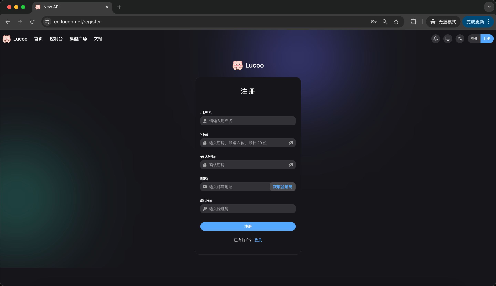
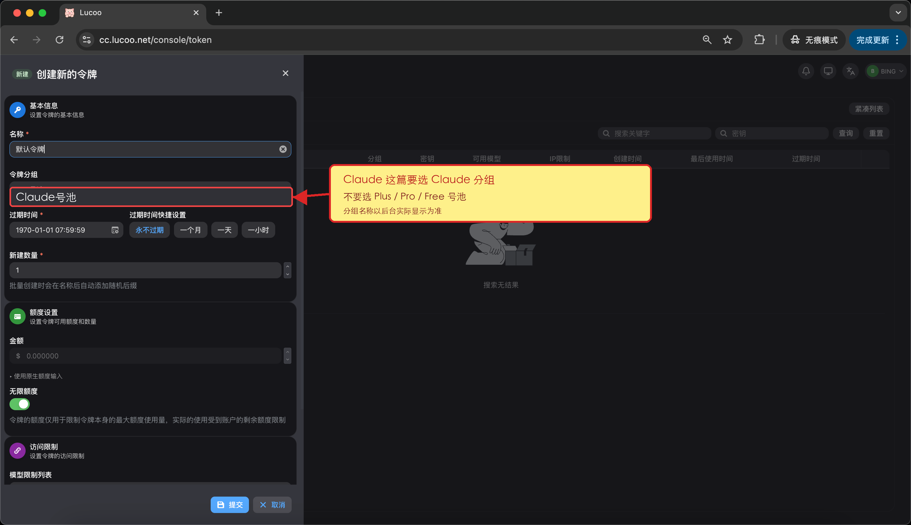
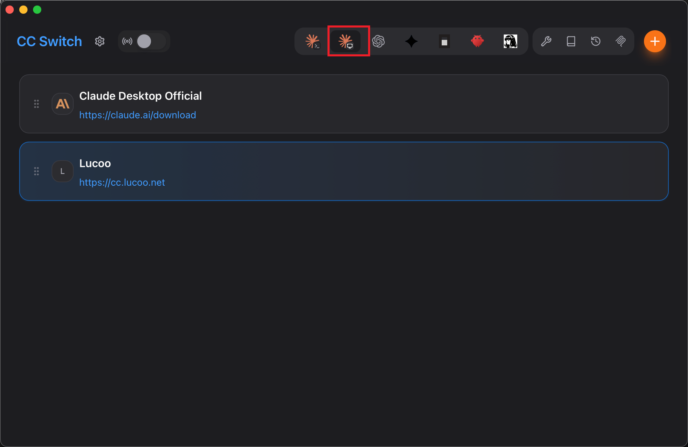
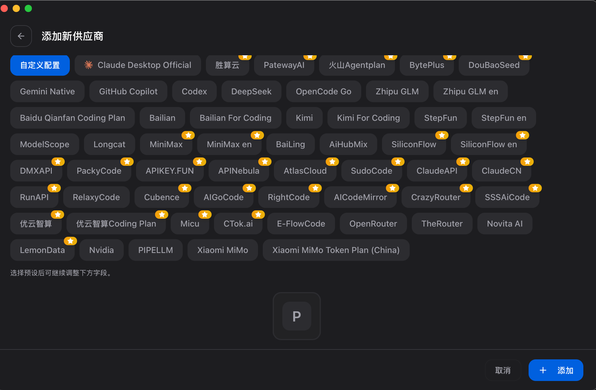
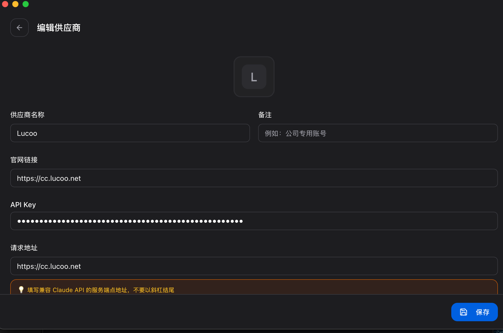
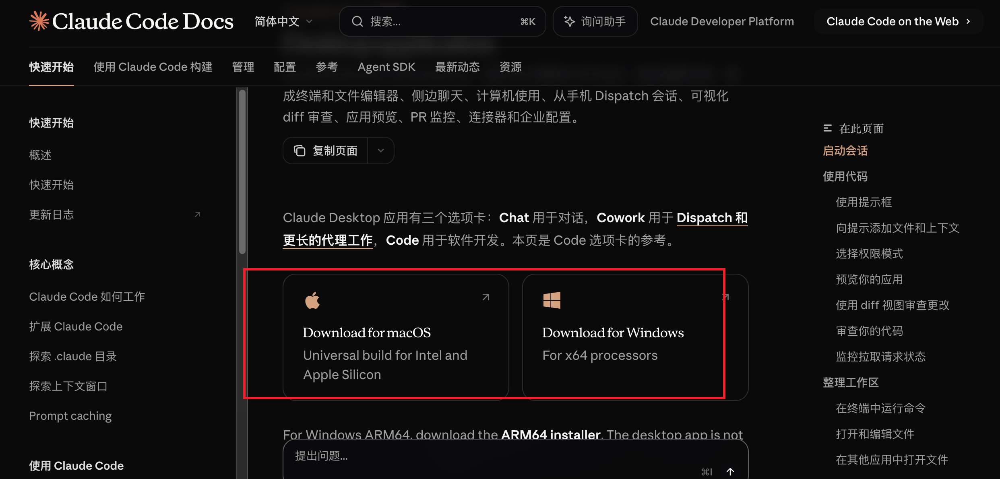
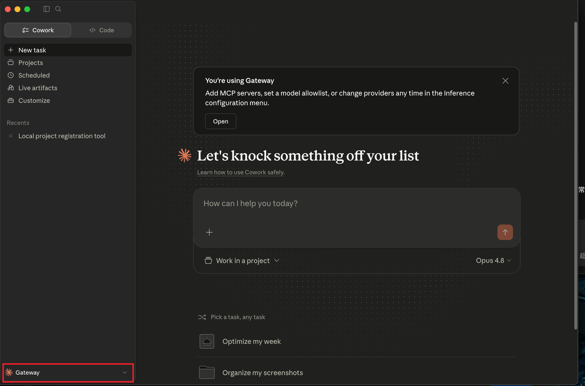
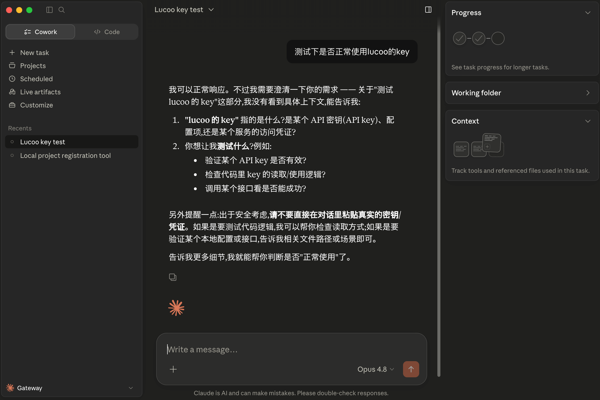

## 一、适用场景

这篇教程适合需要让 Claude Code 桌面端通过 Lucoo 中转站使用的用户。

如果你直接使用官方 Claude 账号，可以按官方方式登录；如果你希望统一使用 Lucoo 的 API Key、走中转站额度，或者在多套服务商之间快速切换，推荐使用 CC Switch 配置一个 Lucoo 供应商。

<p class="lucoo-token-warning-block">重点先说：Claude 和 Codex、Cherry Studio、CodeBuddy 的配置区别在令牌分组。Claude Code 桌面端要选择 Claude 分组，不要选 Plus 号池、Pro 号池或其它 OpenAI 兼容分组。</p>

## 二、常用地址

| 用途 | 地址 |
| --- | --- |
| Lucoo 中转站 | [https://cc.lucoo.net](https://cc.lucoo.net) |
| 海外代理访问地址 | [https://apicc.lucoo.net](https://apicc.lucoo.net) |
| 额度购买地址 | [https://pay.ldxp.cn/shop/Lucoo](https://pay.ldxp.cn/shop/Lucoo) |
| 充值地址 | [https://cc.lucoo.net/console/topup](https://cc.lucoo.net/console/topup) |
| CC Switch 下载地址 | [https://github.com/farion1231/cc-switch/releases](https://github.com/farion1231/cc-switch/releases) |
| Claude Code 桌面端下载 | [https://code.claude.com/docs/zh-CN/desktop](https://code.claude.com/docs/zh-CN/desktop) |

## 三、准备 Lucoo 中转站令牌

已经有可用 API Key 的用户，也建议快速检查一下令牌分组是否为 Claude 分组。没有 Key 的用户按下面步骤创建。

### 1. 注册并登录中转站

打开 [https://cc.lucoo.net](https://cc.lucoo.net)，按页面提示完成注册并登录。



### 2. 进入令牌管理

登录后进入控制台，打开「令牌管理」，点击「添加令牌」。


### 3. 创建令牌并选择 Claude 分组

创建令牌时，最关键的是「令牌分组」。Claude Code 桌面端要选择 `Claude 分组`，这是和 Codex、Cherry Studio、CodeBuddy 这类 OpenAI 兼容客户端最大的区别。

<p class="lucoo-token-warning-block">不要留空，也不要选择 Plus 号池、Pro 号池、Free 号池或其它 OpenAI 兼容分组。Claude 分组必须选择正确，否则后面 CC Switch 和 Claude 里可能看起来已经连接，但实际请求模型时会失败。</p>



建议这样配置：

| 配置项 | 建议 |
| --- | --- |
| 名称 | 方便自己识别即可，例如 `Claude Desktop` |
| 令牌分组 | 必须选择 `Claude 分组` |
| 过期时间 | 可以选择不过期，或按自己的安全要求设置 |
| 额度 | 可保持默认，额度不足时再充值 |
| 模型限制 | 新手建议先不限制，确认可用后再收窄 |

### 4. 复制 API Key

令牌创建成功后，在列表里复制 `sk-` 开头的 API Key。后面配置 CC Switch 时会用到它。

不要把真实 API Key 发到公开群聊、截图或代码仓库里。如果怀疑 Key 泄露，直接删除旧令牌并重新创建。


## 四、安装并配置 CC Switch

### 1. 下载并打开 CC Switch

打开 [CC Switch Releases](https://github.com/farion1231/cc-switch/releases)，根据自己的系统下载对应安装包。安装完成后打开 CC Switch。

在顶部工具栏选择 Claude 桌面端相关入口。截图里标出的第二个图标就是桌面端入口，适合给 Claude Code 桌面端配置 Gateway。



### 2. 添加自定义供应商

点击右上角加号，进入「添加新供应商」页面，选择「自定义配置」。



### 3. 填写 Lucoo 供应商信息

按下面方式填写：

| 配置项 | 推荐填写 |
| --- | --- |
| 供应商名称 | `Lucoo` |
| 官网链接 | `https://cc.lucoo.net` |
| API Key | 粘贴 Lucoo 中转站复制的 `sk-` 开头令牌 |
| 请求地址 | 国内默认填 <span class="lucoo-red-url">https://cc.lucoo.net</span> |
| 海外代理地址 | 如果默认地址不稳定，可改填 <span class="lucoo-red-url">https://apicc.lucoo.net</span> |

<p class="lucoo-token-warning-block">Claude Code 桌面端这里填写的是兼容 Claude API 的服务端地址，通常不要在末尾加 `/v1`。`/v1` 是 Codex、Cherry Studio、CodeBuddy 这类 OpenAI 兼容配置里常用的地址写法。</p>



填完后点击「保存」。

### 4. 启用 Lucoo 供应商

回到 CC Switch 供应商列表，选中刚刚创建的 `Lucoo`。确认卡片高亮后，说明当前桌面端 Gateway 已经切到 Lucoo。


## 五、安装并打开 Claude Code 桌面端

### 1. 下载 Claude Code 桌面端

打开 [Claude Code 桌面端文档](https://code.claude.com/docs/zh-CN/desktop)，根据系统选择 macOS 或 Windows 版本下载。



### 2. 打开 Claude Code

安装完成后打开 Claude Code 桌面端。如果 CC Switch 已经启用 Lucoo，Claude 左下角通常会显示 `Gateway`。



### 3. 发送测试消息

新建一个任务，随便发一条测试消息，例如：

```text
测试下是否正常使用 Lucoo 的 key
```

如果 Claude 正常响应，就说明 Lucoo 中转站、CC Switch 和 Claude Code 桌面端已经连通。



## 六、常见问题排查

### 1. 保存成功但 Claude 不能用

优先检查 Lucoo 后台的令牌是否选择了 <span class="lucoo-token-warning">Claude 分组</span>。如果分组为空，或者误选了 Plus/Pro/Free 这类 OpenAI 兼容分组，Claude 侧配置看起来正常，但实际请求会失败。

### 2. 请求地址应该填什么

Claude Code 桌面端通过 CC Switch 配置时，国内默认填：

```text
https://cc.lucoo.net
```

如果网络不稳定，可以尝试海外代理地址：

```text
https://apicc.lucoo.net
```

这里一般不要写成 `https://cc.lucoo.net/v1`。只有配置 OpenAI 兼容客户端时，才通常使用 `/v1` 地址。

### 3. 提示 API Key 无效

重新复制 Lucoo 后台完整的 `sk-` 开头令牌，确认没有多复制空格，也没有少复制字符。复制后不要把 Key 发给别人截图确认，可以只截图配置项，不展示完整密钥。

### 4. 看不到 Gateway 或仍然走官方

先确认 CC Switch 里已经选中了 `Lucoo` 供应商，然后完全退出 Claude Code 再重新打开。桌面端有时需要重启后才会读取新的 Gateway 配置。

### 5. 模型不可用或无权限

检查当前令牌是否属于 Claude 分组，并确认该分组包含你正在使用的 Claude 模型。如果不确定，先取消模型限制，确认能跑通后再回到中转站后台收窄权限。

## 七、安全提醒

- <span class="lucoo-token-warning">Claude 分组必须选择正确</span>，这是 Claude 桌面端接入时最常见的不可用原因。
- API Key 相当于你的账户凭证，不要公开发布。
- 不要把带有真实 Key 的截图上传到网站、群聊或仓库。
- 如果怀疑 Key 泄露，立即到 Lucoo 后台删除旧令牌并重新创建。
- 购买额度后，到 [https://cc.lucoo.net/console/topup](https://cc.lucoo.net/console/topup) 完成充值。
