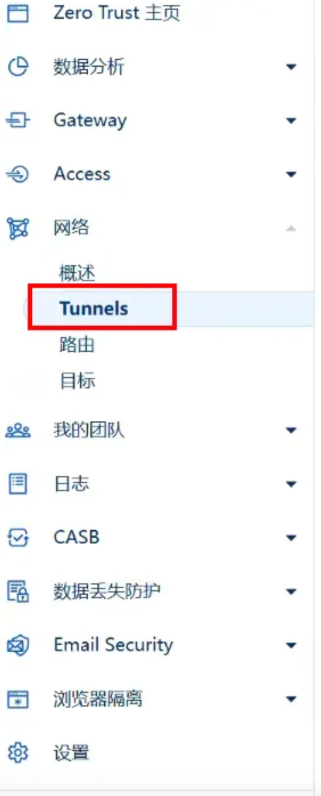
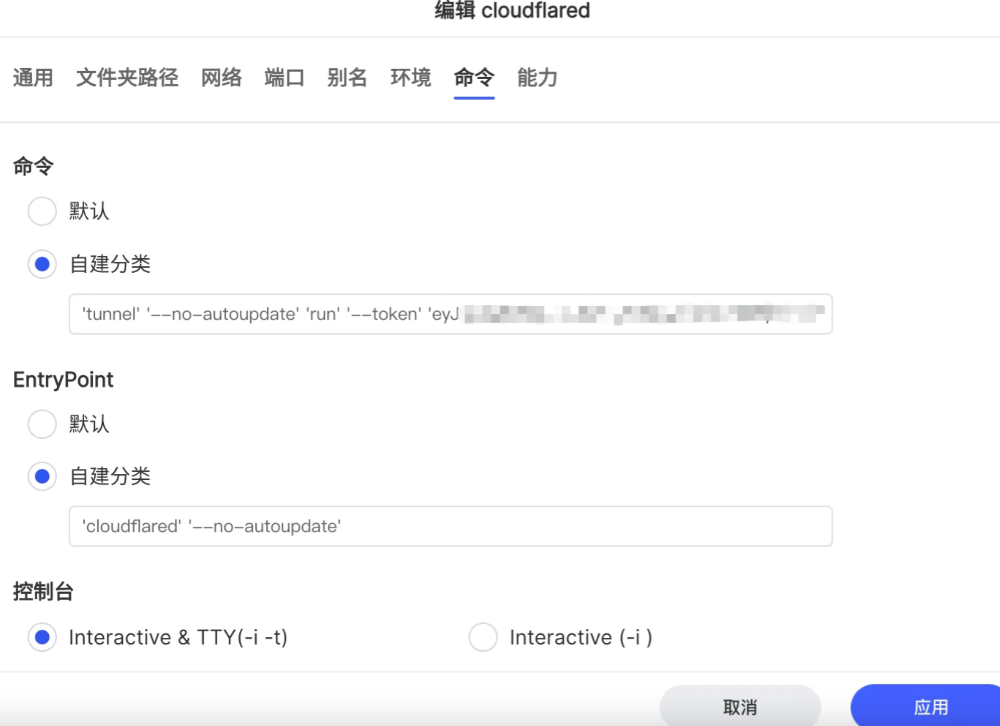
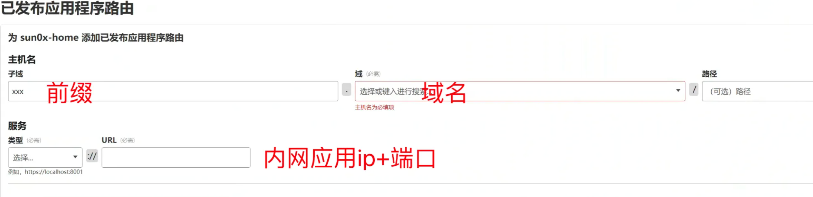

## 一、✅ 成功的终极指南：正确配置六步走

本指南将跳过所有错误和排查，为您提供最干净、最有效的配置步骤，实现公网域名（例如 `https://media.yourdomain.com`）对内网 Emby 服务（真实端口 `8096`）的 HTTPS 访问。

### 1. 准备工作：确认服务地址
<!-- more -->

在进行 Cloudflare 配置前，请确认您的内网服务（Emby）的 **真实、未被代理的** HTTP 地址。

* **Emby 真实地址：** `http://[您的内网IP]:8096`
    * **示例：** `http://192.168.50.118:8096`

### 2. 创建并启动 Cloudflare Tunnel

这是建立出站连接的关键步骤。

* **路径：** 登录 [Cloudflare Zero Trust](https://one.dash.cloudflare.com/) $\rightarrow$ **网络** $\rightarrow$ **Tunnels**。
* 

* **操作：**
    1.  创建新 Tunnel，并选择 **Docker** 环境。
    2.  复制系统提供的 **`docker run`** 命令，其中包含您的唯一 **Token**。
    3.  在您的 NAS/Docker 环境中，使用 **`--network host`** 参数启动容器，确保容器能访问主机上的内网 IP:
        > `docker run -d --name cloudflared --network host --restart unless-stopped cloudflare/cloudflared tunnel run --token <您的Token>`

### 3. 配置最终的域名路由

将公网域名映射到 Emby 的真实 HTTP 地址。

* **路径：** Tunnels 页面 $\rightarrow$ 选择您的 Tunnel $\rightarrow$ **已发布应用程序路由**。
* **配置内容：**

| 字段名称 | 填写内容 | 说明 |
| :--- | :--- | :--- |
| **主机名 (Subdomain)** | `media` (示例) | 您公网访问的域名 |
| **类型 (Type)** | **`HTTP`** | **重要：** 连接 Emby 真实端口，协议为 HTTP |
| **URL (必填)** | **`http://[您的内网IP]:8086`** | **Emby 服务的真实地址** |

### 4. 消除所有代理和端口占用（博主之前是lucky进行的反代没有取消，这里正常不要管）

在 Cloudflare Tunnel 直接连接 Emby 真实端口后，必须移除所有中间代理。

* **操作：** 登录 Lucky 代理界面，**删除或禁用** 所有与该域名 (`media.yourdomain.com`) 相关的 **Web 服务规则**。

### 5. 最终测试（直接访问域名即可，如https://blog.sun0x.com）

* 保存 Cloudflare Tunnel 路由配置。
* 清除浏览器缓存，访问：**`https://media.yourdomain.com`**。
* **结果：** 访问成功，流量路径：用户 (HTTPS 443) $\rightarrow$ Cloudflare $\rightarrow$ Tunnel $\rightarrow$ Emby (HTTP 8096)。

---

## 二、❌ 故障排除经验：我们遇到的陷阱和解决方案

在部署过程中，我们遇到了 Cloudflare Tunnel 用户的常见错误，这些经验能帮助您快速排查问题。

### 1. 错误：DNS 记录冲突

* **现象：** 在 Cloudflare Zero Trust 后台保存路由时，提示 **`A Warning: An A, AAAA, or CNAME record with that host already exists.`**。
* **原因：** 您的域名下已存在同名的 DNS 记录（例如，手动添加的 `emby` A记录），阻止了 Tunnel 自动创建 CNAME。
* **解决方案：** 登录 **Cloudflare DNS 管理界面**，找到并 **删除** 所有冲突的旧 A 或 CNAME 记录。

### 2. 错误：Error 1033 (Cloudflare Tunnel error)

* **现象：** 浏览器显示 Error 1033，提示 Cloudflare 无法解析。
* **原因：** `cloudflared` 容器未正确认证或运行。最常见是 **Docker 启动命令缺少 Token**。
* **解决方案：** 停止并重新运行 `cloudflared` 容器，确保 `docker run` 命令中包含正确的 `--token` 参数。

### 3. 错误：Error 502 (Bad Gateway) & `connection refused`

这是最复杂的错误，它表示 Tunnel 客户端无法连接到内网目标服务。日志显示：**`dial tcp 192.168.50.118:443: connect: connection refused`**。

| 错误原因 | 日志信息 | 解决方案 |
| :--- | :--- | :--- |
| **Docker 网络隔离 (Host)** | 即使是 Host 模式，NAS 内部服务也可能拒绝。 | **将服务监听 IP 改为 `0.0.0.0`**。确保 Lucky 代理或 Emby 服务监听所有接口。 |
| **错误地连接到代理 (Lucky)** | `originService=https://192.168.50.118:8443` | **将 Tunnel URL 直接指向 Emby 真实端口**：`http://[内网IP]:8096`。 |
| **TLS 验证失败 (HTTPS)** | 错误配置为 `https://` 且未禁用验证。 | 尽管最终使用了 HTTP 目标，如果坚持使用 HTTPS 目标，**必须** 在 Tunnel 路由的 **TLS 选项** 中勾选 **“No TLS Verify”**。 |

### 4. 性能优化建议

* **检查 SSL/TLS 模式：** 登录 Cloudflare **SSL/TLS** $\rightarrow$ **概览**，确保模式设置为 **“Full” (完整)**。
* **确认带宽：** Cloudflare Tunnel 的速度最终受限于您家庭宽带的 **上行带宽**。