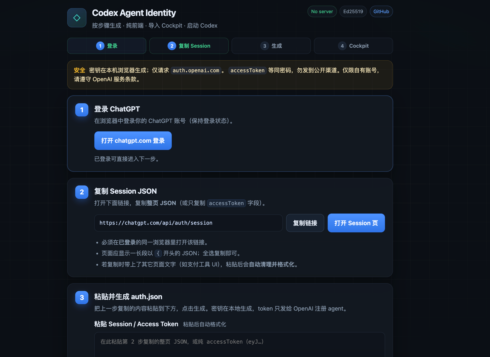
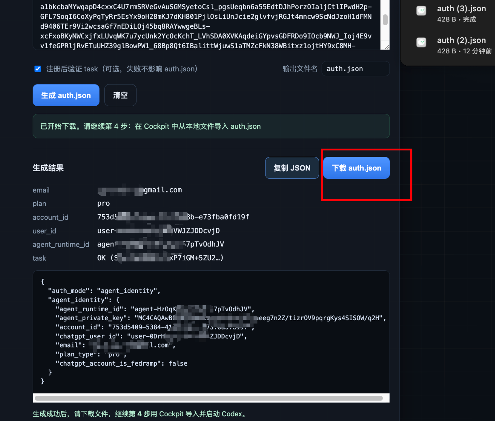
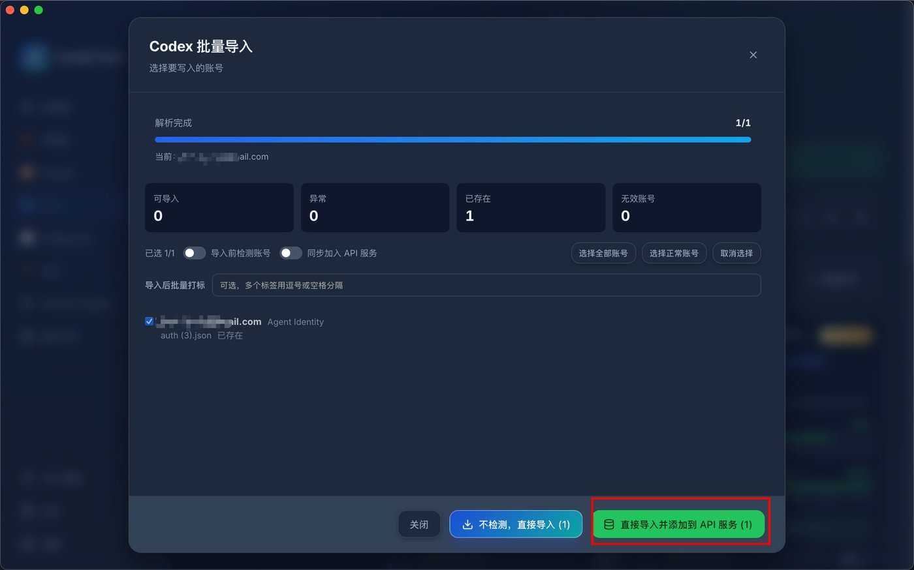
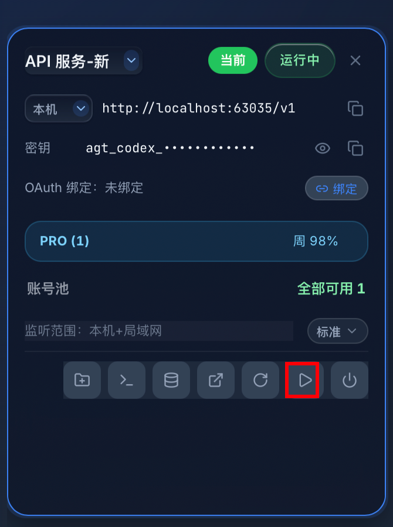

> ⚠️ **重要提醒（截止 2026 年 7 月 23 日）**  
> 该方法**新账号已无法使用**，生成 / 注册时可能出现 **403** 等错误。  
> **已经完成授权的账号不受影响**（此前已成功生成并导入使用的可继续用）。  
> 请勿再对新账号依赖本流程。在线工具页也会显示同一提醒： [https://codex.lucoo.net/](https://codex.lucoo.net/)

如果你已经能在浏览器中正常使用 ChatGPT，但在 Codex 客户端登录时不方便再次接收手机号短信验证码，可以利用浏览器里已有的登录状态生成 `auth.json`，再通过 Cockpit 导入并启动 Codex。

> 本文所说的“无需手机号短信验证”，是指无需在 Codex 客户端里重新完成一次手机号短信验证。第一次登录 ChatGPT 时，仍需按照账号原本支持的方式正常登录。

<!-- more -->

## 一、准备工作

开始前，请准备好：

- 一个可以正常使用的 ChatGPT 账号；
- 已经登录该账号的浏览器；
- [Cockpit](https://github.com/jlcodes99/cockpit-tools/releases)；
- 已安装的 Codex 客户端；
- `auth.json` 生成工具：[https://codex.lucoo.net/](https://codex.lucoo.net/)。

整个流程可以概括为：

```text
登录 ChatGPT → 复制 Session JSON → 生成 auth.json → 导入 Cockpit → 启动 Codex
```

## 二、生成 auth.json

### 1. 打开生成工具

访问：

[https://codex.lucoo.net/](https://codex.lucoo.net/)

页面会按照“登录、复制 Session、生成、导入 Cockpit”的顺序展示全部操作。



### 2. 登录 ChatGPT

点击页面中的“打开 chatgpt.com 登录”。

如果当前浏览器已经登录 ChatGPT，可以直接进入下一步；如果还没有登录，请先按照 ChatGPT 的正常流程完成登录，并保持当前浏览器的登录状态。

### 3. 复制 Session JSON

点击“打开 Session 页”，或者在同一个浏览器中访问：

[https://chatgpt.com/api/auth/session](https://chatgpt.com/api/auth/session)

页面正常时会显示一整段以 `{` 开头的 JSON。全选并复制整个页面内容即可，也可以只复制其中的 `accessToken` 字段。

这里必须使用已经登录 ChatGPT 的同一个浏览器，否则可能无法读取到当前账号的 Session。

### 4. 粘贴并生成 auth.json

回到 [Codex Agent Identity](https://codex.lucoo.net/) 页面，将刚刚复制的 Session JSON 或 `accessToken` 粘贴到输入框中，然后点击“生成 auth.json”。

页面解析成功后，会显示当前账号信息和生成结果。

### 5. 下载 auth.json

点击“下载 auth.json”，把生成的文件保存到本地。后面导入 Cockpit 时会用到这个文件。



## 三、在 Cockpit 中导入 auth.json

### 1. 下载并安装 Cockpit

打开 Cockpit Releases 页面：

[https://github.com/jlcodes99/cockpit-tools/releases](https://github.com/jlcodes99/cockpit-tools/releases)

按照自己的操作系统下载并安装。macOS 通常选择 `.dmg`，Windows 通常选择 `.msi`。

如果还没有使用过 Cockpit，可以先参考：[Cockpit 本地反代与多账号管理教程](https://lucoo.net/postsinfo/cockpit-local-reverse-proxy/)。

### 2. 导入 auth.json 到 API 服务

打开 Cockpit，进入 Codex 模块，然后：

1. 点击添加 Codex 账号；
2. 在弹窗顶部选择“导入”；
3. 点击“从本地文件导入”；
4. 选择刚刚下载的 `auth.json`；
5. 解析成功后，确认显示的是 **Agent Identity** 账号；
6. 点击绿色按钮 **「直接导入并添加到 API 服务」**（不要只点「不检测，直接导入」，这样才能写入 API 服务号池）。



如果提示「已存在」，说明该账号此前已导入过；可先删除旧记录再导入，或直接使用已有账号继续下一步。

### 3. 在 API 服务中点击「开始」

导入并加入 API 服务成功后，切换到 Cockpit 的 **API 服务** 卡片（例如「API 服务-新」）：

1. 确认状态为运行中，账号池中有可用账号；
2. 点击卡片底部工具栏中的 **播放 / 开始** 按钮；
3. Cockpit 会使用该 Agent Identity 账号池启动服务 / 进入 Codex，无需再走浏览器 OAuth 或短信接码。



> 本机地址类似 `http://localhost:xxxxx/v1`，密钥形如 `agt_codex_...`，可按需复制给本地客户端使用。
## 四、常见问题

### Session 页面没有显示 JSON

先确认当前浏览器已经登录 ChatGPT，并且打开 Session 页面时使用的是同一个浏览器和同一个浏览器配置文件。确认后刷新页面再试。

### 生成 auth.json 失败

重新复制完整的 Session 页面内容，确保没有漏掉开头或结尾。如果完整 JSON 无法识别，也可以只复制 `accessToken` 字段重新生成。

### Cockpit 导入失败

确认选择的是刚刚下载的 `auth.json`，并检查文件是否完整。导入时应识别为 Agent Identity 类型。

### 启动后仍然是旧账号

先完全退出 Codex、VS Code 以及其他正在使用 Codex 的程序，再回到 Cockpit 刷新账号并重新点击“开始”。

## 五、安全提醒

`Session JSON`、`accessToken` 和 `auth.json` 都属于账号认证信息：

- 不要发送到公开群聊；
- 不要上传到公开代码仓库或公共网盘；
- 不要交给不可信的人；
- 不再使用时，及时删除本地多余副本；
- 如果怀疑认证信息已经泄露，请立即退出相关账号会话并重新生成认证文件。

## 六、相关入口

- auth.json 生成工具：[https://codex.lucoo.net/](https://codex.lucoo.net/)
- 开源仓库：[https://github.com/JeremyPy/codex-agent-identity](https://github.com/JeremyPy/codex-agent-identity)
- ChatGPT：[https://chatgpt.com/](https://chatgpt.com/)
- Cockpit 下载：[https://github.com/jlcodes99/cockpit-tools/releases](https://github.com/jlcodes99/cockpit-tools/releases)
- Cockpit 完整教程：[https://lucoo.net/postsinfo/cockpit-local-reverse-proxy/](https://lucoo.net/postsinfo/cockpit-local-reverse-proxy/)

## 七、关键词 / Keywords

便于搜索发现（中英双语）：

**中文：** Codex Agent Identity · 无需手机号登录 Codex · Codex 无需验证码 · Codex 免短信 · Codex 免接码 · Codex 跳过手机验证 · ChatGPT Session 转 auth.json · Cockpit 导入 Codex · Codex CLI 登录 · agent_identity

**English:** Codex Agent Identity · Login to Codex without phone number · Codex no SMS verification · Codex without verification code · Skip phone verification for Codex · ChatGPT session to auth.json · Import auth.json into Cockpit · Codex CLI login · agent_identity · no-SMS Codex login

在线工具：[https://codex.lucoo.net/](https://codex.lucoo.net/)
