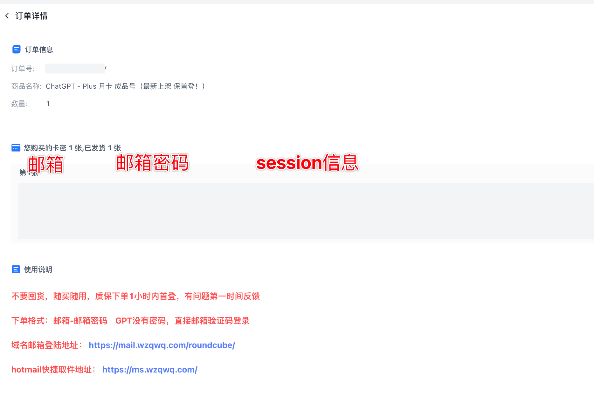
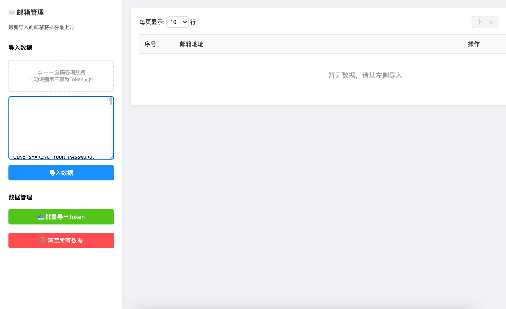
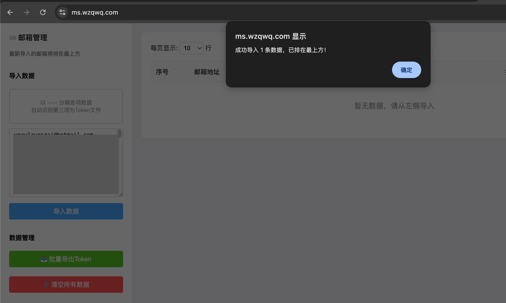
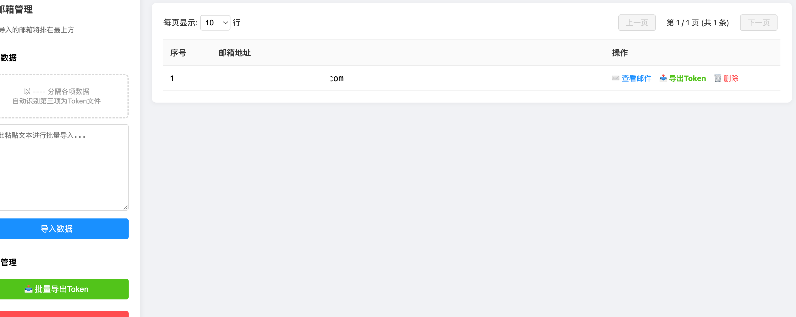
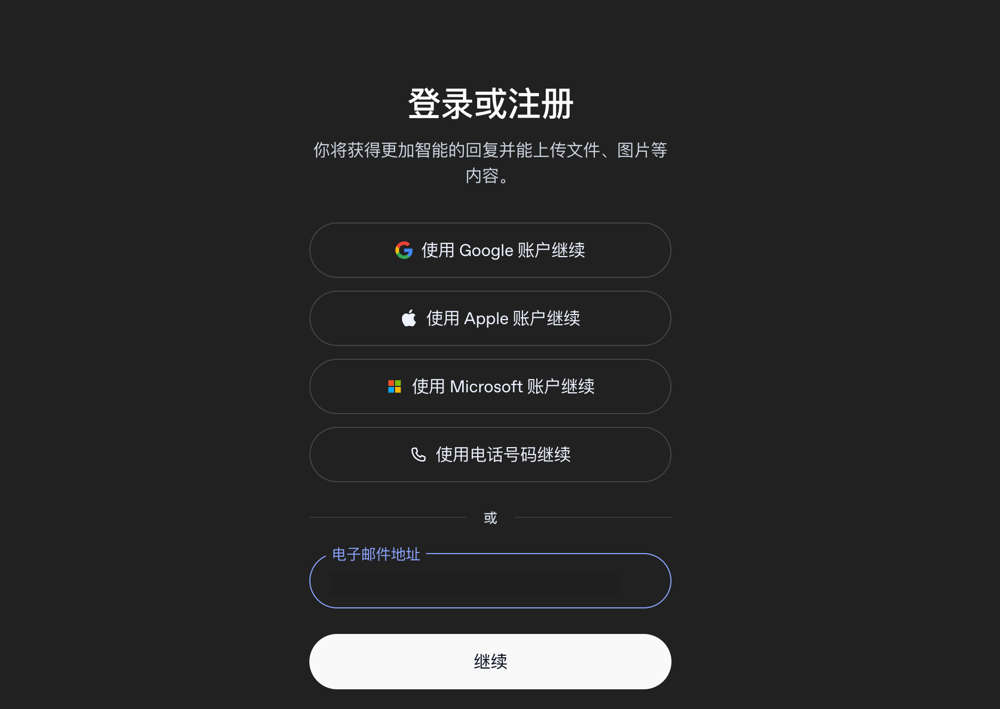
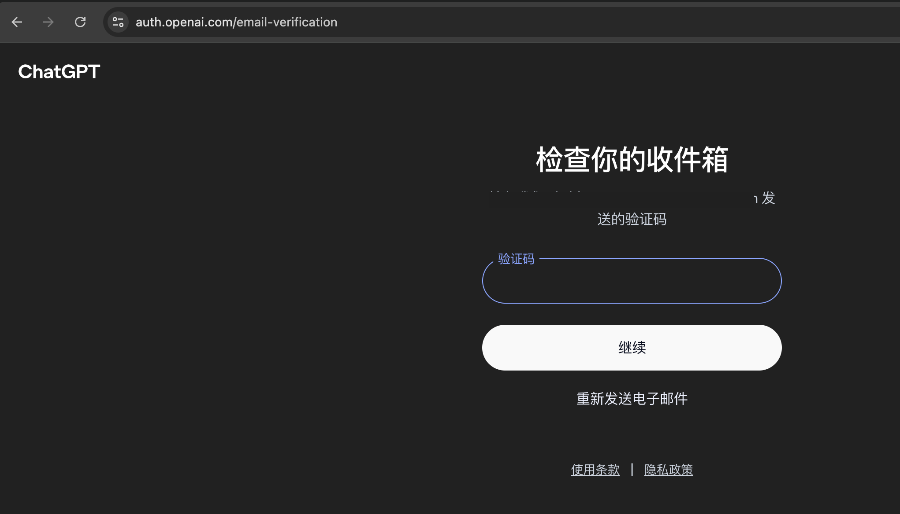
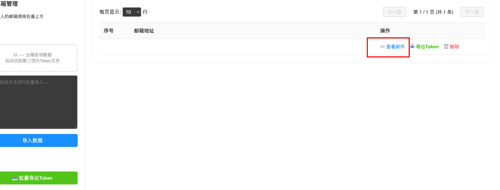
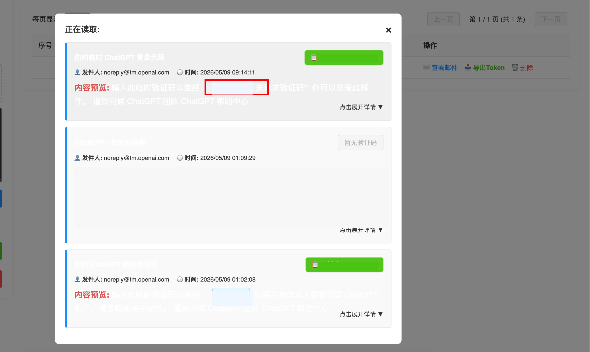
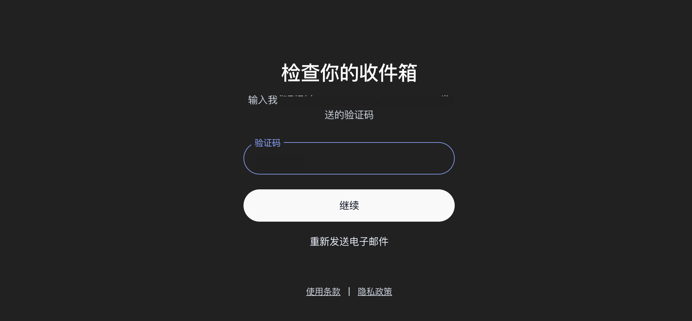
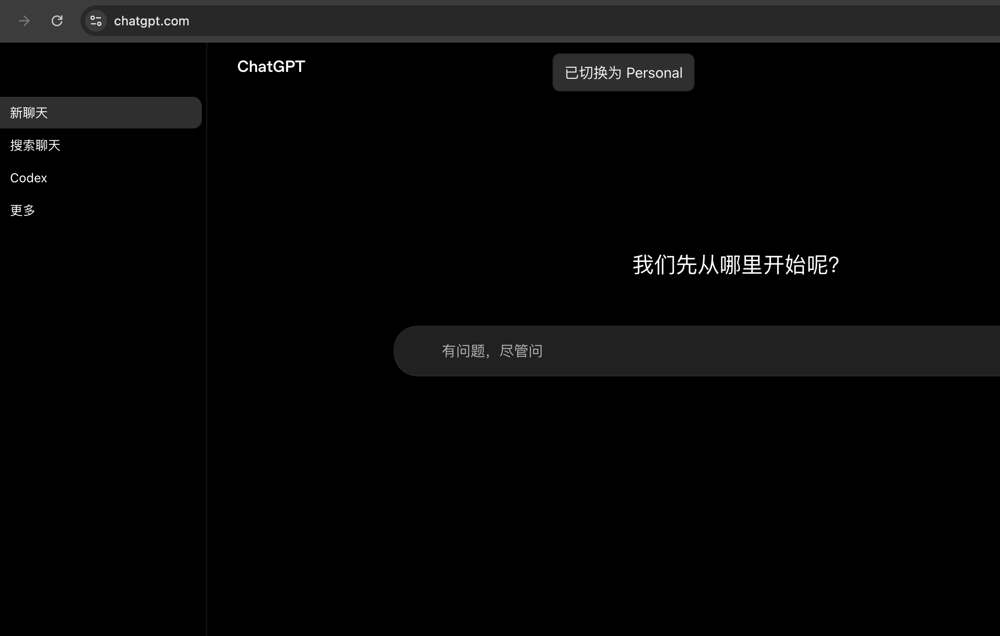

这篇手册适用于购买 18.8 元款 ChatGPT Plus 成品号后的首次登录。整个流程不需要 ChatGPT 密码，按订单里的邮箱信息进入取件工具，拿到验证码后登录 ChatGPT 即可。

> 公开页面中的邮箱、密码、Session 和验证码均已打码。你自己操作时不要把完整卡密、Session、验证码截图发到公开群聊或网站。

## 一、准备信息

打开订单详情，先确认你拿到的卡密内容。一般会包含三部分：

| 项目 | 说明 |
| --- | --- |
| 邮箱 | 用来登录 ChatGPT 的账号邮箱 |
| 邮箱密码 | 用于邮箱后台或取件工具识别 |
| Session 信息 | 取件工具需要用到的辅助信息 |

常用地址如下：

| 用途 | 地址 |
| --- | --- |
| 域名邮箱登录地址 | [https://mail.wzqwq.com/roundcube/](https://mail.wzqwq.com/roundcube/) |
| Hotmail 快捷取件地址 | [https://ms.wzqwq.com/](https://ms.wzqwq.com/) |
| ChatGPT 登录地址 | [https://chatgpt.com/](https://chatgpt.com/) |

## 二、导入邮箱数据

进入邮箱取件工具后，把订单里的整段卡密粘贴到左侧输入框。不要只复制邮箱或邮箱密码，需要把完整卡密一起粘贴进去。

点击「导入数据」。页面提示导入成功后，说明取件工具已经识别到这条邮箱数据。

导入成功后，右侧列表会出现对应邮箱。后面要取 ChatGPT 验证码时，点击这一行右侧的「查看邮件」即可。

## 三、登录 ChatGPT

打开 [https://chatgpt.com/](https://chatgpt.com/)，在登录或注册页面输入订单里的邮箱地址，然后点击继续。

ChatGPT 会提示检查收件箱，这时不要关闭当前页面，保持验证码输入框打开。

## 四、获取验证码

回到取件工具，刷新或打开对应邮箱，点击「查看邮件」。

找到最新的 ChatGPT 登录验证码邮件，复制绿色按钮或邮件预览中显示的验证码。验证码有时效性，如果输入后提示错误，重新发送并获取最新验证码。

回到 ChatGPT 验证码页面，粘贴验证码并点击继续。

登录成功后，页面会进入 ChatGPT 主界面。如果看到已切换到 Personal 或可以正常发起对话，就说明这一步已经完成。

## 五、常见问题

### 1. 验证码提示不正确

优先确认验证码是不是最新邮件里的那一条。验证码会过期，也可能被新的验证码覆盖；遇到错误时，回到 ChatGPT 页面重新发送，再去取件工具刷新邮件。

### 2. 取件工具里看不到邮件

先确认卡密已经完整导入，不要只粘贴邮箱。导入后仍然没有邮件，可以等待几秒刷新；如果长时间没有收到，回到 ChatGPT 页面重新发送验证码。

### 3. 登录后没有进入 Plus

先确认是否登录到了订单里的邮箱账号。如果邮箱无误但页面状态异常，保留下单订单号和当前截图，第一时间反馈处理。

## 六、安全提醒

- 完整卡密、Session 和验证码都属于敏感信息，不要公开发送。
- 首次登录建议在下单后尽快完成，遇到问题及时反馈。
- 不要自行修改邮箱密码、绑定信息或尝试转移账号，避免影响后续使用和售后处理。
