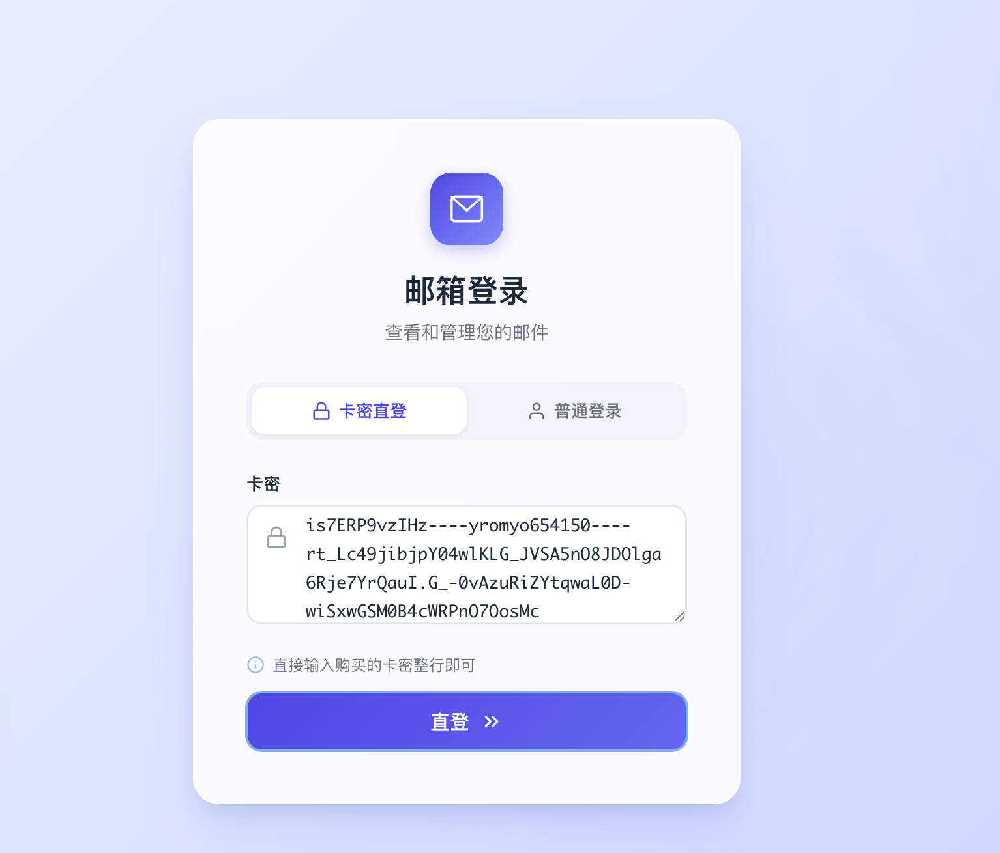
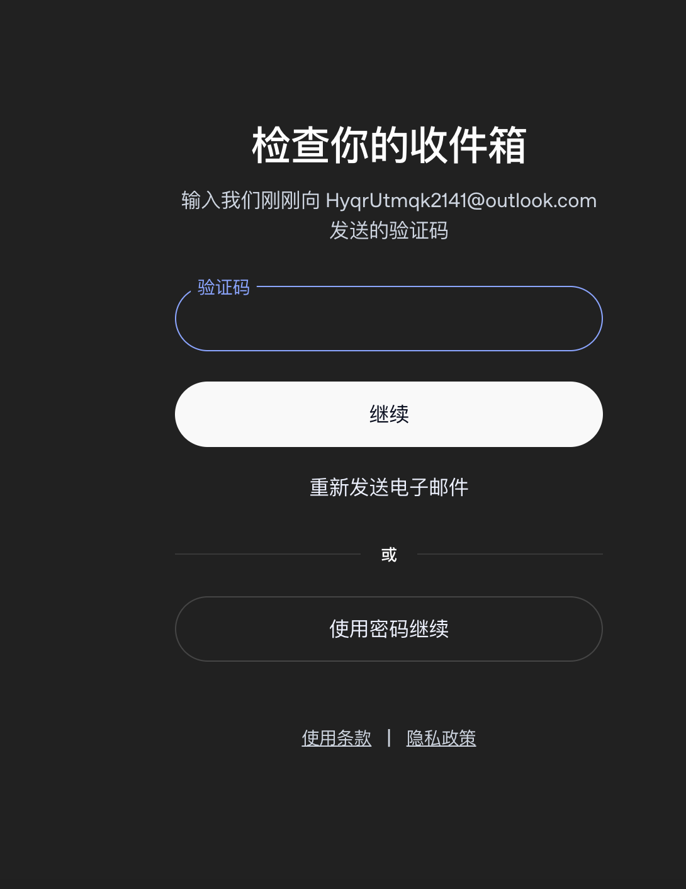
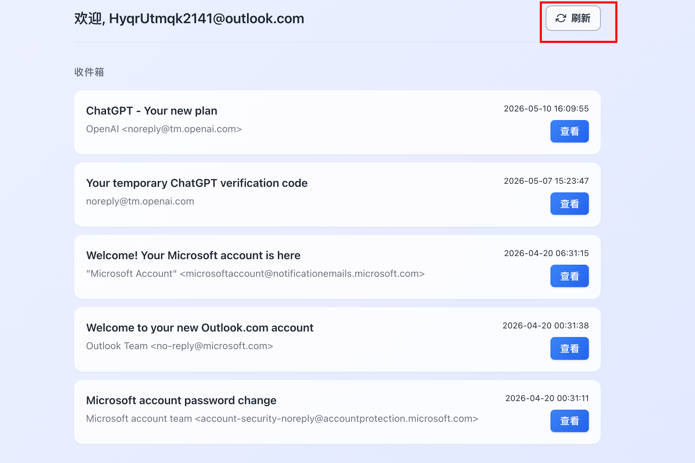
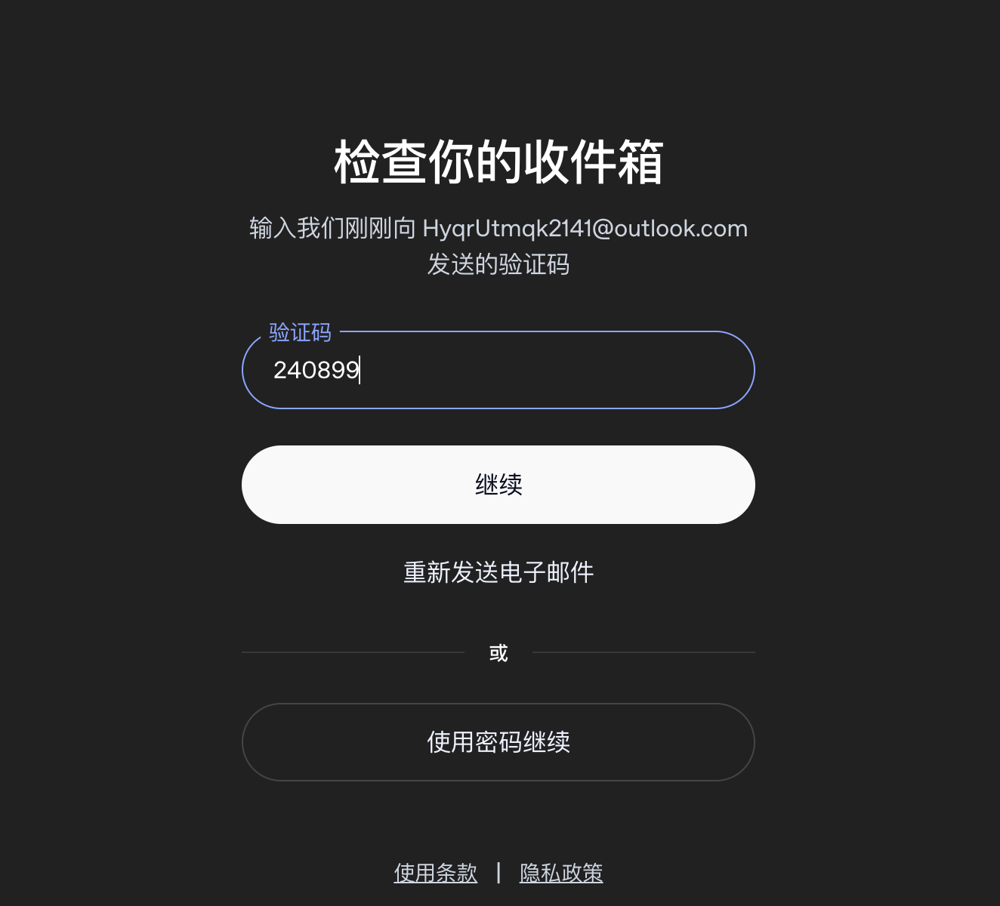
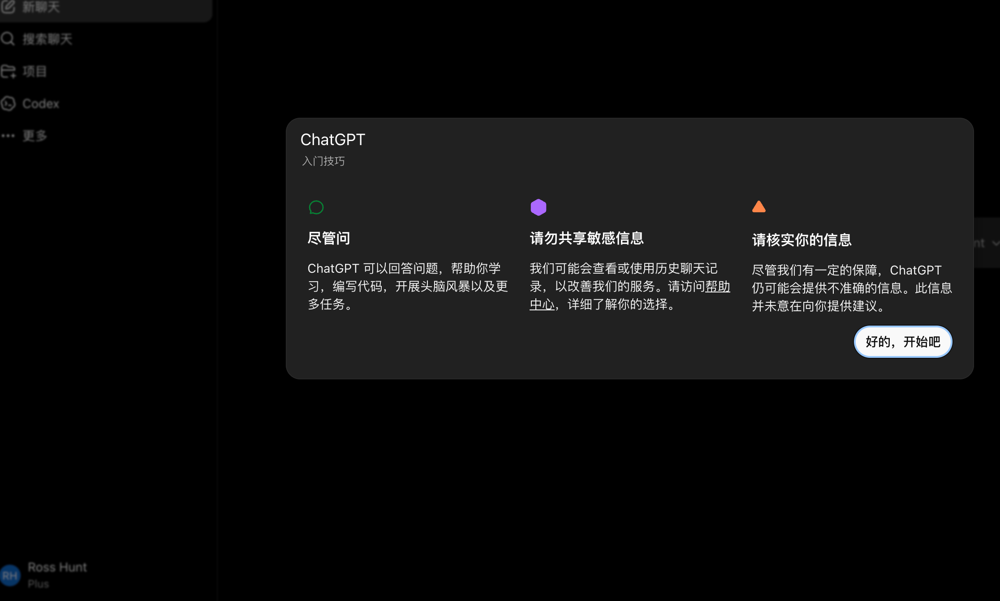

这篇手册适用于购买 4.88 元款 ChatGPT 账号后的首次登录。整个流程的核心是：先用订单里的完整卡密进入邮箱取件工具，再到 ChatGPT 发起邮箱验证码登录，最后回到取件工具刷新并复制验证码。

> 公开页面中的邮箱、密码、Session 和验证码均已脱敏。实际操作时，不要把完整卡密、验证码或登录后的账号信息发到公开群聊、网站或截图里。

## 一、准备信息

打开订单详情，先找到完整卡密。卡密通常是一整段由多个字段组成的内容，可能包含邮箱、邮箱密码、取件参数和 Session 信息。

示例格式如下，实际内容以你的订单为准：

```text
example@outlook.com----邮箱密码----取件参数----session_xxx
```

常用地址如下：

| 用途 | 地址 |
| --- | --- |
| 邮箱取件工具 | [https://ms.lqqq.cc/](https://ms.lqqq.cc/) |
| ChatGPT 登录地址 | [https://chatgpt.com/](https://chatgpt.com/) |

## 二、进入邮箱取件工具

打开 [https://ms.lqqq.cc/](https://ms.lqqq.cc/)，把订单里的完整卡密粘贴进去。不要只复制邮箱，也不要漏掉后面的取件参数和 Session 信息，否则工具可能无法识别邮箱。

粘贴完成后，按页面提示进入邮箱取件页面。



## 三、登录 ChatGPT

打开 [https://chatgpt.com/](https://chatgpt.com/)，进入登录页面后输入订单卡密里的邮箱地址，然后点击继续。



ChatGPT 会向这个邮箱发送登录验证码。此时不要关闭 ChatGPT 页面，保持验证码输入框打开，后面复制验证码后还要回到这里继续。

## 四、获取邮箱验证码

回到邮箱取件工具页面，点击刷新按钮，等待最新邮件出现。



找到 ChatGPT 发来的最新验证码邮件后，复制验证码。验证码有时效性，如果页面里出现多封验证码邮件，优先使用最新收到的那一封。



## 五、完成登录

回到 ChatGPT 的验证码页面，把刚刚复制的验证码粘贴进去，然后点击继续。



验证通过后会进入 ChatGPT 主界面。能正常看到对话页面并发送消息，就说明登录已经完成。

## 六、常见问题

### 1. 验证码提示错误

优先确认验证码是不是最新邮件中的那一条。验证码会过期，也可能被后一次发送的新验证码覆盖。遇到错误时，回到 ChatGPT 页面重新发送验证码，再去取件工具刷新邮件。

### 2. 邮箱取件工具看不到验证码

先确认卡密是否完整粘贴，不要只粘贴邮箱。如果卡密完整但暂时没有邮件，可以等待几秒后刷新；仍然没有收到时，回到 ChatGPT 页面重新发送验证码。

### 3. 登录页面一直卡住

可以先刷新 ChatGPT 页面，或换一个浏览器重新打开 [https://chatgpt.com/](https://chatgpt.com/)。如果你使用了代理，建议保持同一个稳定节点，不要在验证码登录过程中频繁切换网络。

## 七、安全提醒

- 完整卡密、邮箱密码、Session 和验证码都属于敏感信息，不要公开发送。
- 验证码只用于本次登录，不要把验证码发给陌生人或第三方网站。
- 首次登录建议尽快完成；遇到无法登录、验证码异常或账号状态不对时，保留订单号和关键截图后反馈处理。
