## 一、完整操作步骤

### 1. 进行下单购买

店铺购买地址：[https://pay.ldxp.cn/shop/Lucoo](https://pay.ldxp.cn/shop/Lucoo)

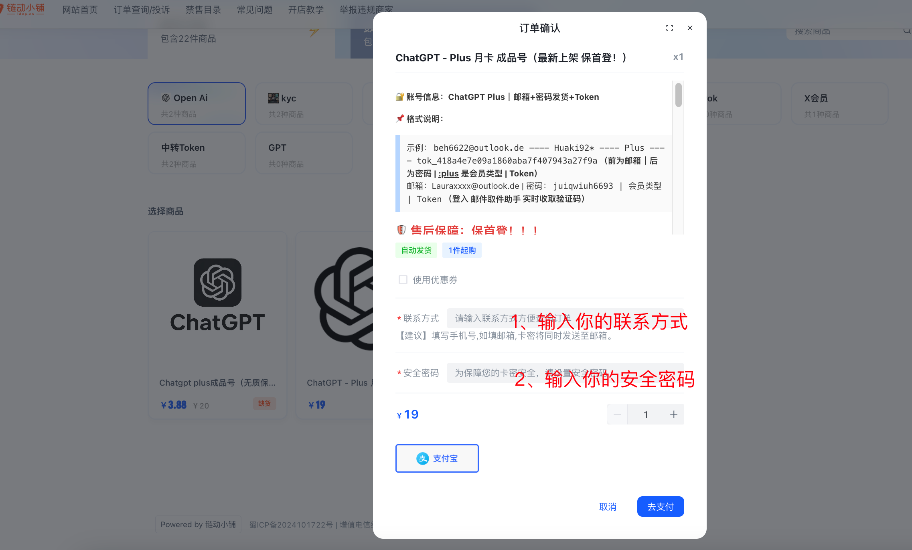

### 2. 购买完成后查看你的卡密信息

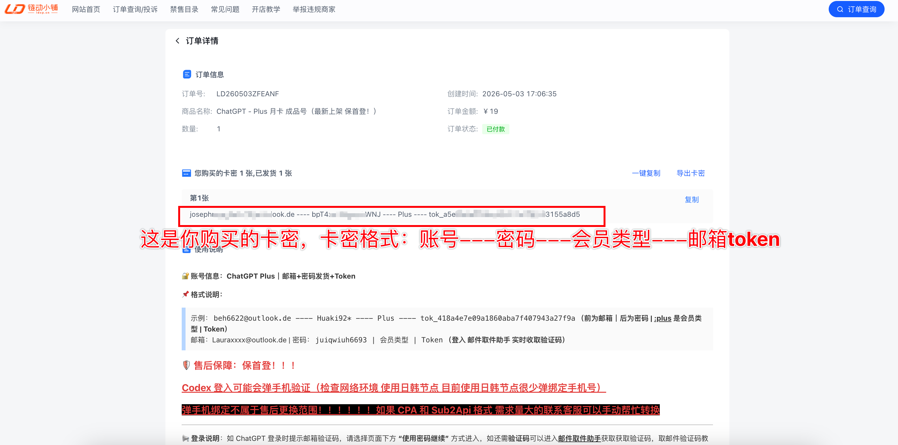

### 3. 登录 ChatGPT

登录 [https://chatgpt.com/](https://chatgpt.com/) 或者使用 APP 登录，以下演示为网页端登录演示。

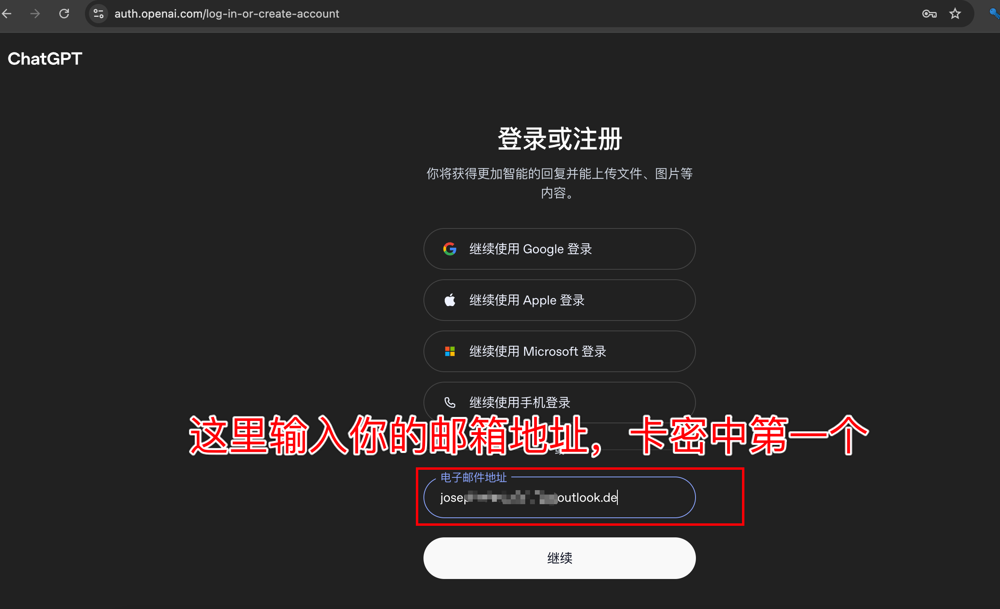

### 4. 获取邮箱验证码

在上图中点击继续，出现如下提示，此时需要去邮箱中获取验证码。

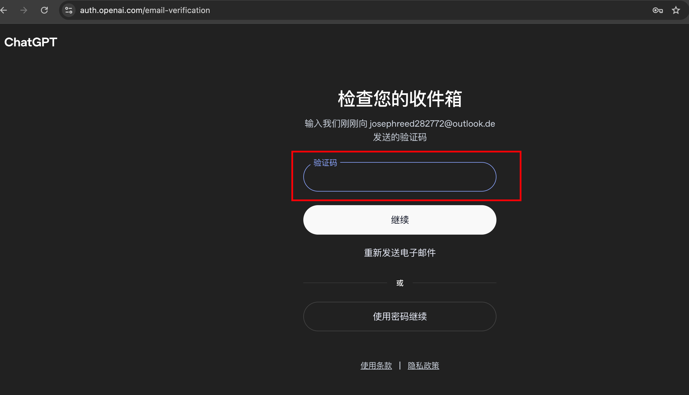

### 5. 进入邮件取件助手

邮件取件助手地址：[https://email.nloop.cc/](https://email.nloop.cc/)

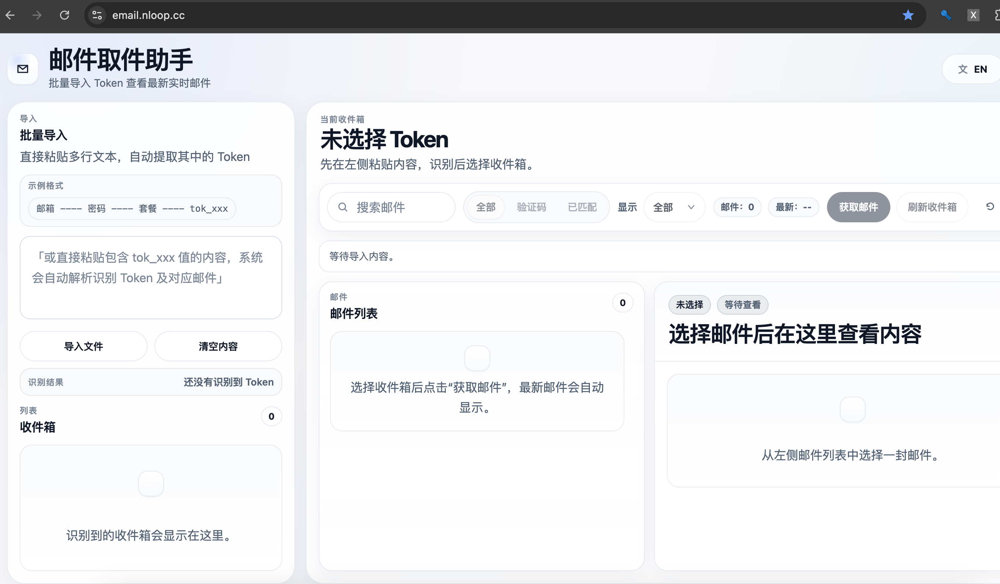

### 6. 获取邮件

将我们的卡密全部粘贴到左上角的输入框中，并获取邮件，如下图所示：

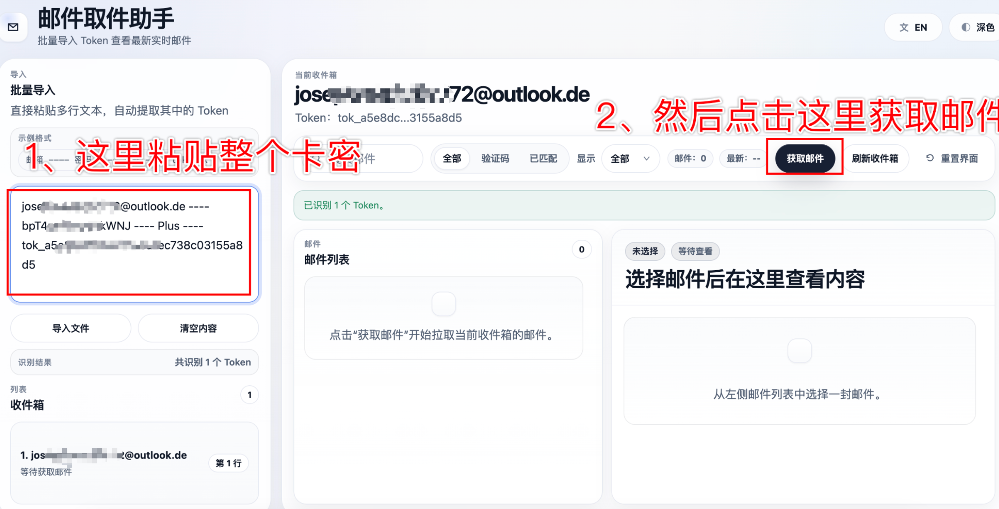

### 7. 复制验证码

然后拿到验证码粘贴到 ChatGPT 的验证码输入框中。

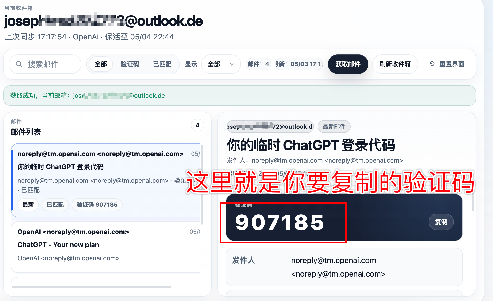

### 8. 输入验证码并继续

输入我们拿到的验证码，并点击继续。

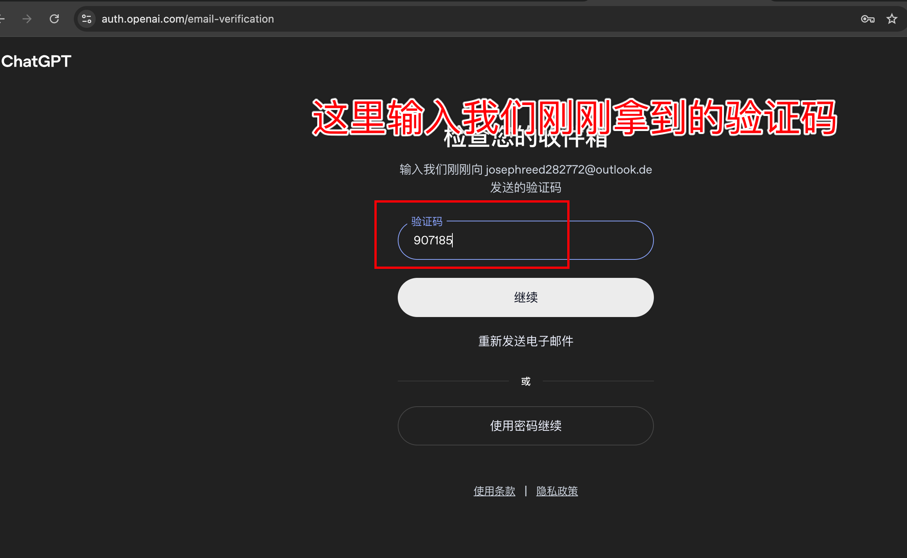

### 9. 等待跳转

点击继续完成后等待跳转到如下图所示。

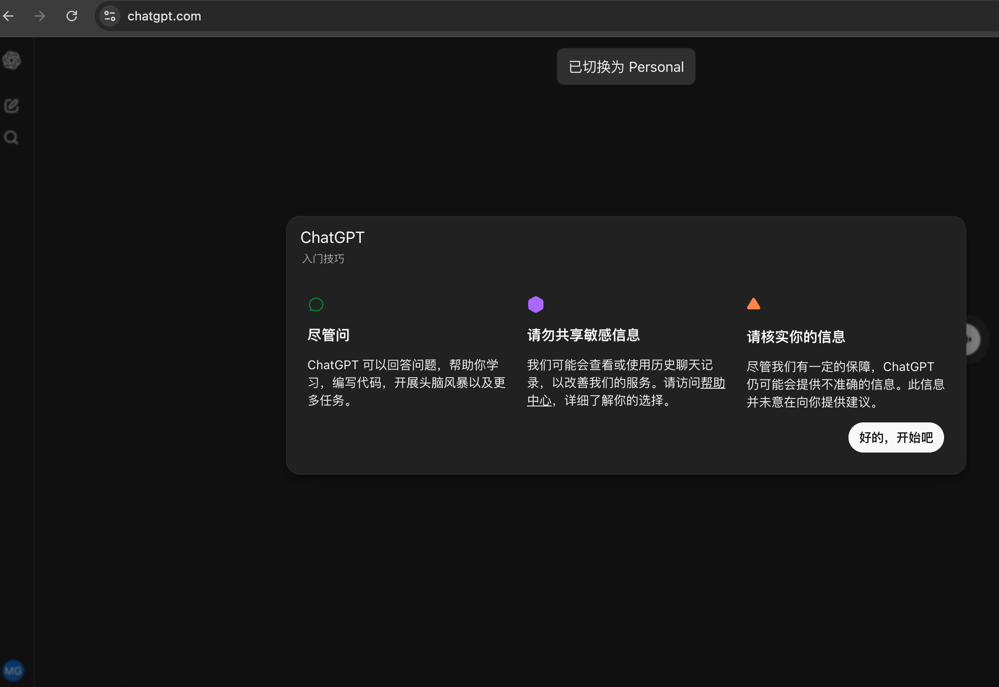

### 10. 确认账号状态

查看自己的账号为 Plus，一切正常，然后可以开始愉快的 AI 体验了！

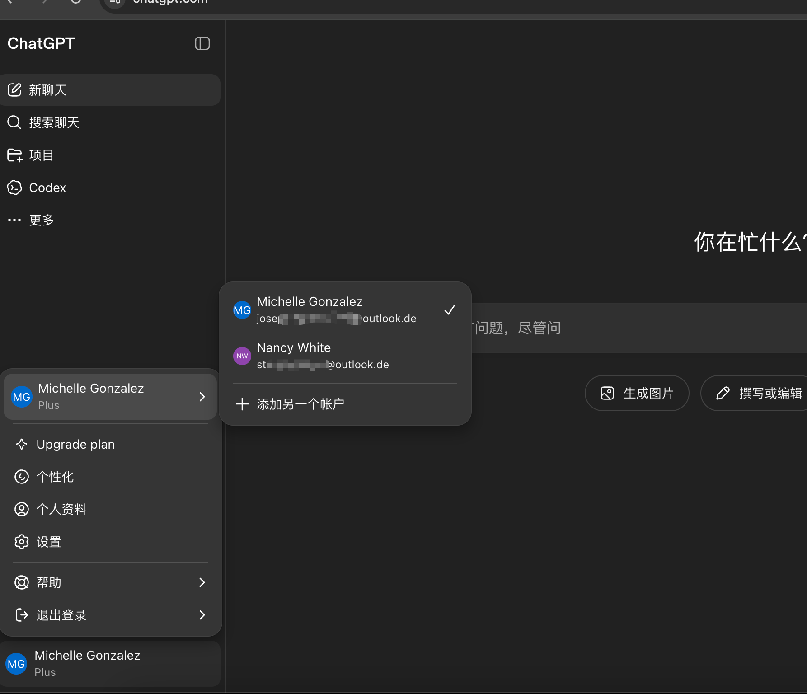

## 二、其他问题

### 1. 验证码不对

验证码不对，说明验证码拿的过期了，需要重新获取一次。

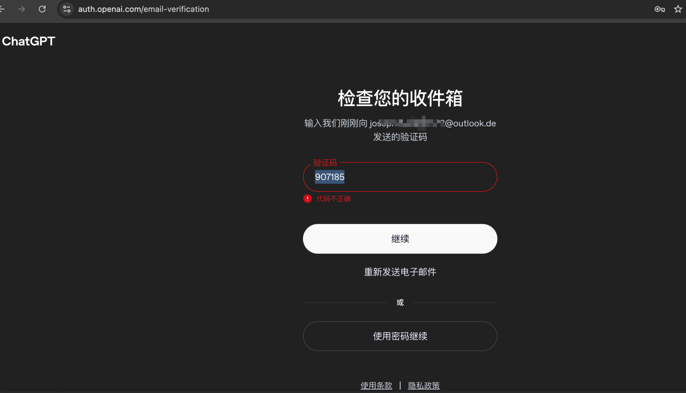

### 2. Codex 需要验证码

Codex 需要验证码，这种切换到日本、韩国、新加坡的代理上试试，如果不行找群主接个码。

接码时间可能比较长，因为不是每个手机号都能接上，需要大家耐心耐心耐心！！！因为确实很耗费时间和精力。

注意：只有购买本商店产品才可以，提供你的订单号，群主免费帮忙接！！！

如果自己有条件，不愿意等待的可以去 [https://hero-sms.com/](https://hero-sms.com/) 上接一下码，群里不发地址了，可能涉嫌违规。

这个站点注册的时候密码输入类似以下格式不会出现无法注册的情况，无法注册大概率是密码问题：

```text
Jp,.123456789
```

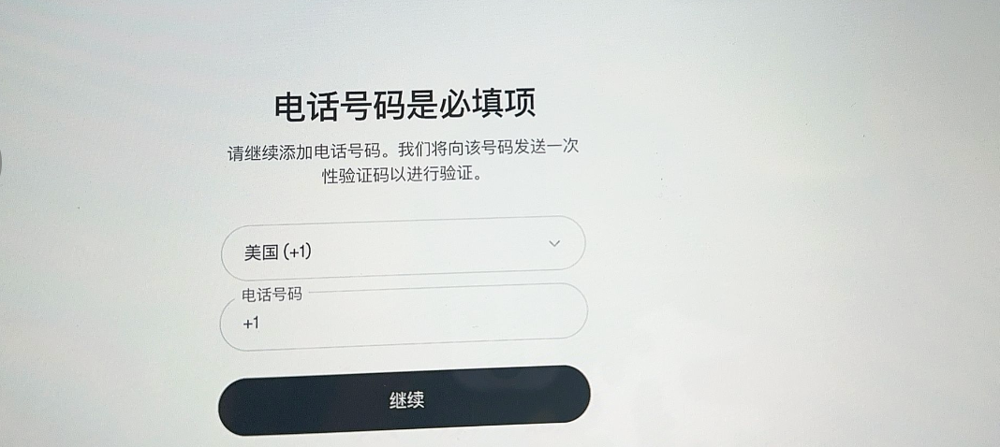
