> 这是一篇给新手看的 0 刀虚拟卡开通 ChatGPT Plus 实操教程。流程里会涉及账号、代理、虚拟卡、PayPal、接码和支付链接，变量比较多；如果你不想自己一点点排查，可以直接看 Lucoo 店铺：[https://pay.ldxp.cn/shop/Lucoo](https://pay.ldxp.cn/shop/Lucoo)。
>
> 本文会用到的常用工具：转长链 [https://gpt.mooizz.com/](https://gpt.mooizz.com/)，配套工具 [https://faka.gsyun.cloud/](https://faka.gsyun.cloud/)，Plus 跳手机 / 直取 JSON [https://gtxx3600.github.io/GPTSession2CPAandSub2API/](https://gtxx3600.github.io/GPTSession2CPAandSub2API/)。后续如果只是想用模型 API，可以走 Lucoo 中转站：[https://cc.lucoo.net](https://cc.lucoo.net)。

## 先说结论

0 刀虚拟卡开 Plus 的核心不是“找到一张卡”这么简单，而是要让账号、支付地区、代理 IP、虚拟卡账单地址、PayPal 手机验证这些信息尽量一致。只要其中一项明显对不上，就容易出现支付失败、验证失败、PayPal 卡住、或者 ChatGPT 页面返回 404。

完整链路大致是：准备有试用资格的 ChatGPT 账号 -> 准备指纹浏览器 -> 购买或准备美国住宅代理 -> 准备 0 刀虚拟卡和 PayPal 接码 -> 提取 ChatGPT Session -> 生成 Plus 试用支付链接 -> 在指纹浏览器里完成 PayPal 绑定和验证 -> 成功后检查 Plus 状态并处理续费。

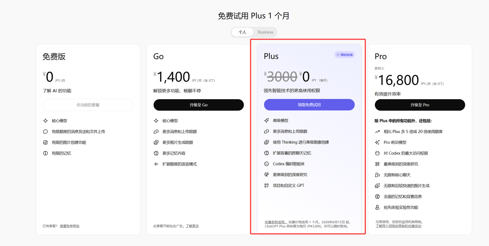

## 准备清单

开始前先把材料准备齐，别边做到支付页边临时找东西。建议按下面顺序检查：

| 准备项 | 为什么需要 | 不会弄怎么办 |
| --- | --- | --- |
| 有 Plus 试用入口的 ChatGPT 账号 | 没有试用资格就无法 0 刀开通 | 换邮箱重新注册，或者直接买现成账号 |
| 指纹浏览器 | 隔离浏览器环境，减少账号串环境 | 按本文用 Roxy 这类工具即可 |
| 美国住宅代理 | 让支付环境和虚拟卡账单地址匹配 | 不要用普通机房节点硬试 |
| 0 刀虚拟卡 | 用于 PayPal 或支付验证 | 可以去店铺看现成方案 |
| PayPal 接码手机号 | PayPal 验证时收短信 | 没有接码就不要继续到支付页 |
| 转链 / JSON 工具 | 用 Session 生成或检查支付链接 | 用文首工具入口 |

如果你只是想尽快用上 Plus 或 GPT API，不想处理这些变量，可以直接看 Lucoo 店铺：[https://pay.ldxp.cn/shop/Lucoo](https://pay.ldxp.cn/shop/Lucoo)。

## 一、准备一个有试用资格的 ChatGPT 账号

账号必须能看到 Plus 试用入口。没有试用资格时，后面的支付链路再完整也没有意义，因为优惠不会真正套上去。

建议注册时注意三点：

1. 使用相对干净的邮箱，比如 Outlook、Gmail 或自己的域名邮箱。
2. 注册时优先使用日本等质量较好的节点，减少一开始就触发风控。
3. 如果使用域名邮箱，域名邮箱建议做成 `edu.xxx.xxx` 这种子域形式，例如在 Cloudflare 电子邮件路由里给域名增加 `edu` 子域。

为什么要重视邮箱和注册节点？因为试用资格通常和账号画像有关。邮箱质量、注册 IP、历史行为都会影响后续页面是否给你试用入口。

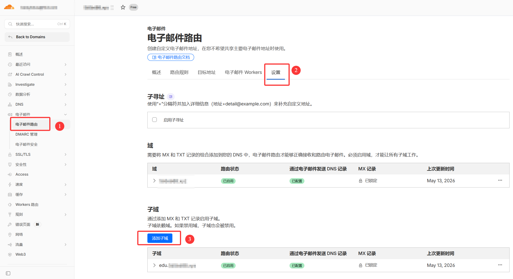

## 二、准备指纹浏览器和住宅代理

这里以 Roxy 指纹浏览器为例，下载地址是 `https://roxybrowser.cn/download`。指纹浏览器的作用是隔离浏览器环境，避免 cookie、设备指纹、语言、时区、代理等信息互相污染。

住宅代理的重点是地区匹配。住宅代理可以用 `cliproxy` 这类平台，小流量套餐通常就够完成一次流程。你也可以使用其他住宅代理，但要满足这些条件：

1. IP 是美国住宅或接近真实用户环境的代理。
2. 州最好和虚拟卡账单地址一致。
3. 城市能一致更好，至少不要跨到完全不相关的地区。
4. 支付前必须再测一次 IP，因为代理可能会变。

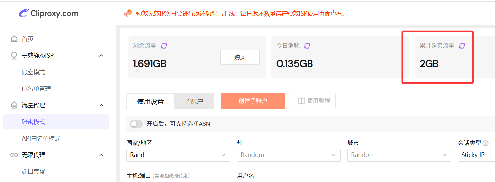

## 三、准备 0 刀虚拟卡和 PayPal 接码

0 刀虚拟卡和 PayPal 接码可以从卡密平台购买。平台不是重点，重点是你要确认自己拿到的信息完整，至少包括下面这些：

| 信息 | 用途 |
| --- | --- |
| 虚拟卡卡号 | 后续 PayPal 或支付验证使用 |
| 有效期和安全码 | 完成卡片校验 |
| 账单地址 | 用来匹配代理地区和支付页地址 |
| PayPal 接码手机号 | PayPal 注册或验证时接短信 |
| 接码取件链接 | 收取 PayPal 验证码 |

如果你不想自己买卡、买代理、接码、排查，可以直接走 Lucoo 店铺：[https://pay.ldxp.cn/shop/Lucoo](https://pay.ldxp.cn/shop/Lucoo)。自己操作时，失败成本通常不在单个卡密，而在反复排查代理和 PayPal 风控上。

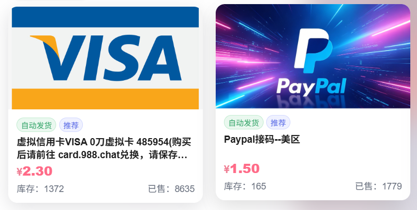

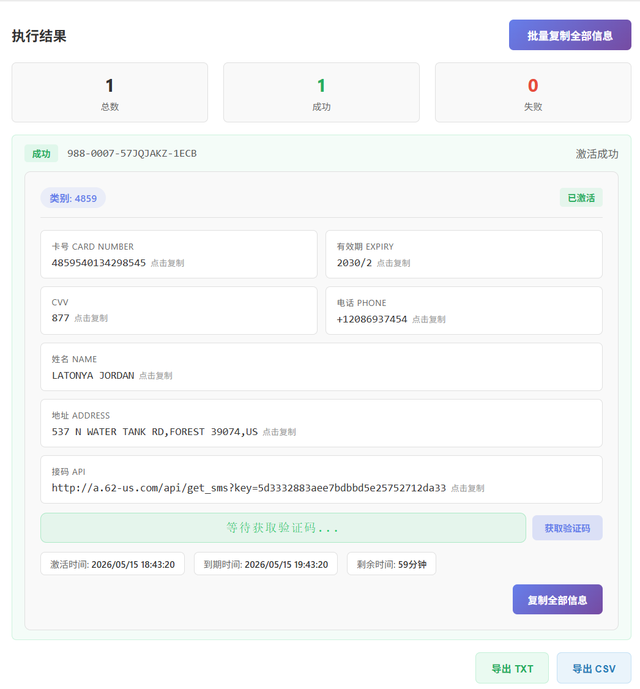

## 四、根据虚拟卡地址匹配代理

拿到虚拟卡以后，先看它的账单地址。举个例子，虚拟卡后台可能会给你类似下面这样的地址：

```text
537 N WATER TANK RD, FOREST 39074, US
```

这类地址需要拆成国家、州、城市、邮编等字段。不会拆的话，可以问 AI：“把这个美国地址拆成街道、城市、州、邮编和国家”。然后在住宅代理平台里按同一个州去生成代理。

这里最关键的规则是：代理 IP 至少要和虚拟卡在同一个州，城市能一致更好。原因是支付系统会综合判断账单地址、IP 地址、PayPal 账号地区和浏览器环境。如果 IP 在 A 州，账单地址在 B 州，就更像异常交易。

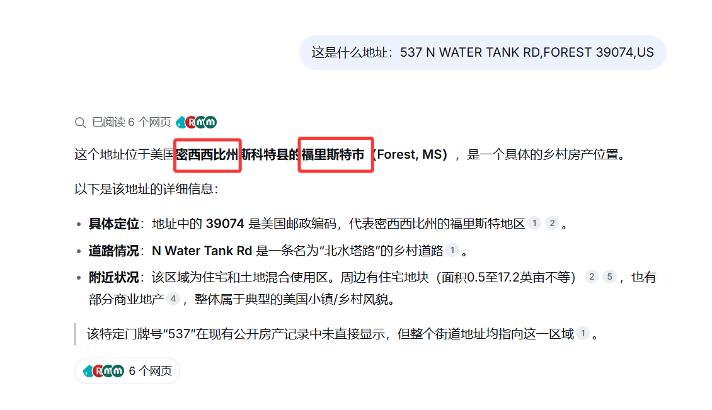

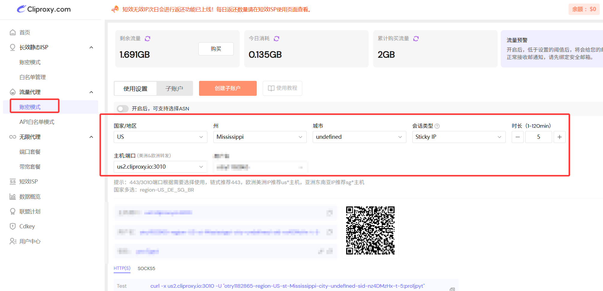

## 五、把代理填进指纹浏览器并测试

代理生成后，把主机、端口、用户名、密码填进指纹浏览器。保存之前先做连通性测试，保存之后再打开 IP 检测页面确认地区。

建议测试两类信息：

1. IP 所在国家、州、城市。
2. IP 纯净度，比如是否是机房、代理、黑名单或高风险地址。

可以用 `ippure.com` 检查纯净度。只要测试结果和虚拟卡地址差距太大，就不要继续支付，先换代理。

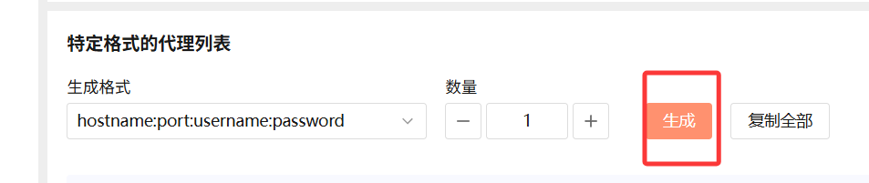

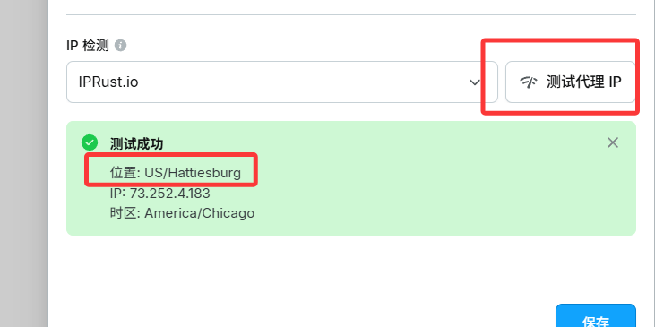

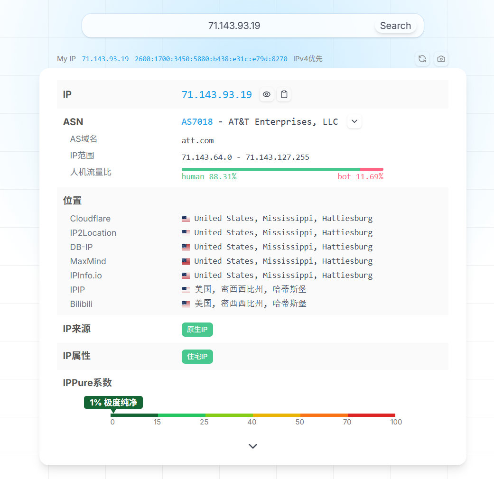

## 六、登录 ChatGPT 并提取 Session

所有后续操作都建议在同一个指纹浏览器里完成。先打开 [https://chatgpt.com/](https://chatgpt.com/) 登录目标账号。登录后如果账号菜单里仍是 Free，说明当前账号还没有开通 Plus，可以继续提取 Session 生成试用支付链接。

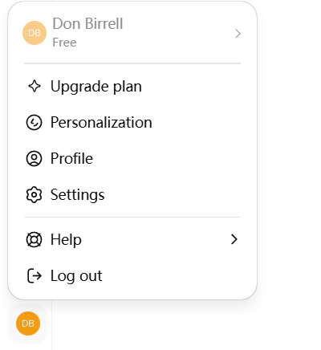

然后新开标签页访问：

```text
https://chatgpt.com/api/auth/session
```

页面会返回一段 JSON，里面通常能看到 Session 相关信息。后续生成 Plus 支付链接时，需要用到这段登录态。

如果你不知道怎么从 Session 里转支付链接，可以使用你给的工具入口：

- 转长链：[https://gpt.mooizz.com/](https://gpt.mooizz.com/)
- Plus 跳手机 / 直取 JSON：[https://gtxx3600.github.io/GPTSession2CPAandSub2API/](https://gtxx3600.github.io/GPTSession2CPAandSub2API/)

注意：Session 等同于账号临时凭证，不要发到公开群里，也不要截图泄露。

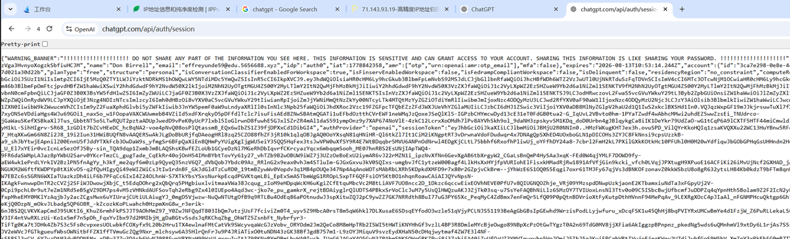

## 七、生成 Plus 支付链接并打开

生成 Plus 试用支付链接有几种方式：可以用脚本、工具站，或者相关机器人。你不需要纠结工具形式，目标只有一个：拿到当前账号对应的 ChatGPT Plus checkout 链接。

如果打开链接后出现 404，可以尝试：

1. 检查短链是否过期。
2. 用转长链工具重新转换。
3. 如果链接里有 `/openai_ie/`，尝试删除这一段后再访问。
4. 回到同一个 ChatGPT 登录环境重新生成支付链接。

打开支付链接时仍然要在前面配置好的指纹浏览器里操作，不要复制到普通浏览器里。否则账号登录态、代理 IP 和浏览器指纹都会变化。

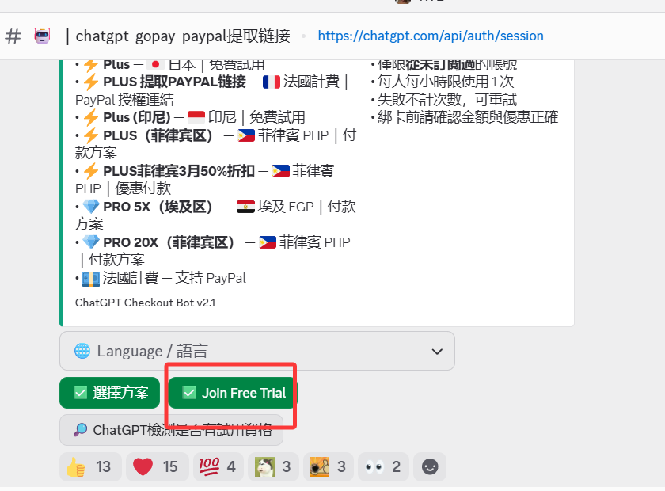

如果工具返回的是 `pay.openai.com` 的长链接，先保存好这个链接，后面浏览器异常、页面刷新或需要重新进入支付页时会用得上。

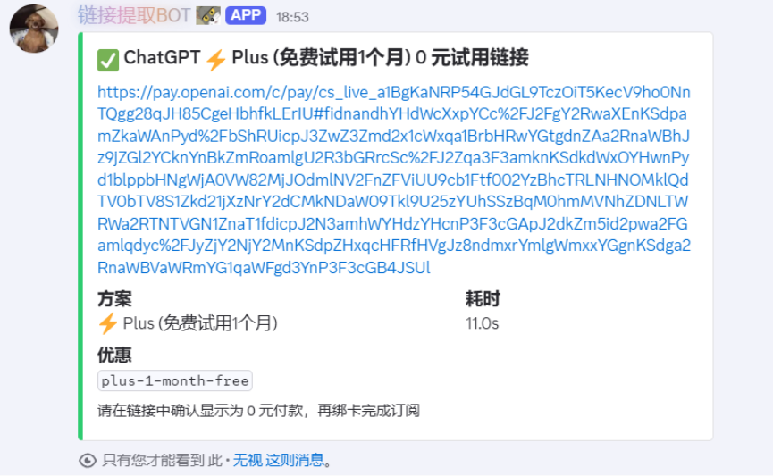

## 八、支付前再次检查代理

这一步很容易被忽略，但它决定成败。住宅代理有时会中途变化，所以点击支付按钮前必须重新测一次 IP。只要发现 IP 和虚拟卡地址不一致，就先换代理，不要继续点支付。

支付前请确认：

1. IP 仍在美国。
2. IP 所在州和虚拟卡账单地址一致。
3. 城市最好也尽量一致。
4. 浏览器没有切回普通网络。
5. PayPal 或支付页没有在中途弹出新的地区提示。

如果不一致，先停下来换代理。不要抱着“试一下”的心态继续点，因为失败记录也会进入风控画像。

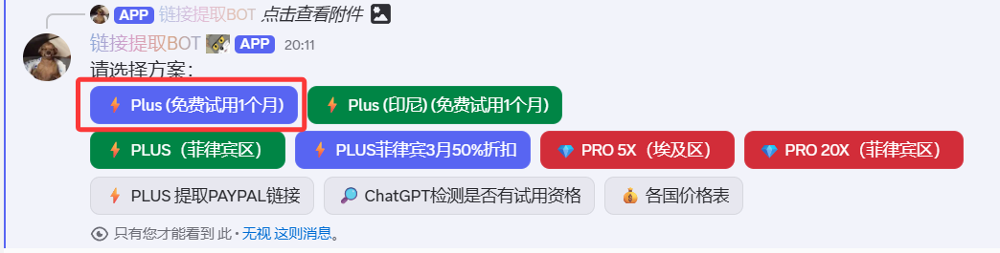

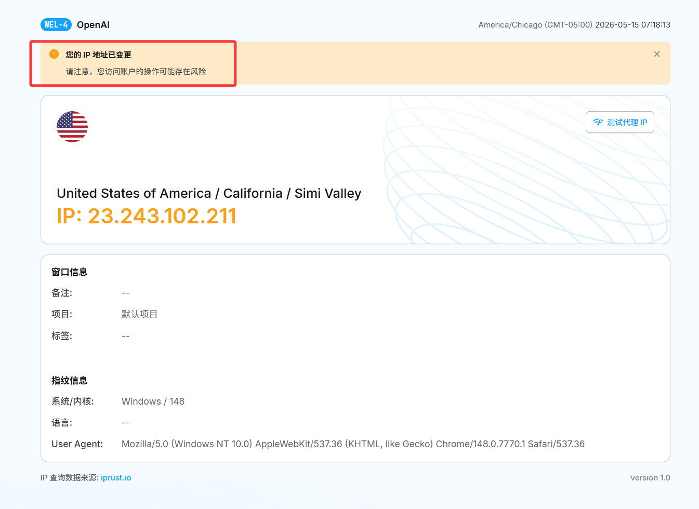

## 九、进入 PayPal 并处理验证

支付页选择 PayPal 后，页面会跳转到 PayPal。这里可能会要求登录、注册、添加地址、添加手机号或短信验证。

这里的关键点是：PayPal 手机号不要填虚拟卡资料里的电话，而要填你购买的 PayPal 接码手机号。原因很直接，后面验证码会发到这个手机号，你必须能收到。

操作顺序建议如下：

1. 在 PayPal 页面按要求填写姓名和地址，地址尽量和虚拟卡账单地址一致。
2. 填写 PayPal 接码手机号。
3. 等待 PayPal 发送验证码。
4. 打开接码链接读取验证码。
5. 回到 PayPal 页面填入验证码并继续。

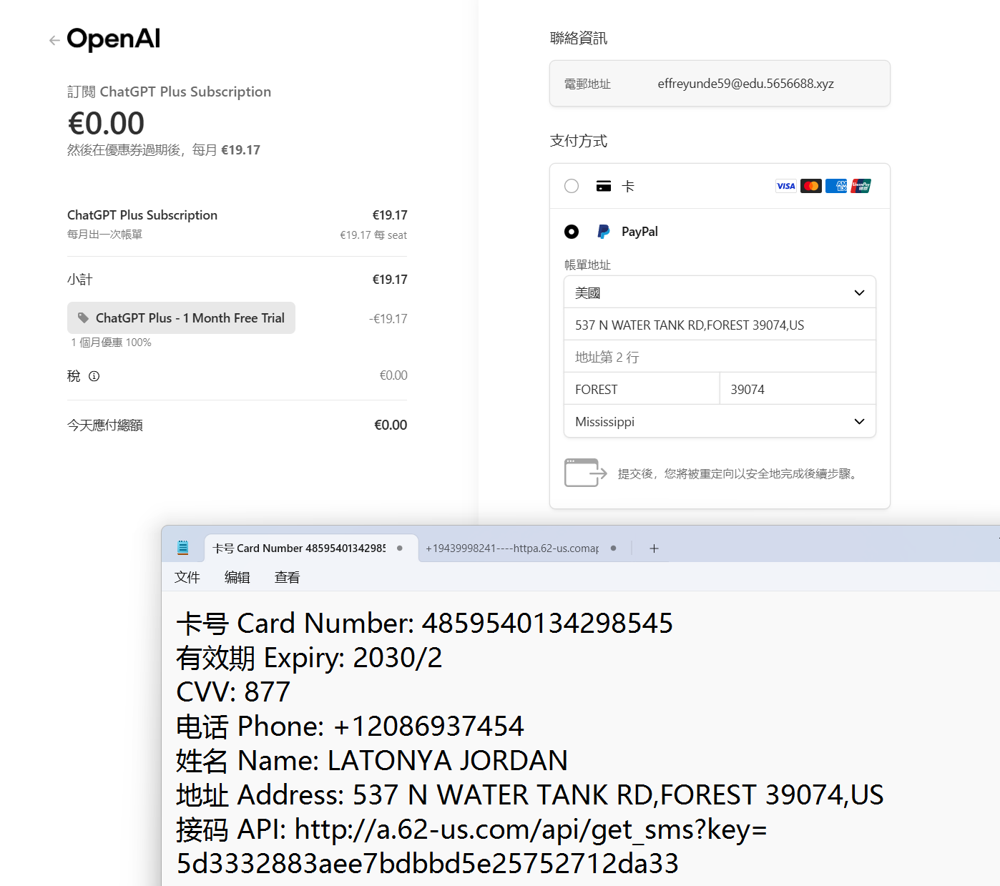

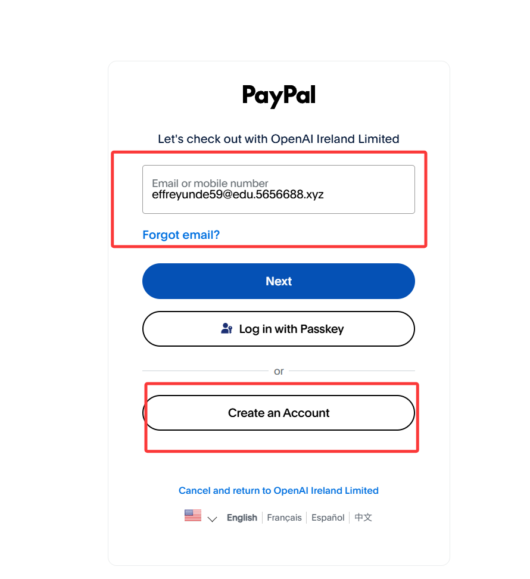

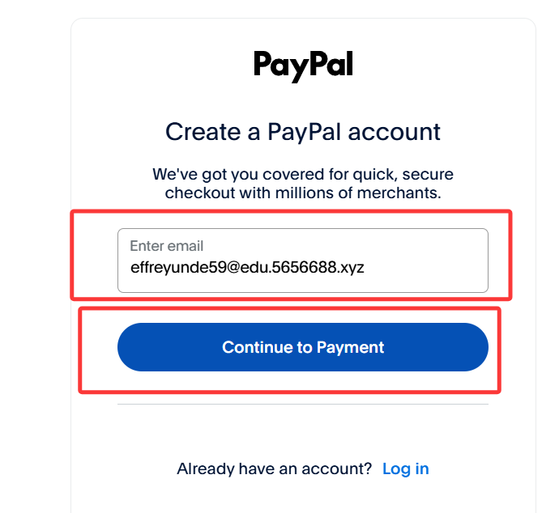

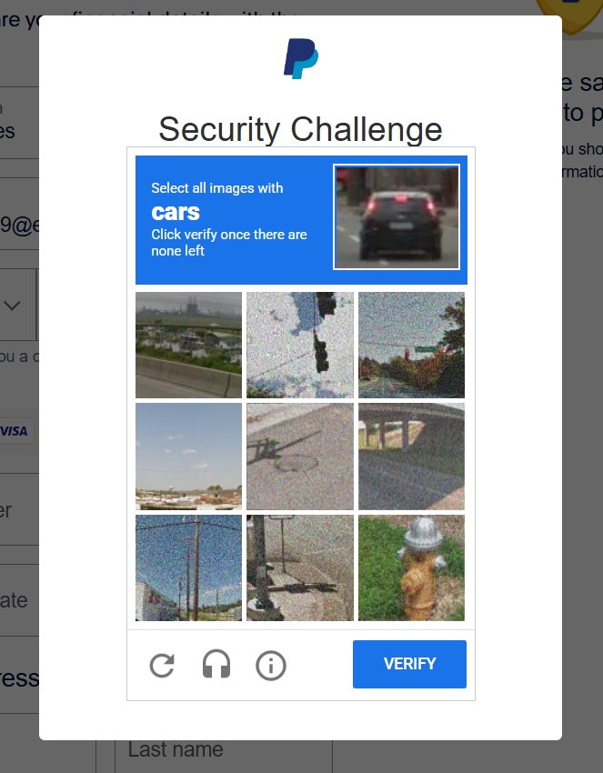

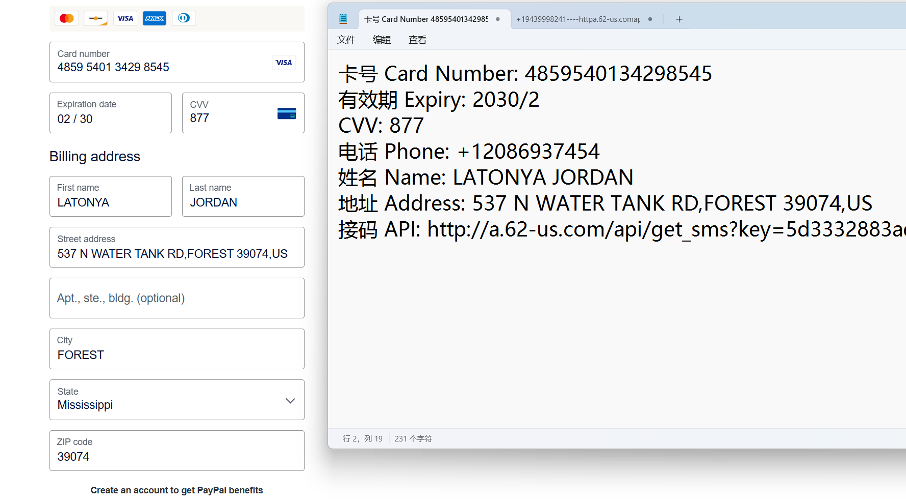

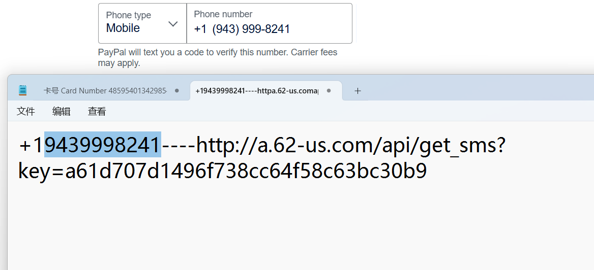

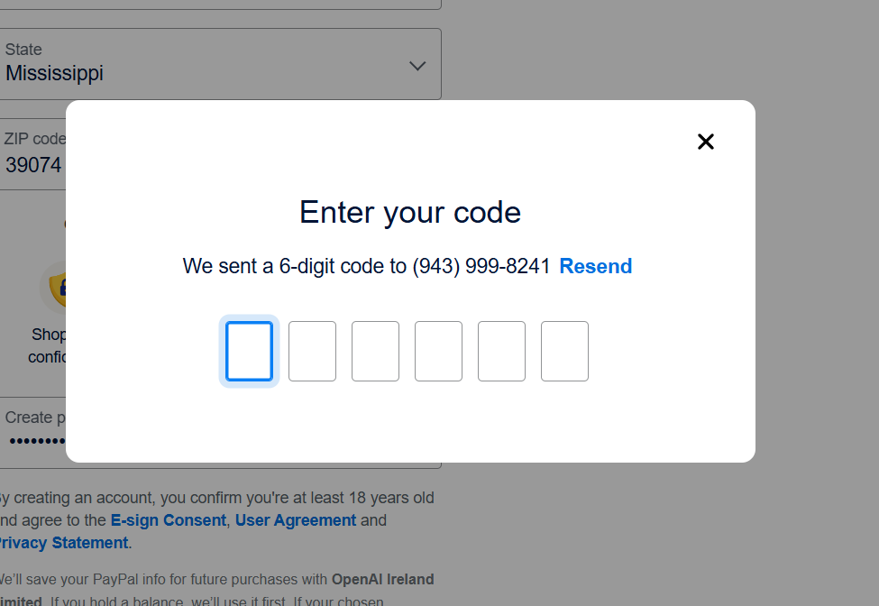

## 十、确认成功和后续处理

如果邮箱里收到 PayPal 或 OpenAI 相关确认邮件，且 ChatGPT 页面显示 Plus 状态，说明流程基本完成。

成功后还要做两件事：

1. 打开 ChatGPT 订阅或账单页面，确认试用结束时间和续费状态。
2. 如果只是试用，不准备续费，尽快取消连续订阅，避免后面自动扣款。

如果你需要长期稳定使用模型，不建议一直依赖这种临时链路。更省心的方式是使用 Lucoo 中转站 [https://cc.lucoo.net](https://cc.lucoo.net)，在店铺购买额度 [https://pay.ldxp.cn/shop/Lucoo](https://pay.ldxp.cn/shop/Lucoo)，再把 API Key 接到 Cherry Studio、Codex 或 CodeBuddy。

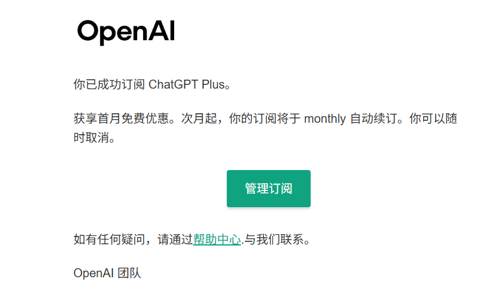

## 常见问题

### 1. 为什么账号没有试用入口？

通常是账号不符合试用资格。可以换邮箱重新注册，并注意注册节点和邮箱质量。不要在同一个异常环境里反复注册，否则新账号也容易被影响。

### 2. 为什么支付链接打开 404？

常见原因是链接过期、地区路径不兼容、Session 失效或登录环境不一致。先用 [https://gpt.mooizz.com/](https://gpt.mooizz.com/) 转长链，再尝试删除 `/openai_ie/` 路径段。

### 3. 为什么 PayPal 要短信验证？

新环境、新设备、新 IP 或支付风险较高时，PayPal 很容易要求短信验证。所以接码手机号要提前准备，不要等页面弹出来再找。

### 4. 为什么必须匹配代理和账单地址？

支付系统会看 IP 地区、账单地址、卡片资料和账号历史。如果这些信息互相矛盾，就容易被判定为高风险交易。

### 5. 失败后还能继续试吗？

可以，但不要连续无脑重试。先换干净代理、确认账号试用资格、重新生成链接，再继续。多次失败会让账号和支付方式更难通过。

## 最后提醒

这套流程本质上是在和支付风控打交道，变量很多。能自己排查的人，可以按本文一步一步做；不想把时间耗在代理、卡、接码和链接异常上的，可以直接走 Lucoo 店铺：[https://pay.ldxp.cn/shop/Lucoo](https://pay.ldxp.cn/shop/Lucoo)。如果只是需要日常使用 GPT、Codex、Cherry Studio、CodeBuddy，走中转站 API 往往更稳定：[https://cc.lucoo.net](https://cc.lucoo.net)。
