> 💡 如果这篇文章对你有帮助，欢迎多多投喂🍗哦！  
> 🌐 更多干货分享请关注我的个人博客：[lucoo.net](https://lucoo.net)

这份教程主要记录如何通过欧洲节点和 PayPal 零成本开通 ChatGPT Team Business 的免费试用，并及时防扣费。整个流程分为以下几个核心步骤：

## 一、 基础账号注册

前期注册跟平时一样，按正常步骤走就行：

1. 打开官网 [chatgpt.com](https://chatgpt.com)，点击注册并输入邮箱。
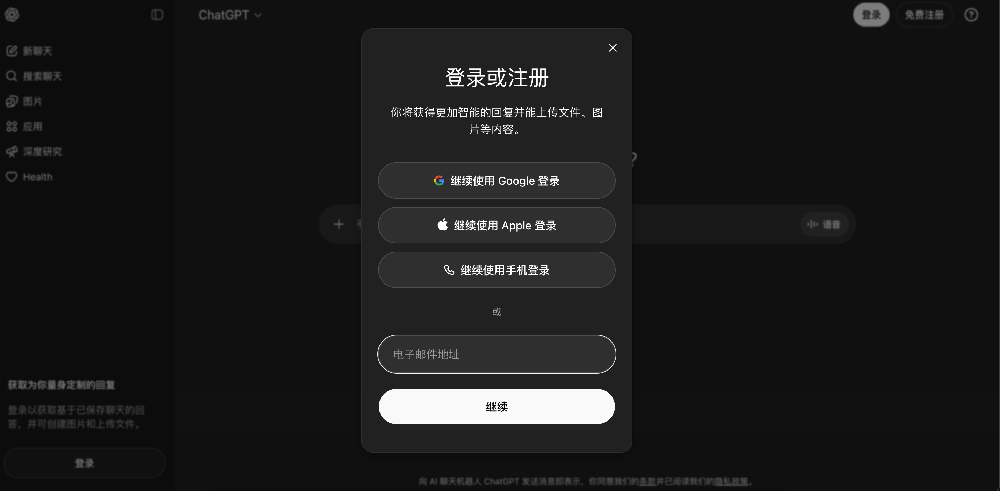
2. 输入邮箱账号和密码，跳转创建密码界面。
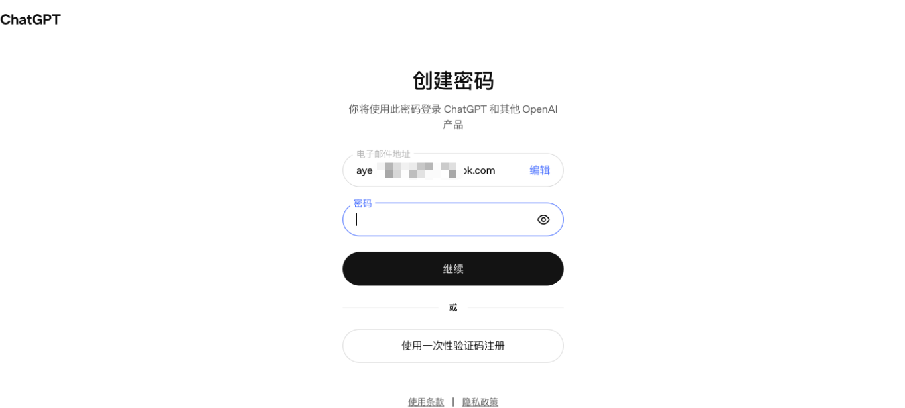
3. 去邮箱收个验证码填上。
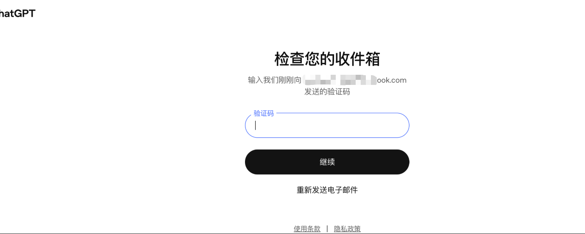
4. 接着填一下姓名等基本信息，中间弹出的提示直接跳过不用管。
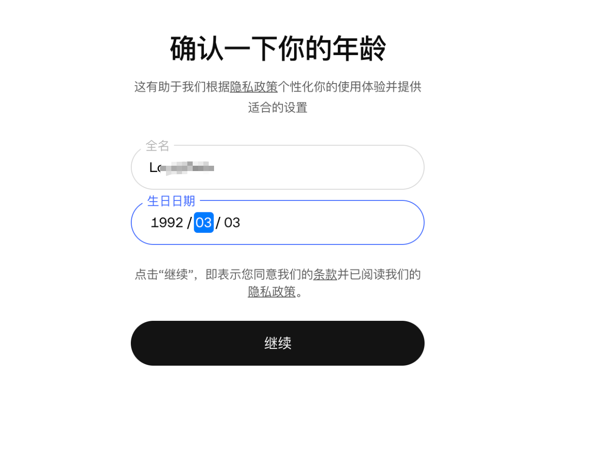

## 二、 切换节点 & 触发试用界面

这是最关键的一步，必须用欧洲节点才能看到欧元的试用入口！

1. 先在浏览器打开这个链接（保持登录状态）：
[https://chatgpt.com/zh-Hans-CN/overview?openaicom_referred=true](https://chatgpt.com/zh-Hans-CN/overview?openaicom_referred=true)
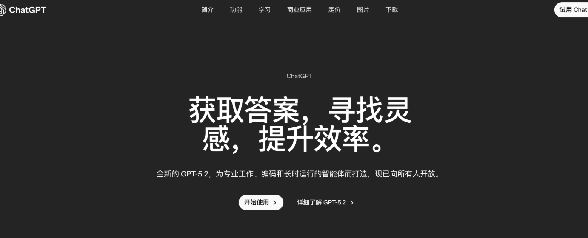
2. **重点来了**：把代理节点切换到欧洲（比如德国🇩🇪），一定要开**全局模式**。
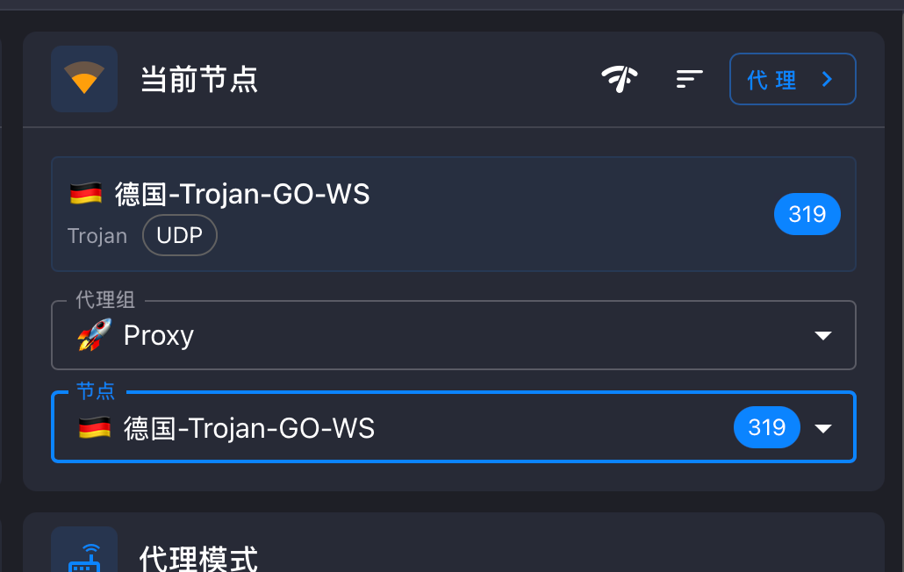
3. 节点切好后，直接访问企业版计划页面：
[https://chatgpt.com/zh-Hans-CN/business/business-plan/](https://chatgpt.com/zh-Hans-CN/business/business-plan/)
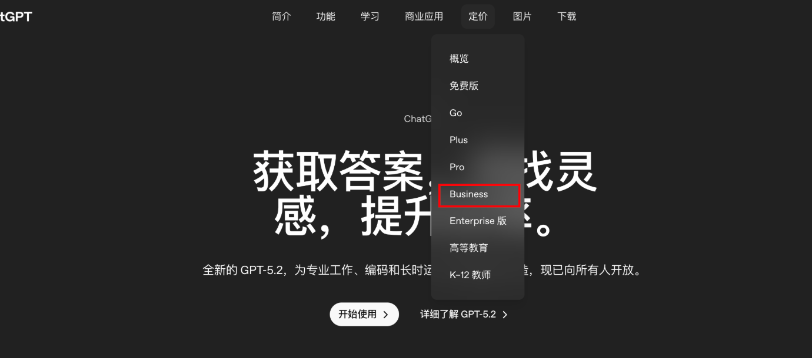
4. 点击页面的「试用」按钮。
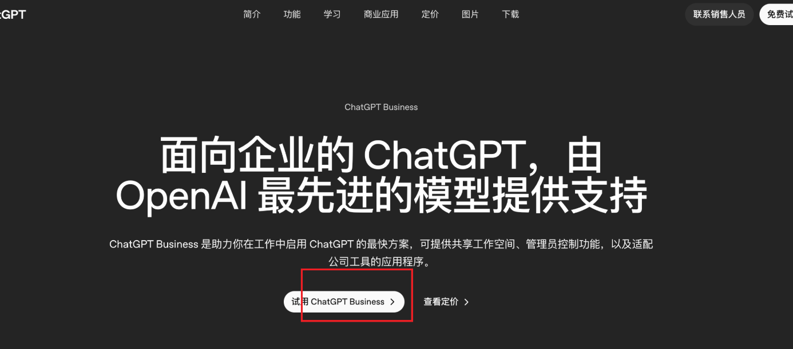
5. **避坑提示**：如果点击试用后，显示的货币是美元（**$30**），千万**不要**继续！直接退回去，多刷新几次页面，再次确认你的代理是不是稳定在欧洲全局节点。
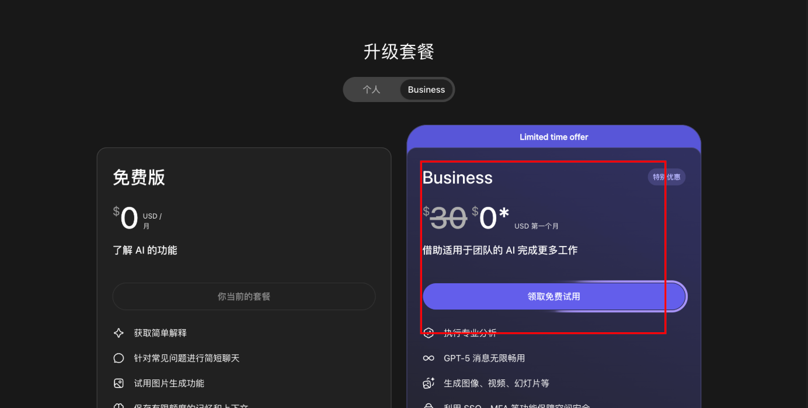
6. 一直刷新重试，直到点击试用后，如果显示的是 **34欧元（€34）**界面，那就基本快成功了。
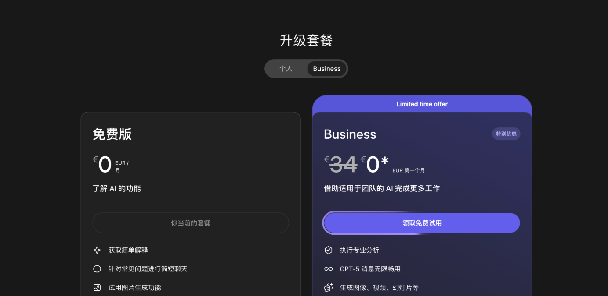

## 三、 填写资料 & PayPal 绑定

到这步接着搞定付款信息的验证。

1. 点击「领取免费试用」，等待页面跳转到付款台，付款方式选择 **PayPal**。
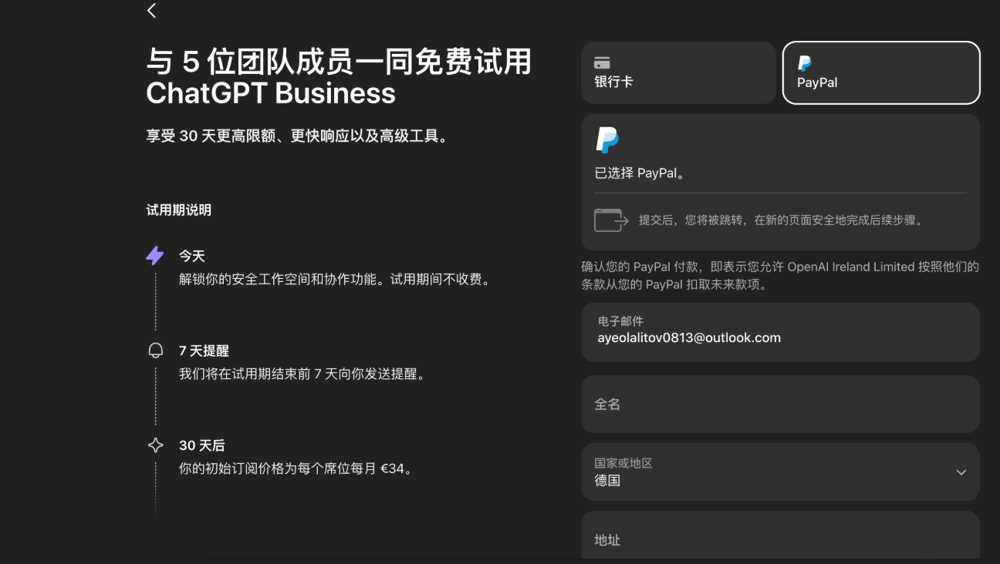
2. 这里需要填欧洲的姓名和地址。可以直接找个“德国地址生成器”弄一套假资料，参考示例：
```text
姓名：Max Mustermann
地址第1行（街道+门牌号）：Musterstraße 1
地址第2行：Wohnung 2
邮编 ：12345
城市： Musterstadt
国家：Deutschland（德国）
```
3. 资料填完后点击「领取激活」，进入 PayPal 的付款界面。
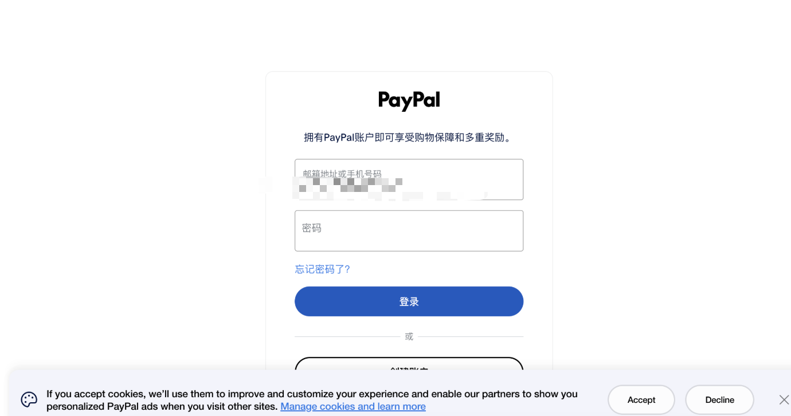
4. 输入你的 PayPal 账号密码登录，直接点击「同意并继续」完成付款绑定。
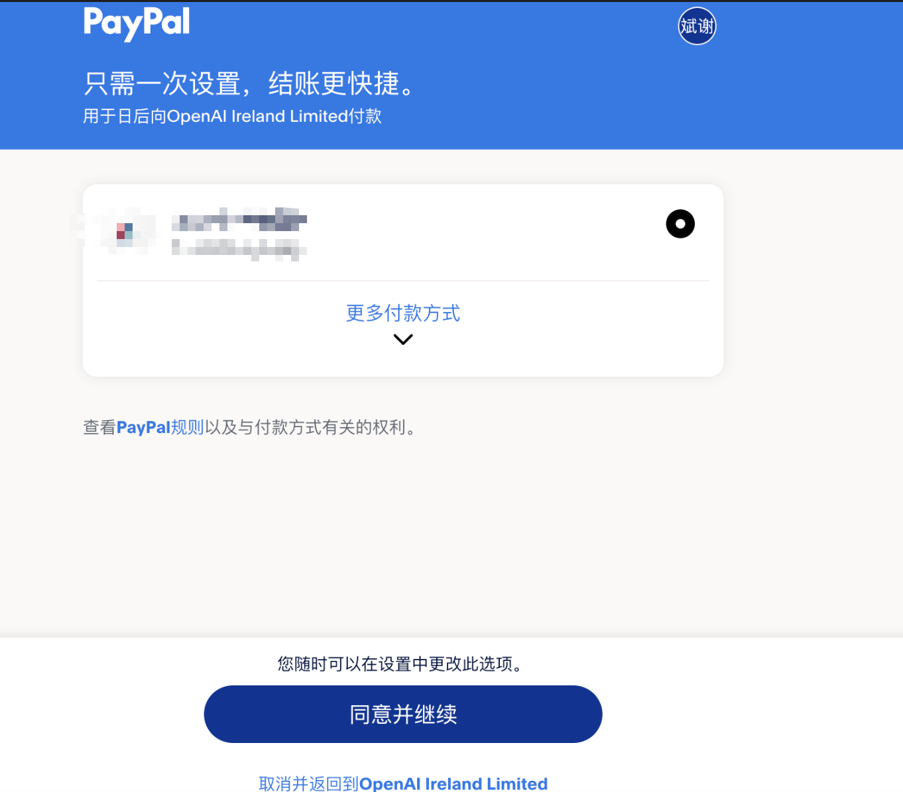
5. 看到这个界面就说明成功订阅啦！
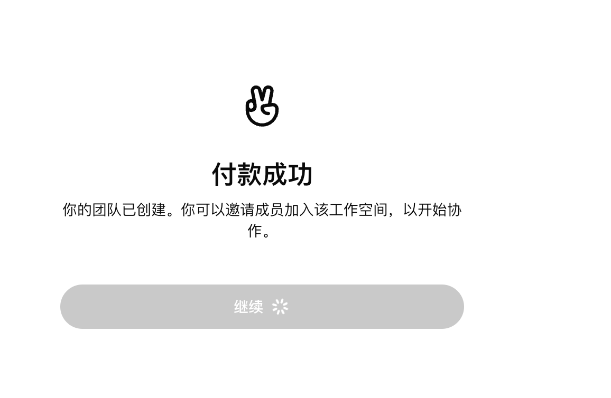

## 四、 【重要】取消订阅防反撸

为了防止试用期结束后被扣费，开通成功的第一时间一定要去取消订阅。

1. 直接访问账单管理页面：[https://chatgpt.com/admin/billing](https://chatgpt.com/admin/billing)
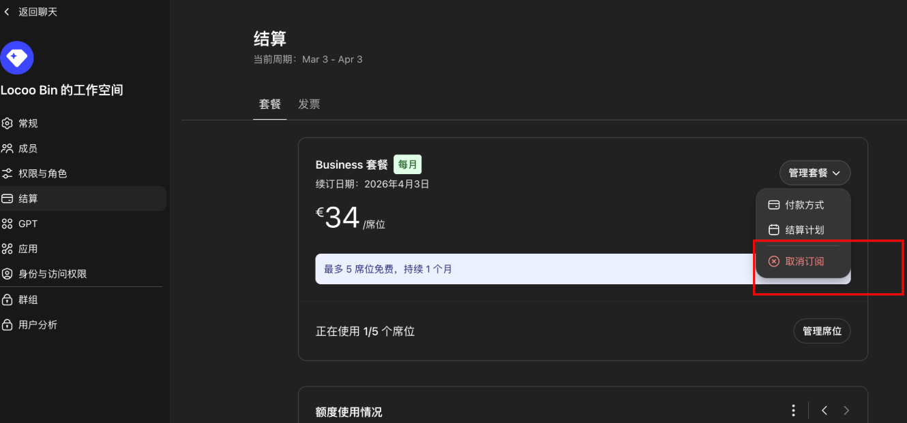
2. 点击取消订阅，输入你刚才注册用的邮箱，然后再点确认取消。
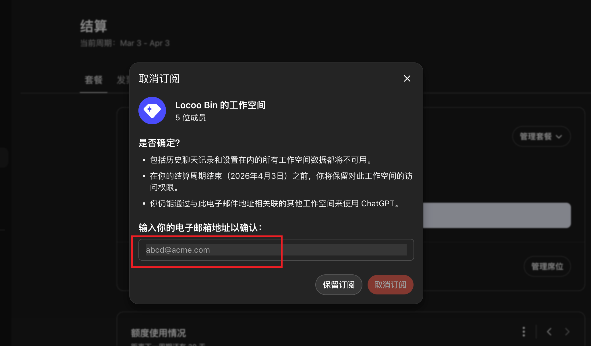
3. 他可能会弹跳到一个新地址网页，那个页面的东西不用管，直接叉掉关闭。回到原来的账单页面看一眼，只要这里显示取消就彻底 OK 了！
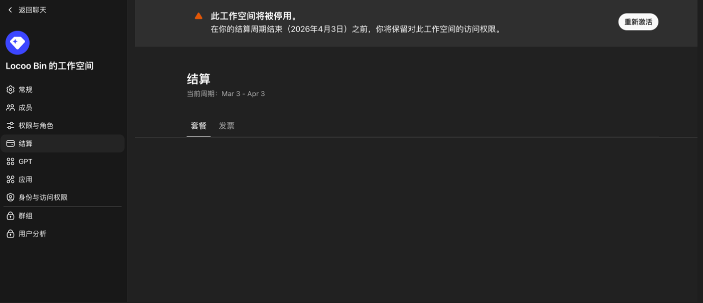
