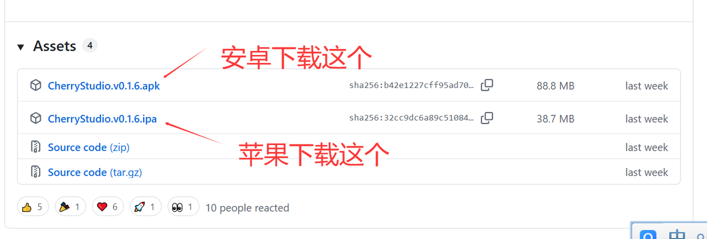
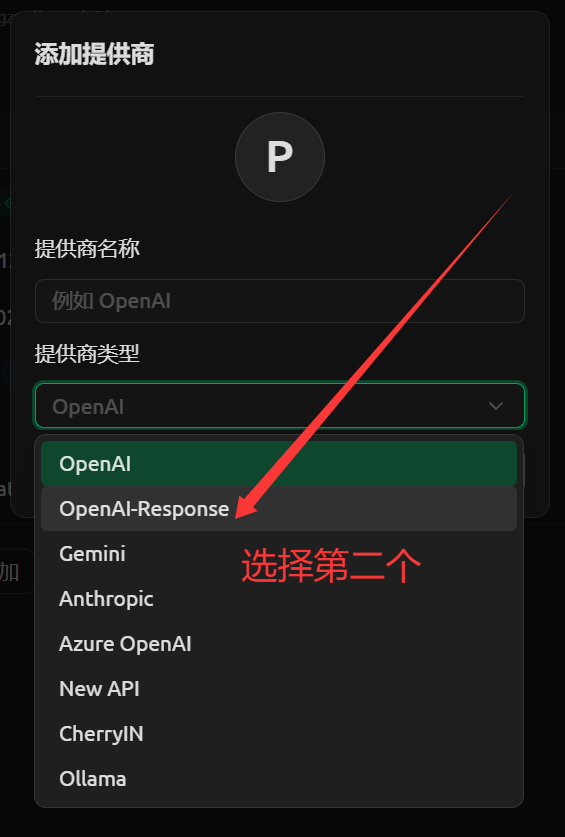
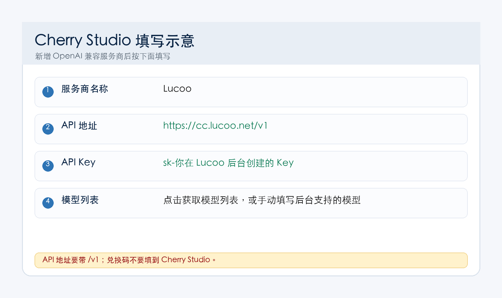

## 一、Cherry Studio 适合谁

如果你不想折腾命令行，只想像聊天软件一样使用模型，Cherry Studio 是比较适合新手的客户端。

它支持 OpenAI 兼容接口，所以可以直接接入 Lucoo 中转站。

## 二、下载 Cherry Studio

电脑端官网：

[https://www.cherry-ai.com/](https://www.cherry-ai.com/)

移动端或更多版本可以看 GitHub Releases：

[https://github.com/CherryHQ/cherry-studio-app/releases](https://github.com/CherryHQ/cherry-studio-app/releases)

下载后按系统提示安装即可。



## 三、先在 Lucoo 后台创建 Key

1. 打开 [https://cc.lucoo.net](https://cc.lucoo.net)。
2. 进入「钱包」兑换余额。
3. 进入「API 密钥」创建 Key。
4. 普通聊天建议选 `plus` 或 `pro` 分组。
5. 复制 `sk-` 开头的 API Key。

<p class="lucoo-token-warning-block">Cherry Studio 里填的是 API Key，不是兑换码。兑换码只在钱包兑换一次。</p>

## 四、添加 Lucoo 服务商

打开 Cherry Studio，进入设置里的模型服务商，新增一个 OpenAI 兼容服务商。



推荐填写：

| 配置项 | 内容 |
| --- | --- |
| 服务商名称 | `Lucoo` |
| API Key | 你在后台创建的 `sk-` 开头 Key |
| API 地址 | `https://cc.lucoo.net/v1` |
| 模型 | 先获取模型列表，或手动填写后台支持的模型 |



如果主站访问不稳定，可以把 API 地址换成：

- `https://api.lucoo.net/v1`
- `https://hkcc.lucoo.net/v1`
- `https://sgcc.lucoo.net/v1`
- `https://uscc.lucoo.net/v1`

## 五、获取模型列表

填好 API 地址和 Key 后，点击获取模型列表。

如果能看到模型，说明连接成功。选择你要用的模型，例如 `gpt-5.5`，然后保存。

如果获取失败，先检查：

1. Key 是否复制完整。
2. API 地址是否带 `/v1`。
3. Key 的分组是否支持当前模型。
4. 当前网络是否能打开 Lucoo 主站或备用入口。

## 六、开始对话

回到 Cherry Studio 首页，新建对话，选择刚添加的 Lucoo 服务商和模型。

建议先发一个短问题测试：

```text
你好，请用一句话回复当前模型已经可以正常使用。
```

能正常回复后，再开始长文本、图片理解或代码任务。

## 七、常见问题

### 1. 401 / invalid api key

大概率是 Key 错了，或者复制了兑换码。回到 Lucoo 后台重新复制 API Key。

### 2. 获取模型列表失败

检查 API 地址必须是 `https://cc.lucoo.net/v1`，并确认 Key 绑定了正确分组。

### 3. 回复很慢或偶发失败

可以切换到 `pro` 分组，或换备用入口测试网络。

### 4. 手机端怎么用

手机端设置思路一样：服务商选 OpenAI 兼容，API 地址填 `https://cc.lucoo.net/v1`，Key 填后台创建的 API Key。

## 八、参考入口

- Cherry Studio 官网：[https://www.cherry-ai.com/](https://www.cherry-ai.com/)
- Cherry Studio GitHub：[https://github.com/CherryHQ/cherry-studio](https://github.com/CherryHQ/cherry-studio)
- Lucoo 防丢主页：[https://lucoo.net](https://lucoo.net)
