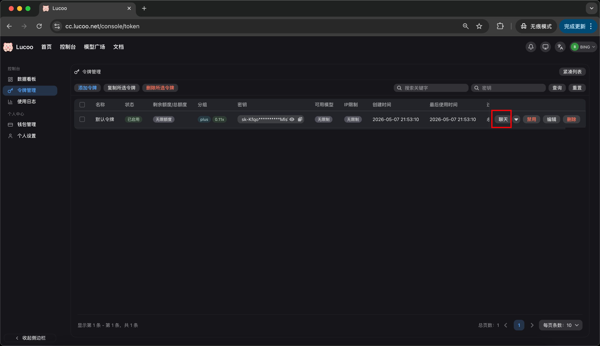
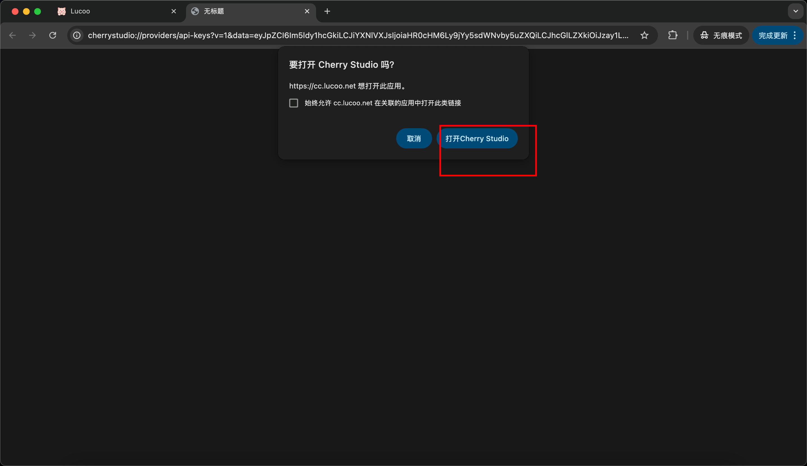
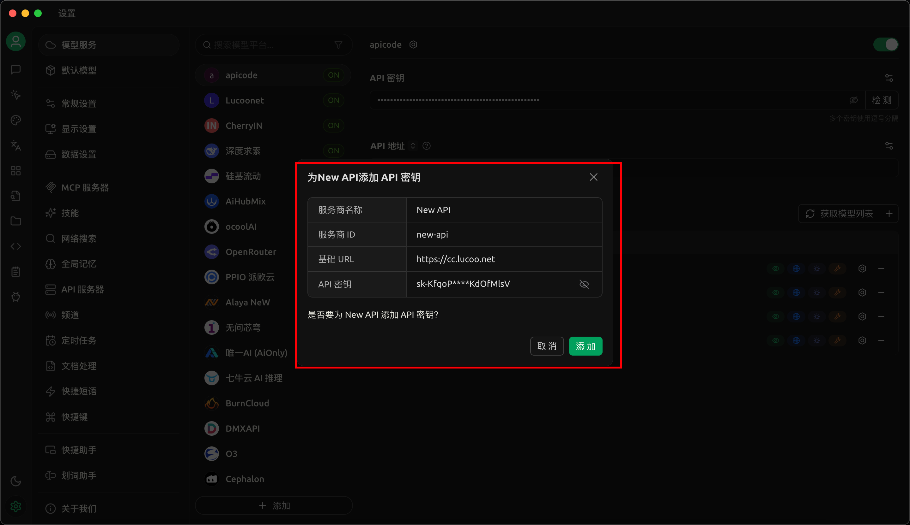
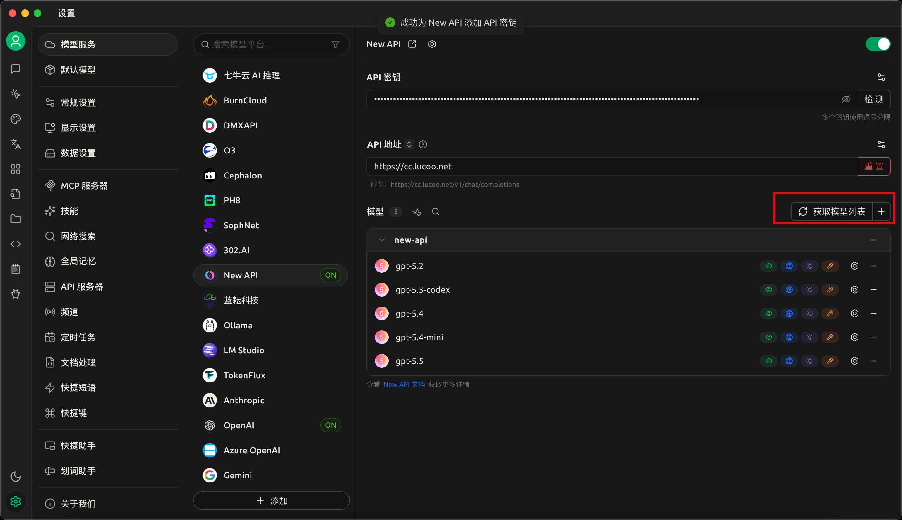
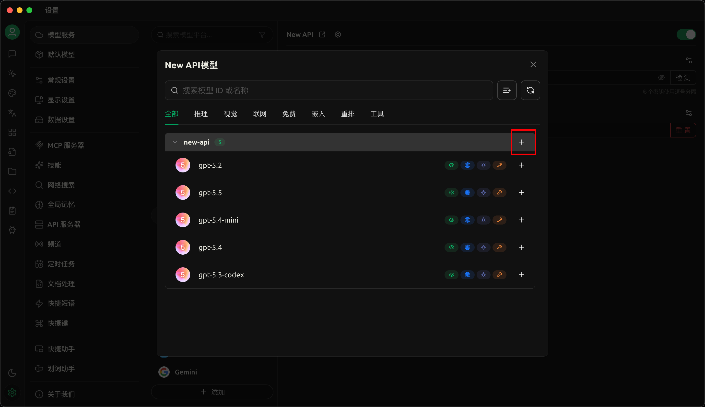
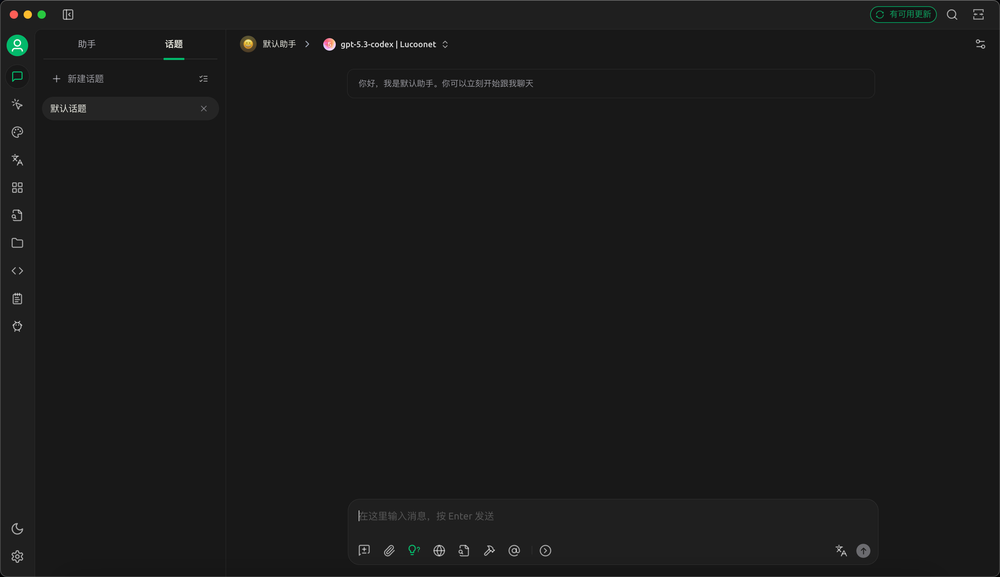
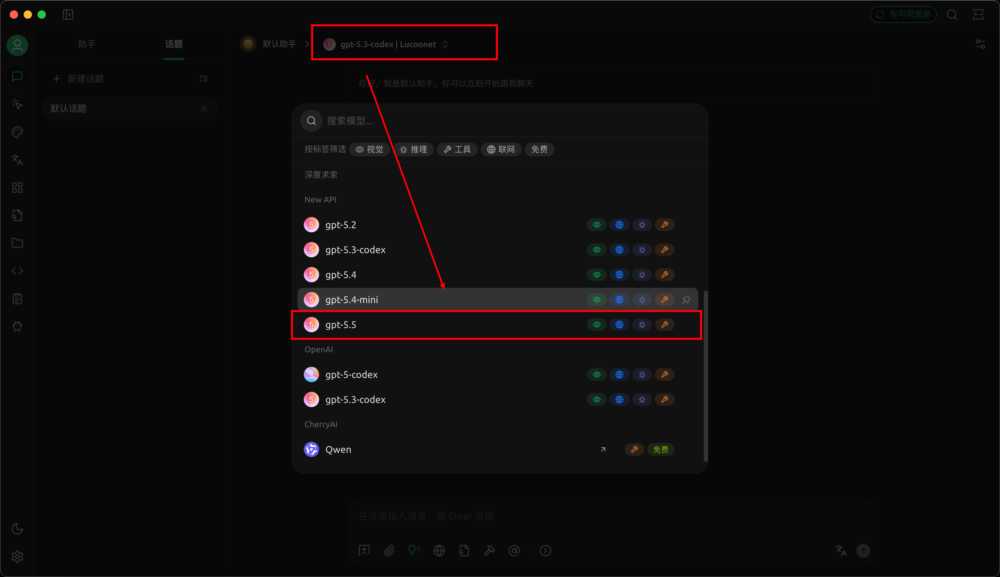
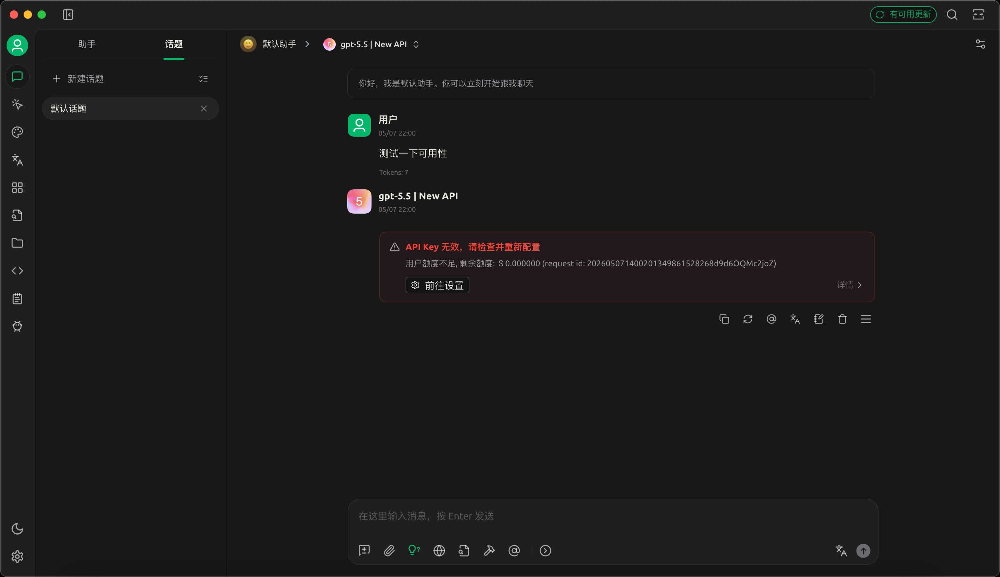

## 一、常用地址

开始前先确认需要用到的几个地址：

| 用途 | 地址 |
| --- | --- |
| 中转站地址 | [https://cc.lucoo.net](https://cc.lucoo.net) |
| 海外代理访问地址 | [https://apicc.lucoo.net](https://apicc.lucoo.net) |
| Cherry Studio 下载地址 | [https://www.cherry-ai.com/](https://www.cherry-ai.com/) |
| 额度购买地址 | [https://pay.ldxp.cn/shop/Lucoo](https://pay.ldxp.cn/shop/Lucoo) |
| 充值地址 | [https://cc.lucoo.net/console/topup](https://cc.lucoo.net/console/topup) |

## 二、对接步骤

### 1. 注册并登录中转站

打开 [https://cc.lucoo.net](https://cc.lucoo.net)，按页面提示完成注册并登录。

### 2. 进入令牌管理

登录后进入后台，选择「令牌管理」，然后点击添加令牌。

### 3. 创建令牌

创建令牌时一定要选择 Plus 号池或 Pro 号池，不要使用默认的 Free 号池。Free 号池额度比较少，可能不够稳定使用；如果需要更高规格，可以选择 Pro 号池。其余配置按截图保存即可。

### 4. 确认令牌创建成功

保存后看到令牌创建成功，后续 Cherry Studio 会通过这个令牌连接中转站。

### 5. 点击聊天入口

回到中转站页面，在令牌对应位置点击「聊天」。

### 6. 安装 Cherry Studio

如果系统提示需要打开 Cherry Studio，但本机还没有安装，先到 [Cherry Studio 官网](https://www.cherry-ai.com/) 下载并安装。

### 7. 确认服务地址

安装完成后打开 Cherry Studio。默认地址通常是 `https://cc.lucoo.net`；如果你需要使用海外代理访问，可以改为 `https://apicc.lucoo.net`。

### 8. 获取模型列表

点击「添加」，再点击「获取模型列表」，让 Cherry Studio 从中转站读取可用模型。

### 9. 添加整个分组

模型列表加载出来后，点击「添加整个分组」。

### 10. 回到 Cherry Studio 首页

添加完成后回到 Cherry Studio 首页的对话框。

### 11. 选择 NewAPI 模型

在模型选择处切换到刚刚添加的 NewAPI 模型分组，即可开始对话。

### 12. 选择需要使用的模型

根据自己的需要选择模型。示例中选择的是 `gpt-5.5`。

## 三、额度与充值

新账号默认会赠送一定额度，可以先直接测试。如果额度不足，按下面的流程充值：

1. 打开购买地址：[https://pay.ldxp.cn/shop/Lucoo](https://pay.ldxp.cn/shop/Lucoo)
2. 购买完成后，进入充值地址：[https://cc.lucoo.net/console/topup](https://cc.lucoo.net/console/topup)
3. 按页面提示完成充值后即可继续使用。

## 四、注意事项

- 令牌相当于访问凭证，不要公开分享给别人。
- 如果模型列表获取失败，先检查中转站地址、令牌和网络环境是否正确。
- 国内默认使用 `https://cc.lucoo.net`；跨境网络不稳定时可以尝试 `https://apicc.lucoo.net`。
