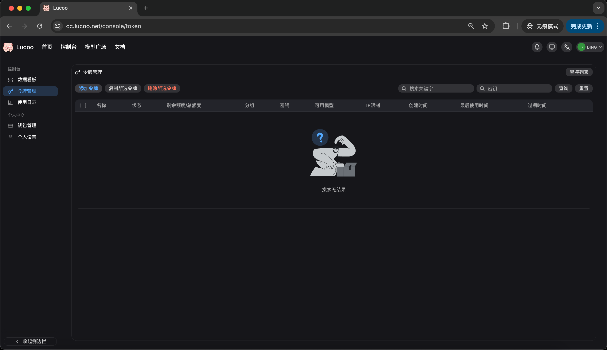
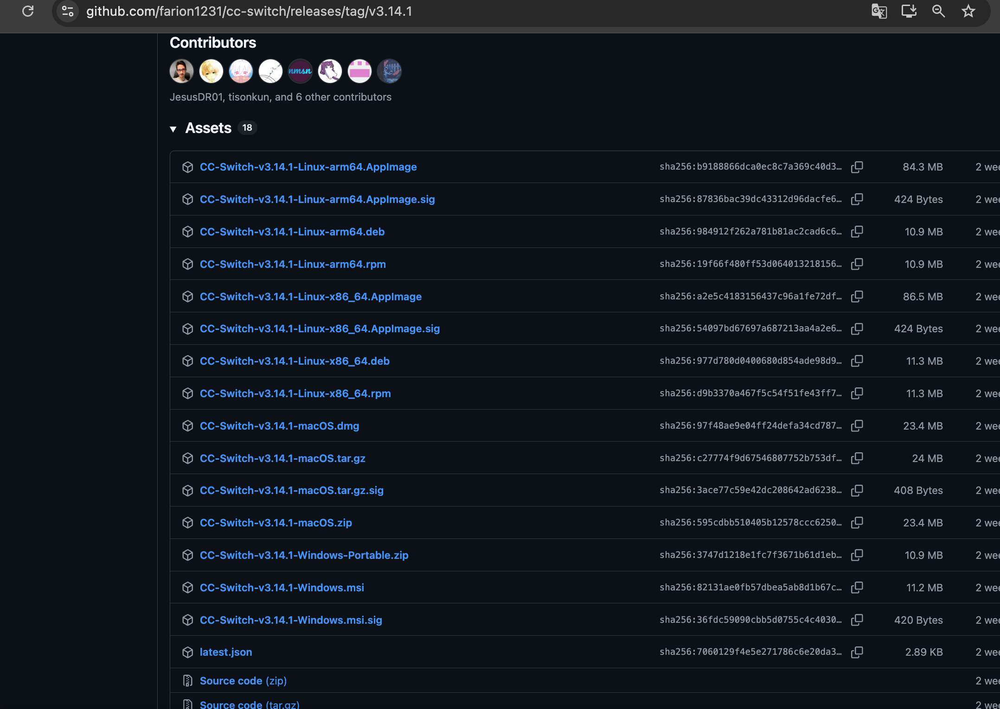
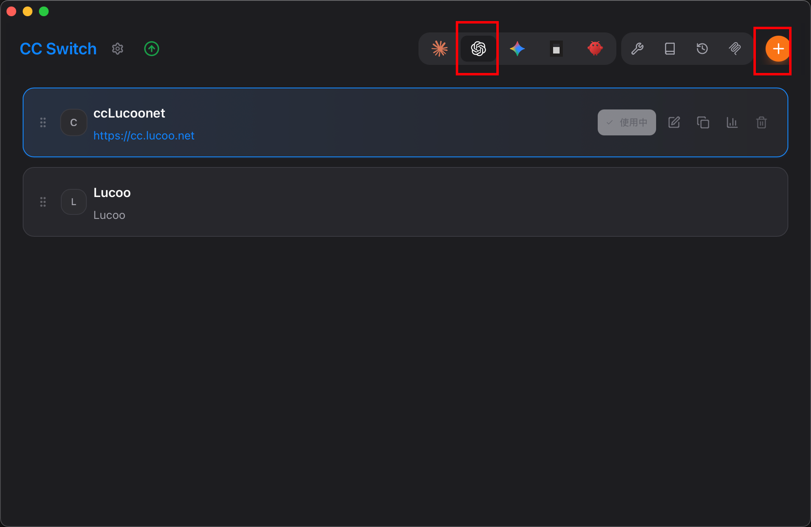
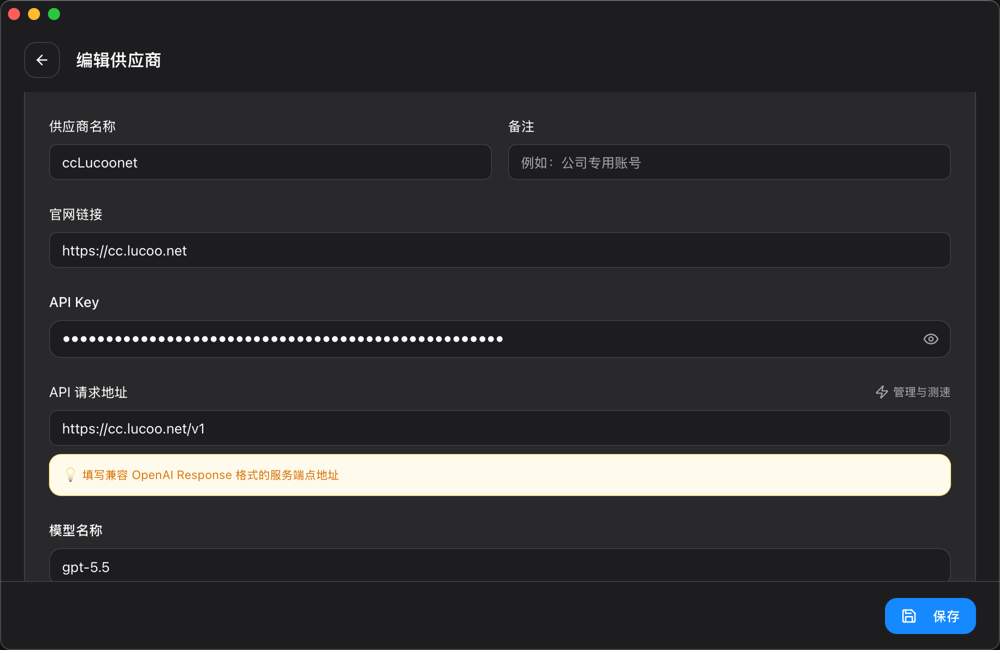
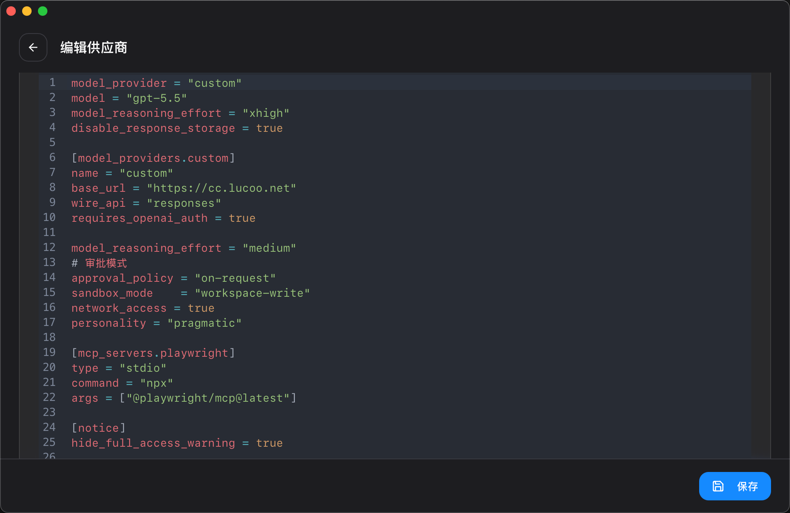
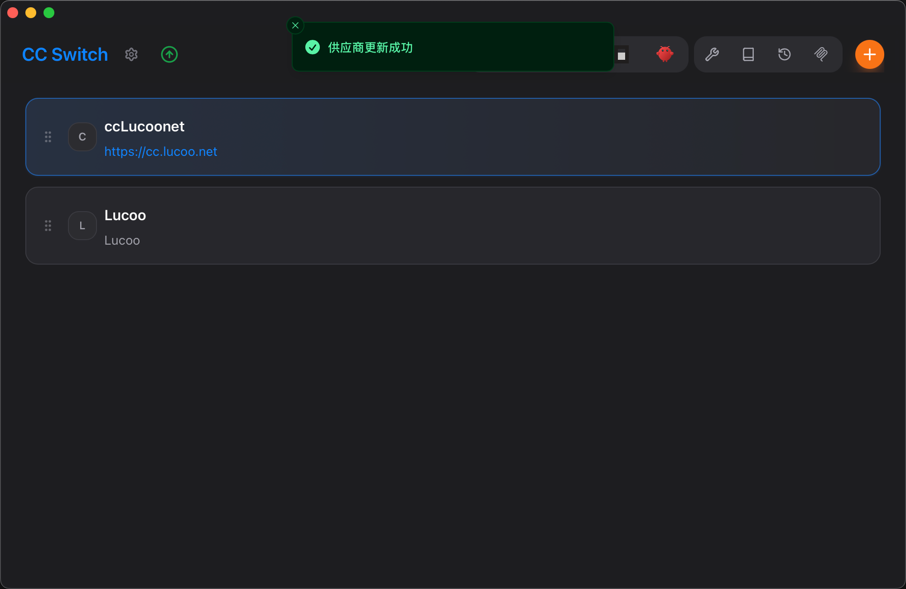
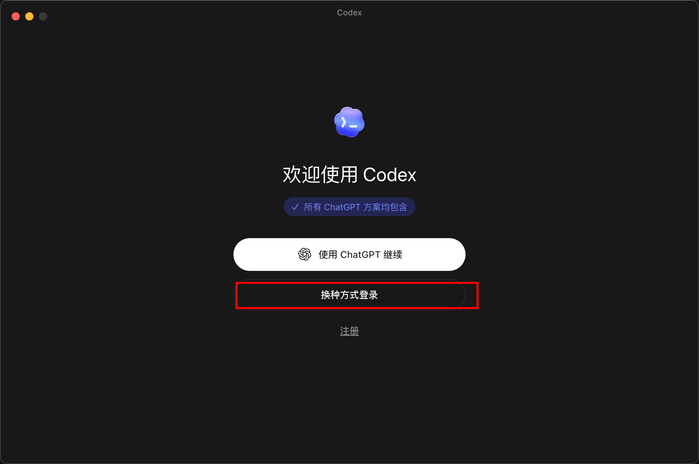
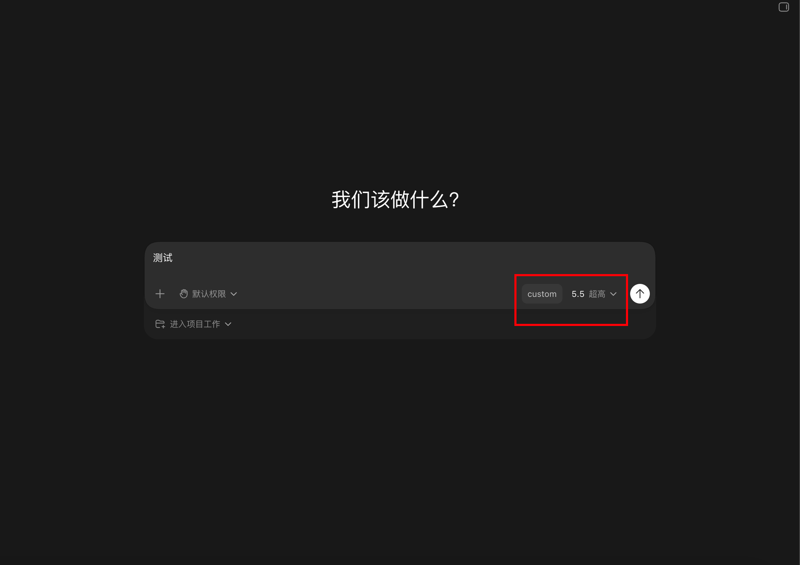

## 一、适用场景

这篇教程适合需要让 Codex 使用 Lucoo 中转站 API Key 的用户。

如果你只想按官方默认方式使用 Codex，可以直接选择「使用 ChatGPT 继续」。如果你需要走中转站、自定义接口或统一管理多套 API 配置，再按下面的步骤使用 CC Switch。

## 二、常用地址

| 用途 | 地址 |
| --- | --- |
| 中转站地址 | [https://cc.lucoo.net](https://cc.lucoo.net) |
| 海外代理访问地址 | [https://apicc.lucoo.net](https://apicc.lucoo.net) |
| 额度购买地址 | [https://pay.ldxp.cn/shop/Lucoo](https://pay.ldxp.cn/shop/Lucoo) |
| 充值地址 | [https://cc.lucoo.net/console/topup](https://cc.lucoo.net/console/topup) |
| CC Switch 下载地址 | [https://github.com/farion1231/cc-switch/releases](https://github.com/farion1231/cc-switch/releases) |

## 三、准备 Lucoo 中转站令牌

如果你还没有中转站令牌，先完成以下步骤；已经有令牌的用户可以跳过本节。

### 1. 注册并登录中转站

打开 [https://cc.lucoo.net](https://cc.lucoo.net)，按页面提示完成注册并登录。


### 2. 进入令牌管理

登录后进入后台，选择「令牌管理」，然后点击添加令牌。



### 3. 创建令牌

创建令牌时一定要选择 Plus 号池或 Pro 号池，不要使用默认的 Free 号池。Free 号池额度比较少，可能不够稳定使用；如果需要更高规格，可以选择 Pro 号池。其余配置按截图保存即可。


### 4. 确认令牌创建成功

保存后看到令牌创建成功，复制并保存你的 API Key。后面配置 Codex 时会用到它。


## 四、安装并配置 CC Switch

### 1. 下载 CC Switch

打开 [CC Switch Releases](https://github.com/farion1231/cc-switch/releases)，根据自己的系统下载对应安装包。macOS 用户一般选择 `.dmg`、`.zip` 或 `macOS` 相关包，Windows 用户选择 `.msi` 或 Windows 版本。



### 2. 新增 OpenAI 供应商

打开 CC Switch，选中 OpenAI 图标，然后点击右上角的新增按钮。



### 3. 填写供应商信息

按下面的方式填写：

| 配置项 | 推荐填写 |
| --- | --- |
| 供应商名称 | `ccLucoonet` |
| 官网链接 | `https://cc.lucoo.net` |
| API Key | 你在中转站复制的 `sk-` 开头令牌 |
| API 请求地址 | 国内默认 <span class="lucoo-red-url">https://cc.lucoo.net/v1</span>，海外用户可用 <span class="lucoo-red-url">https://apicc.lucoo.net/v1</span> |
| 模型名称 | 按你开通的模型填写，示例为 `gpt-5.5` |

不要把真实 API Key 截图发给别人，也不要把它写进公开文章、群聊或代码仓库。



### 4. 参考 Codex 配置

CC Switch 会帮你写入 Codex 相关配置。如果你需要手动检查，可参考下面的结构。

```toml
model_provider = "custom"
model = "gpt-5.5"
model_reasoning_effort = "xhigh"
disable_response_storage = true

[model_providers.custom]
name = "custom"
base_url = "https://cc.lucoo.net/v1"
wire_api = "responses"
requires_openai_auth = true

model_reasoning_effort = "medium"
approval_policy = "on-request"
sandbox_mode = "workspace-write"
network_access = true
personality = "pragmatic"
```

如果你使用海外代理地址，手动配置时把 `base_url` 改成：

```toml
base_url = "https://apicc.lucoo.net/v1"
```



### 5. 保存并启用供应商

确认配置无误后点击保存。返回供应商列表后，选中新建的 `ccLucoonet`，看到「供应商更新成功」就说明 CC Switch 已经写入配置。



## 五、在 Codex 中使用 API Key 登录

### 1. 重启 Codex 或 VS Code

配置写入后，建议完全退出并重新打开 Codex、VS Code 或其它调用 Codex 的工具。Codex 有本地缓存，刚写入配置后不重启可能不会立刻生效。

### 2. 选择换种方式登录

打开 Codex 后，如果看到登录页，点击「换种方式登录」。



### 3. 输入 API Key

在 OpenAI API 密钥输入框里粘贴你的 `sk-` 开头令牌，然后点击继续。

为避免泄露，这里不放真实 Key 截图。你只需要确认格式类似下面这样：

```json
{
  "OPENAI_API_KEY": "sk-你的中转站令牌"
}
```

### 4. 确认模型已切换

回到 Codex 主界面后，检查右侧模型区域。如果看到自定义供应商和对应模型，例如 `custom`、`5.5` 或你配置的模型名称，基本就说明切换成功了。



## 六、常见问题

### 1. 配置后仍然不可用

优先检查三件事：

1. API Key 是否复制完整，前后不要有空格。
2. 国内地址使用 `https://cc.lucoo.net/v1`，海外代理访问使用 `https://apicc.lucoo.net/v1`。
3. 修改配置后是否完全重启 Codex 或 VS Code。

如果还是不行，重新打开 CC Switch，检查写入的 `config.toml` 是否和页面里显示的一致。

### 2. 模型没有切换

Codex 可能还在使用旧缓存。先完全退出 Codex，再重新打开；如果你是在 VS Code 里使用，也把 VS Code 一起重启。

### 3. 是否必须使用 CC Switch

不是必须。CC Switch 的作用是降低手动改配置文件的成本。如果你熟悉 Codex 的配置文件，也可以直接手动修改 `config.toml` 和认证文件。

## 七、安全提醒

- API Key 相当于你的账户凭证，不要公开发布。
- 不要把带有真实 Key 的截图上传到网站、群聊或仓库。
- 如果怀疑 Key 泄露，立即到中转站后台删除旧令牌并重新创建。
- 购买额度后，到 [https://cc.lucoo.net/console/topup](https://cc.lucoo.net/console/topup) 完成充值。
