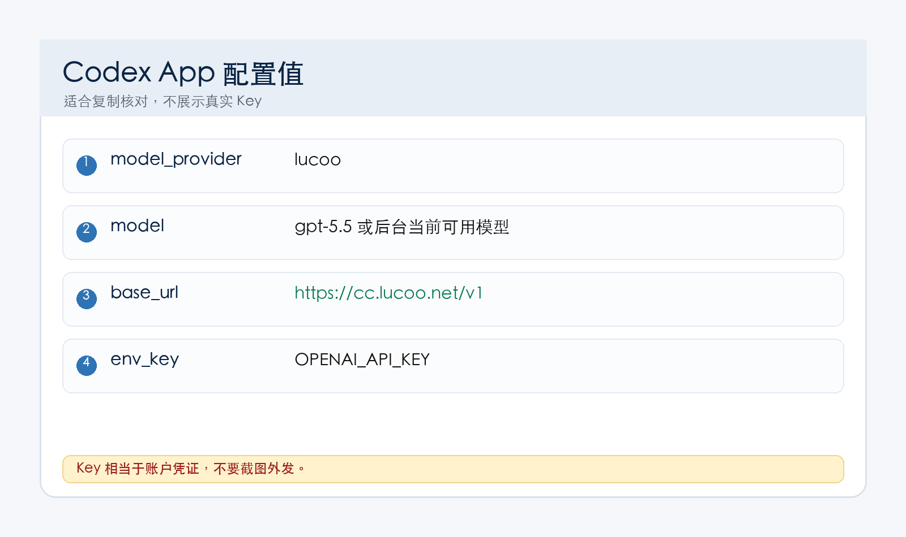
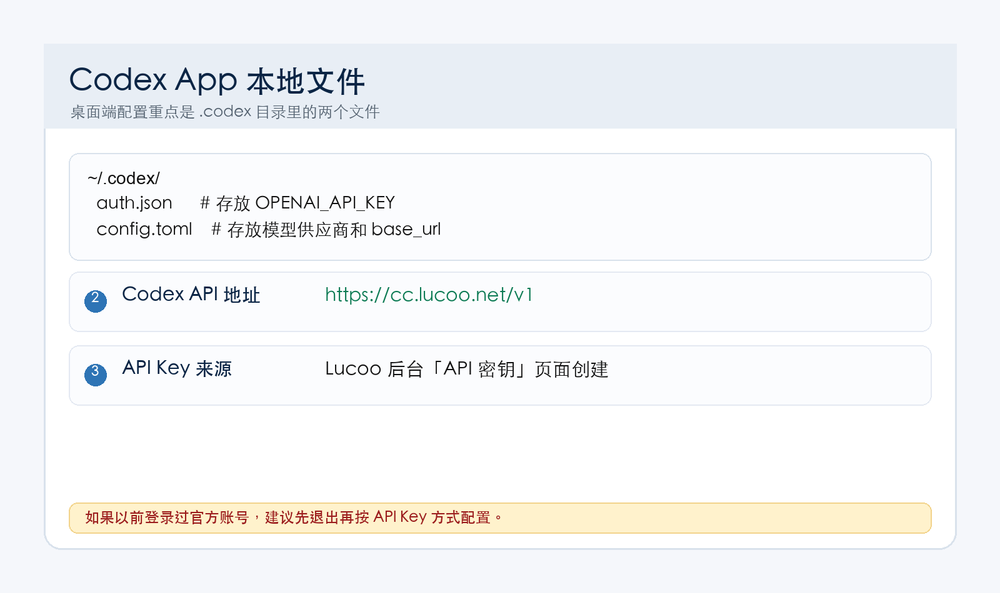

Codex App 是桌面客户端，适合不想一直在终端里操作的用户。配置 Lucoo 时，核心仍然是两个文件：`auth.json` 和 `config.toml`。

<div style="border:2px solid #ef4444;background:#fff1f2;color:#991b1b;padding:14px 16px;border-radius:12px;font-size:18px;font-weight:700;line-height:1.7;margin:18px 0;">
重点：如果你之前用 ChatGPT 官方账号登录过 Codex App，请先退出旧登录，再按本文写入 Lucoo API Key。否则客户端可能继续走旧账号。</div>



## 一、先准备 Lucoo API Key

1. 打开 [https://cc.lucoo.net](https://cc.lucoo.net)。
2. 登录账号后，进入「钱包 / 兑换」使用兑换码。
3. 进入「API 密钥」创建 `sk-` 开头 API Key。
4. 分组建议优先选 `pro`；轻量使用可以选 `plus`。

请注意：**兑换码不是 API Key。Codex App 里要用的是 `sk-` 开头 API Key。**

## 二、安装或打开 Codex App

按 Codex 官方页面下载安装桌面客户端：

- Codex App 官方说明：[https://developers.openai.com/codex/app](https://developers.openai.com/codex/app)

如果你已经装过，直接打开即可。

## 三、退出旧登录

如果客户端里已经登录过官方 ChatGPT / OpenAI 账号，建议先退出：

1. 打开 Codex App。
2. 找到账户或设置入口。
3. Sign out / Log out。
4. 完全退出 Codex App。
5. 再继续写入下面两个配置文件。

这样做是为了避免客户端继续读取旧登录状态，导致你明明写了 Lucoo 配置，但请求仍然走旧账号。

## 四、创建 `.codex` 配置目录

| 系统 | 配置目录 |
| --- | --- |
| macOS | `/Users/你的用户名/.codex` |
| Windows | `C:\Users\你的用户名\.codex` |
| Linux | `/home/你的用户名/.codex` |

macOS / Linux 可以执行：

```bash
mkdir -p ~/.codex
```

Windows PowerShell 可以执行：

```powershell
mkdir $HOME\.codex -Force
```



## 五、写入 `auth.json`

文件路径：`~/.codex/auth.json`

```json
{
  "OPENAI_API_KEY": "sk-这里填你在 Lucoo 后台创建的 API Key"
}
```

写完后保存。注意 JSON 里的双引号、冒号、花括号都不能删。

## 六、写入 `config.toml`

文件路径：`~/.codex/config.toml`

```toml
model = "gpt-5.5"
model_provider = "lucoo"
model_reasoning_effort = "xhigh"
sandbox_mode = "workspace-write"
approval_policy = "on-request"
file_opener = "vscode"
web_search = "cached"
suppress_unstable_features_warning = true

[history]
persistence = "save-all"

[tui]
notifications = true

[shell_environment_policy]
inherit = "all"
ignore_default_excludes = false

[features]
unified_exec = false

[model_providers.lucoo]
name = "Lucoo"
base_url = "https://cc.lucoo.net/v1"
env_key = "OPENAI_API_KEY"
wire_api = "responses"
```

备用入口只改 `base_url`：

```toml
base_url = "https://api.lucoo.net/v1"
```

其它可用入口：

- `https://hkcc.lucoo.net/v1`
- `https://sgcc.lucoo.net/v1`
- `https://uscc.lucoo.net/v1`

## 七、重新打开 Codex App 测试

1. 完全退出 Codex App。
2. 重新打开 Codex App。
3. 打开一个项目目录。
4. 输入测试问题：

```text
请读取当前项目目录，并告诉我下一步可以怎么开始。
```

如果能正常回答，说明 Codex App 已经通过 Lucoo 中转站工作。

## 八、常见问题

### 1. 仍然报 401

优先检查：

- `auth.json` 是否放在正确的 `.codex` 目录。
- API Key 是否是 `sk-` 开头。
- 是否把兑换码误填进去了。
- `config.toml` 的 `base_url` 是否带 `/v1`。
- 是否完整退出并重新打开了 Codex App。

### 2. App 仍然显示旧账号

先在 App 里退出旧账号，再关闭 App。必要时先用 Codex CLI 测通 Lucoo 配置，确认两个配置文件没问题，再回 App 测试。

### 3. 找不到配置目录

macOS 用户可以在 Finder 里按 `Command + Shift + G`，输入：

```text
~/.codex
```

Windows 用户可以在资源管理器地址栏输入：

```text
%USERPROFILE%\.codex
```

### 4. 模型不可用

后台模型和分组可能会调整。如果 `gpt-5.5` 不可用，按 Lucoo 后台当前模型名修改 `model`。

## 九、参考入口

- Lucoo 防丢主页：[https://lucoo.net](https://lucoo.net)
- Lucoo 主站：[https://cc.lucoo.net](https://cc.lucoo.net)
- Codex App 官方说明：[https://developers.openai.com/codex/app](https://developers.openai.com/codex/app)
- Codex 配置参考：[https://developers.openai.com/codex/config-reference](https://developers.openai.com/codex/config-reference)
