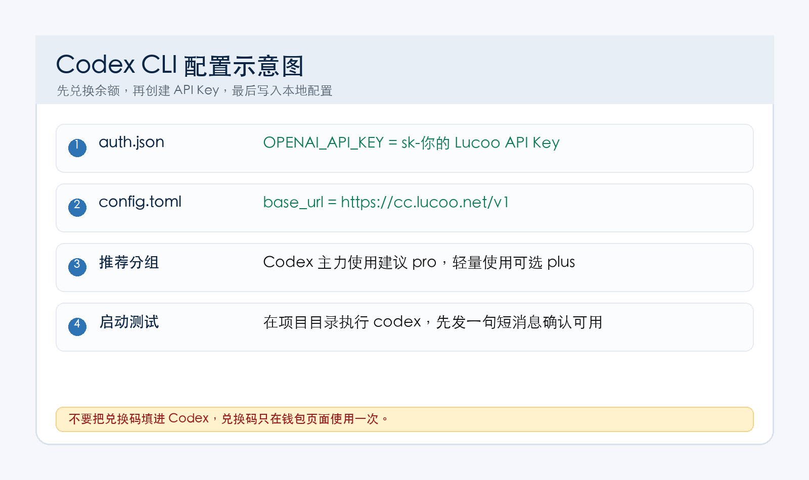
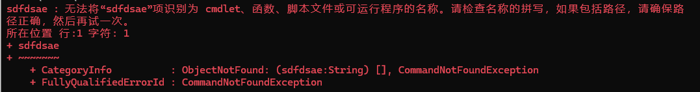
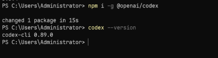
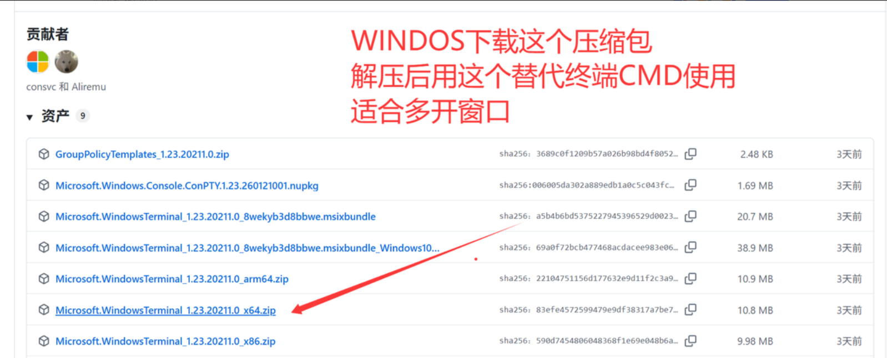
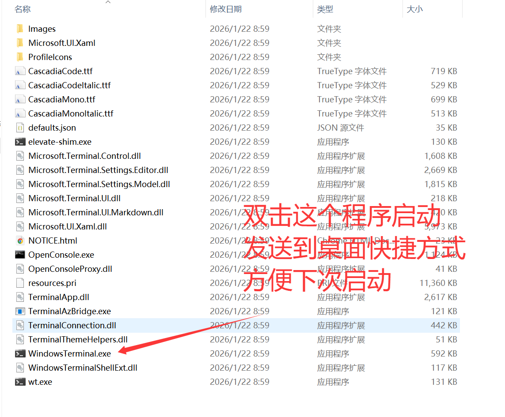
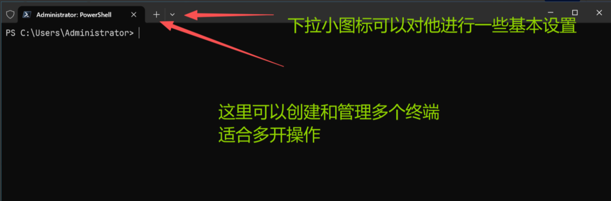
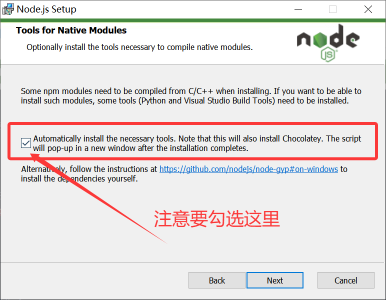
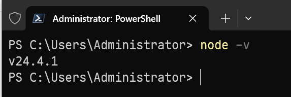
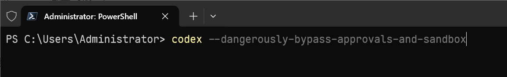

这篇是给 Lucoo 客户直接看的版本。你只需要记住一句话：**兑换码先去后台兑换余额，Codex 里填的是自己创建的 `sk-` 开头 API Key，不是兑换码。**

<div style="border:2px solid #ef4444;background:#fff1f2;color:#991b1b;padding:14px 16px;border-radius:12px;font-size:18px;font-weight:700;line-height:1.7;margin:18px 0;">
重点：Codex 的 Base URL 固定填写 <code>https://cc.lucoo.net/v1</code>，结尾必须带 <code>/v1</code>。API Key 必须是 Lucoo 后台生成的 <code>sk-</code> 开头密钥。
</div>



## 一、收到发货内容后先做什么

你在闲鱼或小店收到的发货内容里，可能会看到「使用方法」「兑换码」「卡号」「密码」等字段。请按下面理解：

| 发货字段 | 正确用途 | 不要怎么用 |
| --- | --- | --- |
| 使用方法链接 | 打开教程，看安装和配置步骤 | 不要当成接口地址 |
| 兑换码 / 卡密 | 到 Lucoo 后台「钱包 / 兑换」里兑换余额 | 不要填到 Codex、VS Code、OpenCode 里 |
| API Key | 在 Lucoo 后台「API 密钥」自己创建，通常是 `sk-` 开头 | 不要发给陌生人，也不要截图公开 |
| Base URL | Codex 连接 Lucoo 的接口地址：`https://cc.lucoo.net/v1` | 不要漏掉 `/v1` |

防丢入口：打开 [https://lucoo.net](https://lucoo.net) 可以找到最新地址。

## 二、Lucoo 后台兑换并创建 API Key

1. 打开主站：[https://cc.lucoo.net](https://cc.lucoo.net)。
2. 注册或登录你的账号。
3. 进入「钱包」或「兑换」页面，粘贴卖家发你的兑换码。
4. 兑换成功后，进入「API 密钥」。
5. 点击创建 API Key，分组建议优先选 `pro`；轻量使用可以选 `plus`。
6. 复制生成的 `sk-` 开头密钥，后面写入 `auth.json`。

备用入口如下，主站不稳定时只需要替换域名，路径仍然保留 `/v1`：

| 用途 | 地址 |
| --- | --- |
| 主站 | `https://cc.lucoo.net/v1` |
| DNS 解析入口 | `https://api.lucoo.net/v1` |
| 香港入口 | `https://hkcc.lucoo.net/v1` |
| 新加坡入口 | `https://sgcc.lucoo.net/v1` |
| 美国洛杉矶入口 | `https://uscc.lucoo.net/v1` |

## 三、安装 Codex CLI

### macOS / Linux 推荐方式

打开终端，执行：

```bash
curl -fsSL https://chatgpt.com/codex/install.sh | sh
```

安装完成后检查版本：

```bash
codex --version
```

### Windows PowerShell 推荐方式

用管理员或普通 PowerShell 执行：

```powershell
powershell -ExecutionPolicy ByPass -c "irm https://chatgpt.com/codex/install.ps1 | iex"
```

如果 PowerShell 提示脚本执行策略拦截，可以先执行：

```powershell
Set-ExecutionPolicy RemoteSigned -Scope CurrentUser
```



### 已经安装 Node.js 的用户

如果你的电脑已经有 Node.js，也可以用 npm 安装：

```bash
npm install -g @openai/codex
```

国内网络下载慢时，可以先切换 npm 镜像：

```bash
npm config set registry https://registry.npmmirror.com
npm install -g @openai/codex
```



## 四、Windows 用户环境截图参考

Windows 用户建议先安装 Windows Terminal，再安装 Node.js 或使用官方 Codex 安装脚本。







安装 Node.js 时，如果看到 Native Modules 相关选项，可以勾选，后续安装命令行工具会省事一些。



装好后在终端里输入：

```bash
node -v
```

能看到版本号就说明 Node.js 环境可用。



## 五、写入 Codex 配置文件

Codex 的用户级配置目录是 `.codex`：

| 系统 | 配置目录 |
| --- | --- |
| macOS / Linux / WSL | `~/.codex` |
| Windows | `C:\Users\你的用户名\.codex` |

### 1. 创建目录

macOS / Linux / WSL：

```bash
mkdir -p ~/.codex
```

Windows PowerShell：

```powershell
mkdir $HOME\.codex -Force
```

### 2. 创建 `auth.json`

文件路径：`~/.codex/auth.json`

内容如下，把示例密钥换成你自己的 `sk-` 开头 API Key：

```json
{
  "OPENAI_API_KEY": "sk-这里填你在 Lucoo 后台创建的 API Key"
}
```

### 3. 创建 `config.toml`

文件路径：`~/.codex/config.toml`

推荐客户版配置如下：

```toml
model = "gpt-5.5"
model_provider = "lucoo"
model_reasoning_effort = "xhigh"
sandbox_mode = "workspace-write"
approval_policy = "on-request"
file_opener = "vscode"
web_search = "cached"
suppress_unstable_features_warning = true

[history]
persistence = "save-all"

[tui]
notifications = true

[shell_environment_policy]
inherit = "all"
ignore_default_excludes = false

[features]
unified_exec = false

[model_providers.lucoo]
name = "Lucoo"
base_url = "https://cc.lucoo.net/v1"
env_key = "OPENAI_API_KEY"
wire_api = "responses"
```

如果后台当前展示的主力模型不是 `gpt-5.5`，只改第一行 `model` 即可，例如：

```toml
model = "gpt-5.4"
```

如果要切换备用入口，只改 `base_url`：

```toml
base_url = "https://sgcc.lucoo.net/v1"
```

## 六、启动 Codex CLI

进入你要处理的项目目录，然后执行：

```bash
codex
```

想直接进入少确认的模式，可以执行：

```bash
codex --yolo
```

原文里也有这种全权限启动方式：

```bash
codex --dangerously-bypass-approvals-and-sandbox
```



客户新手建议先用普通 `codex`，确认能正常对话后再决定是否使用全权限模式。

## 七、测试是否配置成功

启动后输入下面这句话：

```text
帮我看一下当前目录结构，并总结主要文件作用。
```

如果能正常返回内容，说明 Codex 已经通过 Lucoo 中转站工作。

## 八、常见问题

### 1. 报 401、invalid api key、Invalid token

通常是下面几种原因：

- 把兑换码当成 API Key 填进去了。
- API Key 复制时多了空格或少复制字符。
- `auth.json` 文件名写错，或者 JSON 格式少了双引号。
- 配置改完后没有重启 Codex。

解决：回 Lucoo 后台重新复制 `sk-` 开头 API Key，覆盖 `auth.json`，然后重启终端。

### 2. 报 404、Not Found

检查 `base_url` 是否是：

```text
https://cc.lucoo.net/v1
```

结尾少了 `/v1` 就容易报 404。

### 3. 报 No available accounts 或暂时不可用

通常是当前分组或号池忙。建议：

1. API Key 分组优先选择 `pro`。
2. 等 1-3 分钟再试。
3. 把入口从 `cc.lucoo.net` 换成 `sgcc.lucoo.net` 或 `hkcc.lucoo.net`。

### 4. Windows 提示 codex 不是内部或外部命令

说明 Codex 没有装成功，或者 npm 全局目录没有加入 PATH。可以重新打开终端，或者重新执行安装命令。

## 九、参考入口

- Lucoo 防丢主页：[https://lucoo.net](https://lucoo.net)
- Lucoo 主站：[https://cc.lucoo.net](https://cc.lucoo.net)
- Codex CLI 官方文档：[https://developers.openai.com/codex/cli](https://developers.openai.com/codex/cli)
- Codex 配置说明：[https://developers.openai.com/codex/config-basic](https://developers.openai.com/codex/config-basic)
- Codex 配置参考：[https://developers.openai.com/codex/config-reference](https://developers.openai.com/codex/config-reference)
