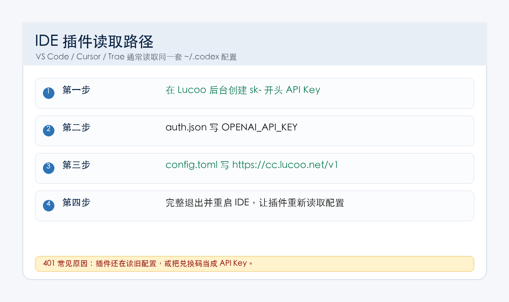
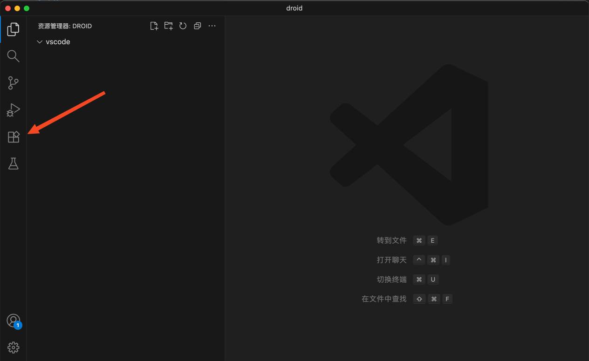
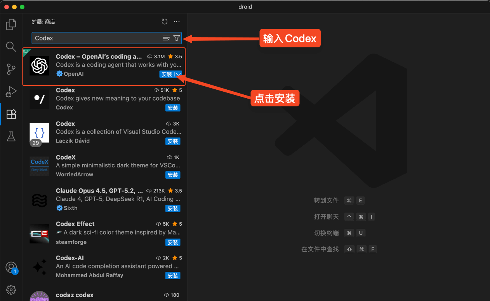
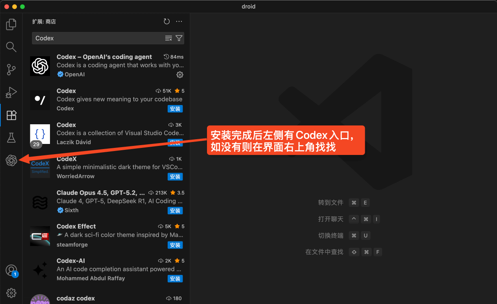
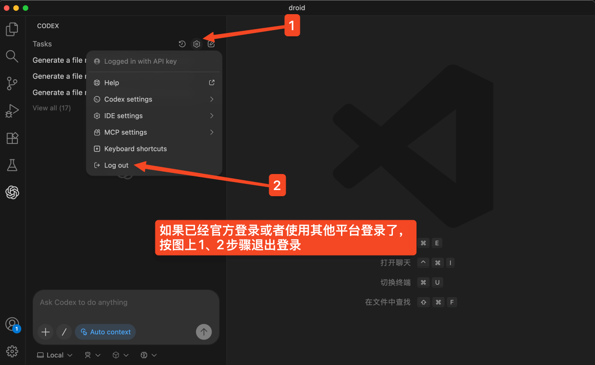
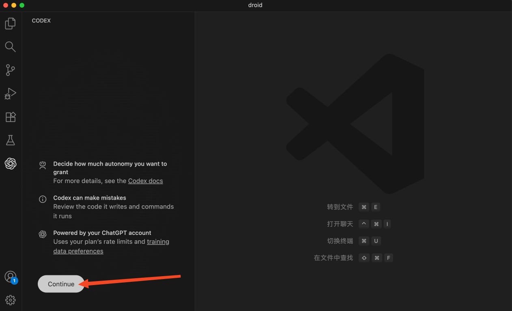

这篇适合已经在用 VS Code、Cursor 或 Trae 的客户。三者的思路一样：**插件读取的是你电脑上的 Codex 配置，所以先把 `~/.codex/config.toml` 和 `~/.codex/auth.json` 配好，再打开插件。**

<div style="border:2px solid #ef4444;background:#fff1f2;color:#991b1b;padding:14px 16px;border-radius:12px;font-size:18px;font-weight:700;line-height:1.7;margin:18px 0;">
重点：插件里不要填兑换码。兑换码只用于 Lucoo 后台兑换余额；插件实际调用时需要 <code>sk-</code> 开头 API Key。</div>



## 一、先准备三样东西

| 项目 | 填什么 |
| --- | --- |
| Lucoo 后台 | [https://cc.lucoo.net](https://cc.lucoo.net) |
| Base URL | `https://cc.lucoo.net/v1` |
| API Key | 后台「API 密钥」里创建的 `sk-` 开头密钥 |

备用入口：

- `https://api.lucoo.net/v1`
- `https://hkcc.lucoo.net/v1`
- `https://sgcc.lucoo.net/v1`
- `https://uscc.lucoo.net/v1`

防丢主页：[https://lucoo.net](https://lucoo.net)。

## 二、安装或打开 Codex 插件

以下截图来自原始插件安装流程，VS Code / Cursor / Trae 的入口基本一致。

### 1. 打开扩展面板



### 2. 搜索 Codex



### 3. 进入 Codex 插件页并安装



### 4. 如果之前登录过官方账号，先退出旧登录



退出旧登录后，再重新打开 Codex 插件入口。



## 三、配置 Codex 公共文件

Codex CLI 和 IDE 插件共用用户级配置。配置目录如下：

| 系统 | 配置目录 |
| --- | --- |
| macOS / Linux / WSL | `~/.codex` |
| Windows | `C:\Users\你的用户名\.codex` |

### 1. 创建 `auth.json`

路径：`~/.codex/auth.json`

```json
{
  "OPENAI_API_KEY": "sk-这里填你在 Lucoo 后台创建的 API Key"
}
```

### 2. 创建 `config.toml`

路径：`~/.codex/config.toml`

```toml
model = "gpt-5.5"
model_provider = "lucoo"
model_reasoning_effort = "xhigh"
sandbox_mode = "workspace-write"
approval_policy = "on-request"
file_opener = "vscode"
web_search = "cached"
suppress_unstable_features_warning = true

[history]
persistence = "save-all"

[tui]
notifications = true

[shell_environment_policy]
inherit = "all"
ignore_default_excludes = false

[features]
unified_exec = false

[model_providers.lucoo]
name = "Lucoo"
base_url = "https://cc.lucoo.net/v1"
env_key = "OPENAI_API_KEY"
wire_api = "responses"
```

如果你使用的是备用入口，只改这一行：

```toml
base_url = "https://hkcc.lucoo.net/v1"
```

## 四、重启编辑器并测试

配置写完后，请完整退出 VS Code / Cursor / Trae，再重新打开。

测试方法：

1. 打开一个项目文件夹。
2. 打开 Codex 插件聊天窗口。
3. 输入：

```text
请阅读当前项目目录，并告诉我这个项目大概是做什么的。
```

能正常返回内容，就说明插件已经走 Lucoo 中转。

## 五、Cursor 和 Trae 怎么办

Cursor、Trae 基本也是 VS Code 扩展体系，按下面顺序处理：

1. 先安装 Codex 插件。
2. 确认本机存在 `~/.codex/auth.json`。
3. 确认本机存在 `~/.codex/config.toml`。
4. 完整退出编辑器，再重新打开。
5. 如果插件里还有模型选择，选择 `gpt-5.5` 或后台当前可用模型。

不要在多个地方混填不同 Key。新手最稳的方式是：**只维护 `.codex` 目录下这两个文件。**

## 六、常见问题

### 1. 插件报 401

原文里的 401 报错，本质就是认证没有通过。优先检查：

- `auth.json` 里是否是 `sk-` 开头 API Key。
- 是否误把兑换码填进去了。
- `config.toml` 里 `model_provider` 是否是 `lucoo`。
- `base_url` 是否带 `/v1`。
- 改完后有没有重启编辑器。

### 2. 插件还在跳官方登录

先退出插件里的旧账号，再重启编辑器。如果仍然跳登录，先用 Codex CLI 测通，再回插件测试。

### 3. 找不到 `.codex` 目录

目录不存在就手动创建。Windows 用户可以在资源管理器地址栏输入：

```text
%USERPROFILE%\.codex
```

如果打不开，就先新建 `.codex` 文件夹。

### 4. 模型列表没有 `gpt-5.5`

后台可用模型可能会变，按 Lucoo 后台当前展示的模型名填写。如果客户不知道怎么选，建议先用卖家发货说明里推荐的模型。

## 七、参考入口

- Lucoo 防丢主页：[https://lucoo.net](https://lucoo.net)
- Lucoo 主站：[https://cc.lucoo.net](https://cc.lucoo.net)
- Codex 配置说明：[https://developers.openai.com/codex/config-basic](https://developers.openai.com/codex/config-basic)
- Codex 配置参考：[https://developers.openai.com/codex/config-reference](https://developers.openai.com/codex/config-reference)
