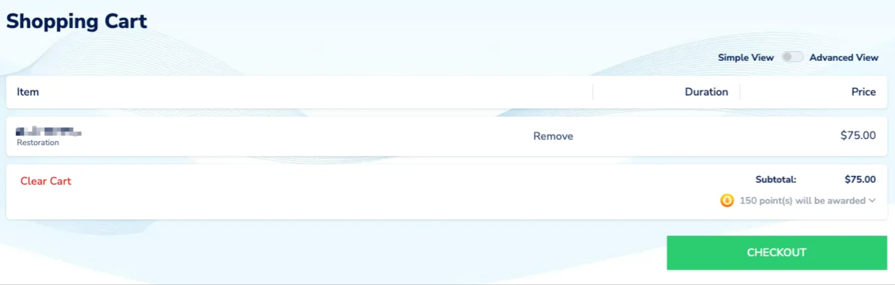

对于想要将 NAS、媒体服务器（如 Emby）或其他 Web 应用发布到公网的家庭用户来说，域名的选择往往是决定项目成败和成本效益的第一步。

在对比了 Namesilo、Godaddy 等传统域名注册商后，我发现 **Cloudflare** 提供的解决方案，在成本、安全性和功能集成方面，具有压倒性的优势。

## 一、成本分析：零利润与价格稳定性

对于普通用户而言，域名续费成本是长期运营的最大负担。Cloudflare 在此提供了市场中最具竞争力的定价，并承诺了价格的透明性。

<!-- more -->

### 1. 零利润续费策略

* **Cloudflare 续费策略：** Cloudflare 采取的是 **按注册局成本价（零利润）续费** 的策略。这意味着用户支付的费用，就是 Cloudflare 支付给域名注册机构的费用。
* **成本优势：** 续费成本通常在 **$10 - $15 USD/年** 左右，远低于许多传统注册商。
    * *对比示例：* 传统注册商某些域名的续费价格可能高达 **$70 USD/年**，Cloudflare 帮助您大幅减少了这一长期开支。

### 2. 续费价格稳定的承诺

* **价格承诺：** Cloudflare 承诺，在续费时，其价格将 **不会变动**。
* **优势分析：** 传统注册商常采用首年低价、续费高价的策略。Cloudflare 的透明定价消除了用户对未来成本不确定性的顾虑，提供了稳定的预算基础。

## 二、技术集成：Tunnel 服务的生态优势

Cloudflare 的集成优势远超传统域名服务商，这也是我们最终能够成功部署公网访问的关键。

### 1. Cloudflare Tunnel (Zero Trust) 的唯一性

* **独家功能：** Cloudflare Tunnel 服务旨在突破运营商的 NAT 和端口限制，实现公网安全访问内网。这项服务是 **Cloudflare 生态独有的**。
* **无缝衔接：** 只有将域名托管在 Cloudflare DNS 上，Tunnel 客户端才能自动创建所需的 **CNAME 记录**，将外部流量安全地指向您的内网服务。
* **排查简化：** Tunnel 的状态和日志反馈直接集成在 Zero Trust 仪表板中，极大地简化了 **Error 502** 等复杂网络问题的排查过程。

### 2. DNS 记录与 API 速度

* **快速生效：** Cloudflare 拥有全球领先的 DNS 解析速度，配置更改通常能在几秒内全球生效（而非数小时）。
* **集中管理：** 域名、DNS、SSL 证书和 Tunnel 路由都集中在一个统一的 Zero Trust 界面中管理。

## 三、安全与性能：免费的专业级保护

对于将家庭 IP 地址隐藏在公网背后的用户来说，安全防护至关重要。

### 1. 免费的专业级安全防护

* **隐藏真实 IP：** Cloudflare Tunnel 确保用户看到的只是 Cloudflare 的 IP 地址，您的家庭 IP 地址（如 `192.168.50.100`）始终保持隐藏。
* **免费 SSL/TLS：** Cloudflare 为您的域名提供免费的 SSL 证书，实现全程 HTTPS 加密。
* **DDoS 保护：** 即使是免费套餐，您的域名也享有基础的 DDoS 攻击保护，为家庭网络抵御外部威胁。

### 2. 全球 CDN 加速

* **性能提升：** Cloudflare 拥有庞大的全球网络节点，用户可以从离他们最近的节点访问您的服务，有效减少延迟，尤其在海外访问时效果显著。

## 最终结论：Cloudflare 是家庭网络的首选

| 领域 | Cloudflare 优势 | 传统注册商劣势 |
| :--- | :--- | :--- |
| **技术核心** | **独家 Tunnel 服务**，解决 NAT 和端口限制。 | 缺乏内置解决方案，需依赖 VPN 或第三方服务。 |
| **成本** | **零利润续费**，且价格**稳定不变**，长期成本最低。 | 续费价格高昂，且通常采用续费加价策略。 |
| **安全性** | 免费 HTTPS、DDoS 保护和隐藏源站 IP。 | 通常只提供域名解析，安全防护需额外购买。 |

对于预算有限、同时需要兼顾 **成本、功能集成和专业级安全防护** 的家庭用户而言，选择 Cloudflare 作为域名服务商或 DNS 托管，是实现家庭服务公网访问的**最佳战略选择**。
