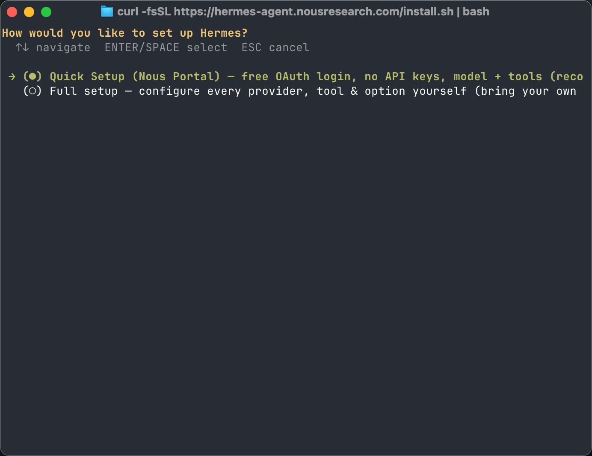
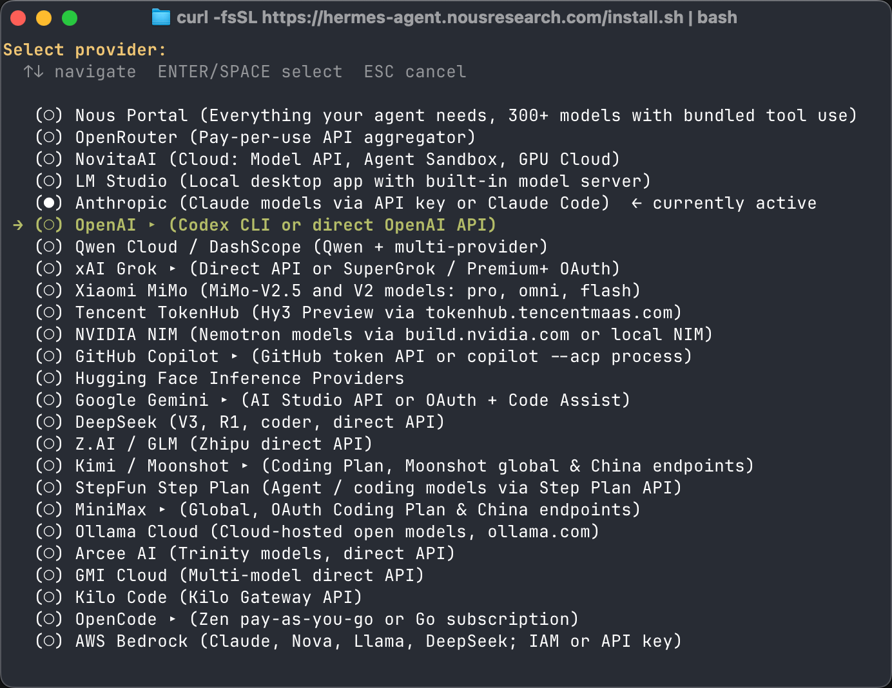
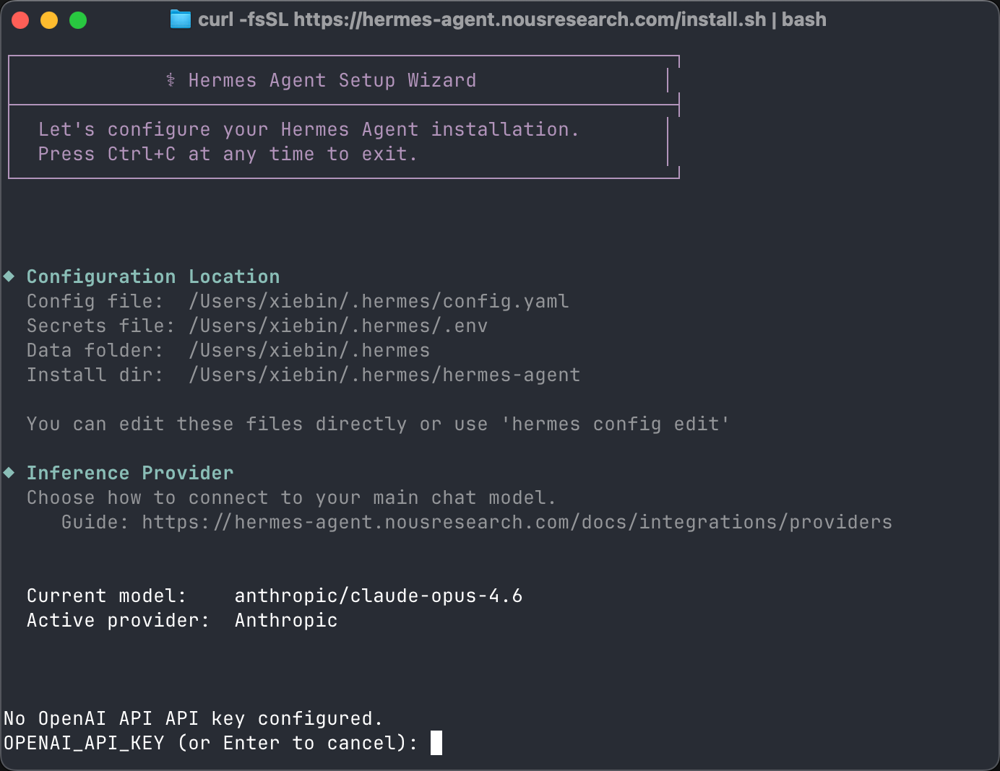
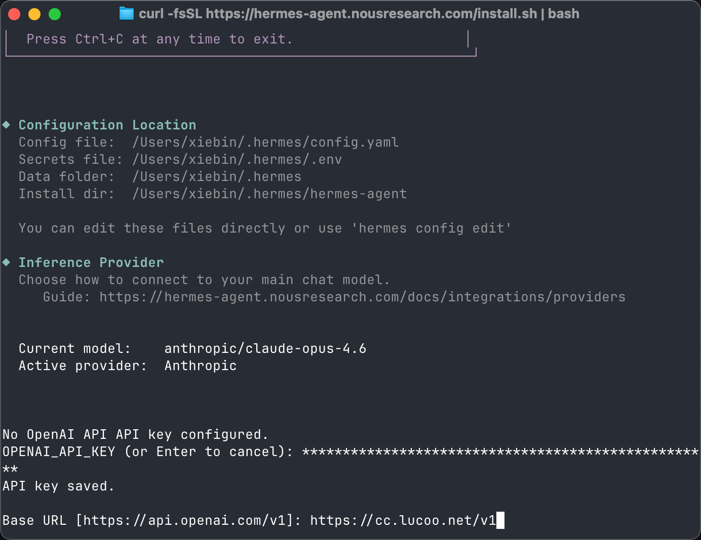
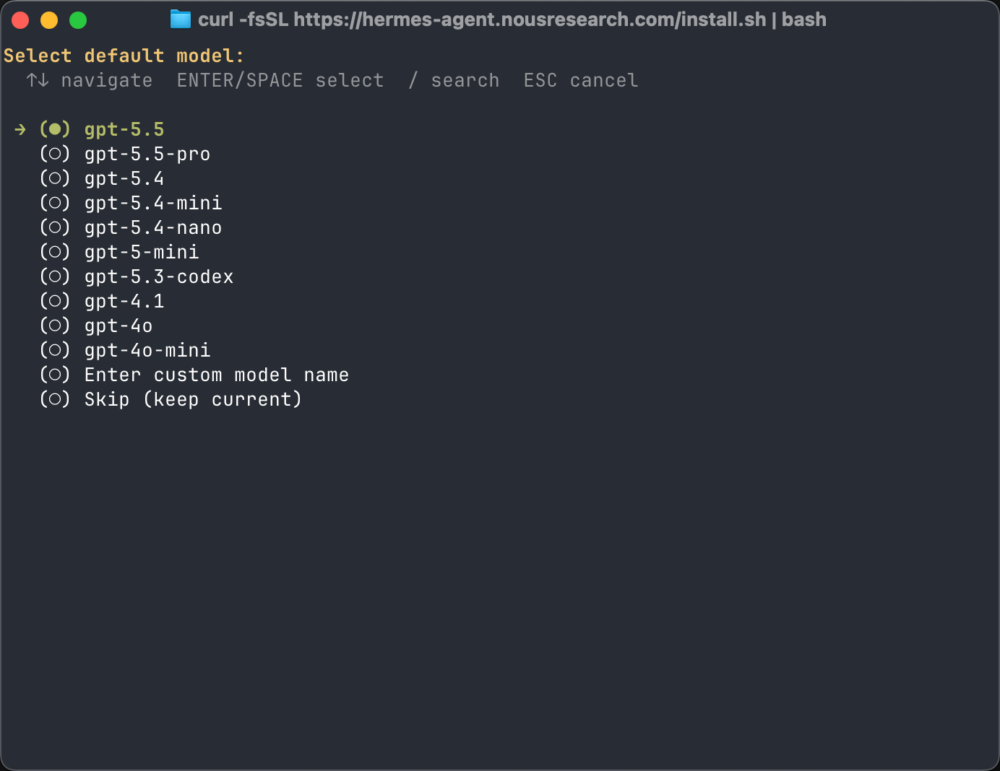
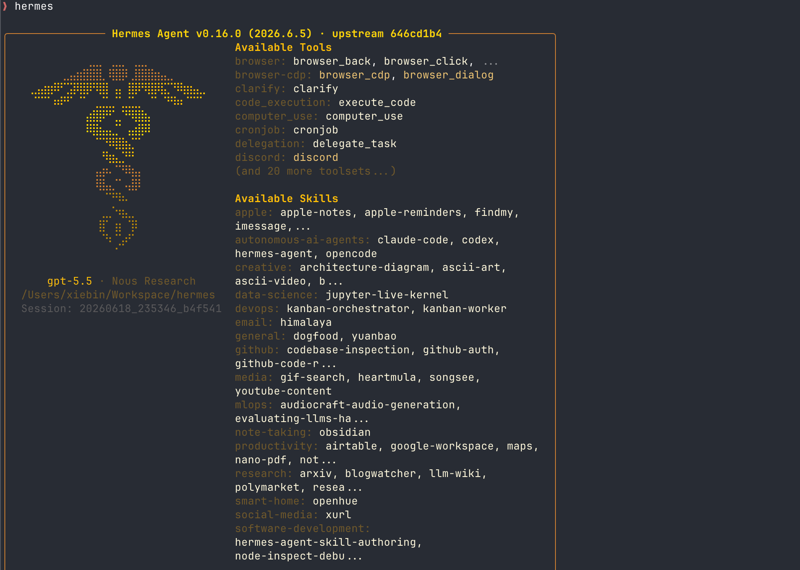
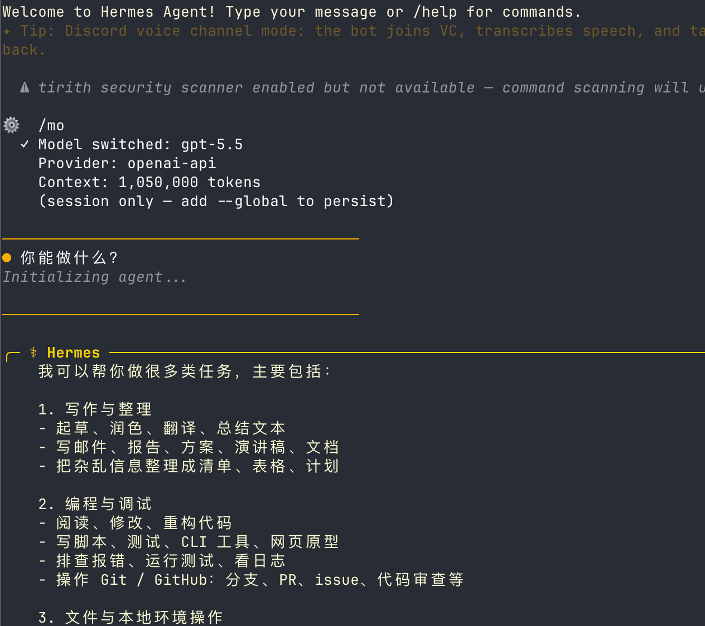
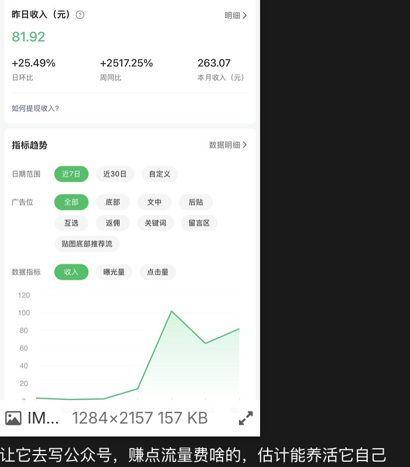

最近 AI Agent 越来越离谱了。

以前我们用 AI，大多是打开网页问一句、复制一段、再自己粘到项目里。Hermes Agent 不是这个玩法。它直接跑在终端里，可以看文件、改代码、执行命令、整理资料，像一个能干活的本地助理。

所以标题里说「日入百元」，不是说装上 Hermes 钱就会自动到账，而是它确实适合拿来做一些可以变现的小活：改脚本、写教程、整理资料、批量处理文档、帮客户排查项目问题。你负责判断和交付，它负责把大量重复步骤干掉。

这篇就讲一件事：怎么把 Hermes Agent 跑起来，并配置好自己的 API Key。跑通后，你就可以调用 GPT-5.5 这类模型，让 Hermes 在终端里帮你干活。

如果你已经在用 Codex、Claude Code、Cherry Studio，Hermes 很值得试。它更像「能打开你电脑工具箱的 AI」，而不是单纯聊天框。后面我会顺手用自己的中转站 Key 做演示，这样模型、Key、额度都能统一管理，不用每个工具单独折腾一遍。

<p class="lucoo-token-warning-block">先说清楚：本文不是收益承诺，也不是躺赚教程。Hermes 只是工具，真正能不能赚到钱，取决于你拿它解决什么问题、交付什么结果。</p>

## 一、适用场景

这篇教程适合下面几类用户：

1. 想在终端里用 Hermes Agent，让 AI 直接处理本地项目。
2. 想用 Lucoo 中转站的 API Key，不想每个工具都单独配官方 Key。
3. 想默认使用 GPT-5.5 这类模型，做代码、文档、资料整理类任务。
4. 担心本机环境被污染，想让 Hermes 跑在 Docker 里。
5. 已经用过 Codex / Claude Code，想试试另一个 Agent 工具。
6. 想把 AI 用到实际接单、内容生产、项目维护里，而不是只拿来聊天。

如果你只是临时聊天，网页端或 Cherry Studio 就够了。如果你希望 AI 能直接操作本地项目文件、执行命令、帮你改代码，Hermes 这种终端 Agent 会更顺手。

## 二、Hermes 能怎么帮你「日入百元」

别把它理解成挂机赚钱。更现实的用法是：你把 Hermes 当成执行力很强的副手，用它把原本两三个小时的杂活压到半小时以内。

比如这些活，很多人都愿意付费：

| 场景 | Hermes 能做什么 | 你负责什么 |
| --- | --- | --- |
| 网站教程 / 博客文章 | 整理素材、重写文章、补标题、生成结构 | 判断内容是否准确，最后发布 |
| 小脚本修改 | 读项目、定位文件、改代码、跑测试 | 确认需求，验收结果 |
| 文档整理 | 批量改 Markdown、提取重点、生成说明 | 检查语气和事实 |
| 项目排查 | 看日志、查配置、跑命令、给出修复建议 | 决定是否执行高风险操作 |
| AI 工具部署 | 按步骤安装、记录配置、生成教程 | 提供账号、Key、服务器权限 |

日入百元并不神秘。你只要一天接一个小单，比如帮别人整理一篇教程、修一个配置问题、写一个部署说明，Hermes 就能把中间很多机械工作吃掉。

但前提是模型要稳定，额度要好管理。这里我用自己的 Lucoo Key 做演示，原因也很简单：统一 Key、统一额度、工具之间切换方便。Codex、Claude、Cherry Studio、Hermes 这类工具都可以围绕同一套后台来配置，后面维护成本低很多。

## 三、常用地址

| 用途 | 地址 |
| --- | --- |
| Hermes Agent 官方文档 | [https://hermes-agent.nousresearch.com/docs/zh-Hans/getting-started/installation](https://hermes-agent.nousresearch.com/docs/zh-Hans/getting-started/installation) |
| Hermes Agent GitHub | [https://github.com/NousResearch/hermes-agent](https://github.com/NousResearch/hermes-agent) |
| Lucoo 中转站 | [https://cc.lucoo.net](https://cc.lucoo.net) |
| Lucoo 海外代理地址 | [https://apicc.lucoo.net](https://apicc.lucoo.net) |
| 额度购买地址 | [https://pay.ldxp.cn/shop/Lucoo](https://pay.ldxp.cn/shop/Lucoo) |
| 充值地址 | [https://cc.lucoo.net/console/topup](https://cc.lucoo.net/console/topup) |

<p class="lucoo-token-warning-block">重点：Hermes 里配置 OpenAI 兼容接口时，API Key 建议使用 Lucoo 中转站生成的 `sk-` 开头令牌。创建令牌时记得选择你实际可用的分组，不要留空。</p>

## 四、安装 Hermes Agent

打开官方安装文档：

[https://hermes-agent.nousresearch.com/docs/zh-Hans/getting-started/installation](https://hermes-agent.nousresearch.com/docs/zh-Hans/getting-started/installation)

官方给的安装命令很简单，终端执行：

```bash
curl -fsSL https://hermes-agent.nousresearch.com/install.sh | bash
```



安装过程中按提示往下走即可。第一次安装完成后，Hermes 会进入初始化配置流程。

## 五、选择 Full 完整配置

初始化时我这里选择 `Full`，也就是完整配置。



为什么建议新手也选 Full？因为 Hermes 不只是普通聊天工具，它有工具调用、终端执行、文件操作、记忆、技能等功能。完整配置能一次把主要选项走完，后面少折腾。

## 六、选择 OpenAI 兼容提供商

模型供应商这里选择 OpenAI 相关选项，然后填入 Lucoo 中转站的 Key。



在 Lucoo 中转站后台创建令牌后，把 `sk-` 开头的 API Key 复制到 Hermes 配置里。



这里要注意两点：

1. API Key 不要多复制空格，也不要截图公开。
2. Lucoo 后台的令牌分组要选对。分组不对时，Hermes 可能能启动，但实际请求模型会失败。

如果你还没有 Lucoo Key，可以先打开 [https://cc.lucoo.net](https://cc.lucoo.net) 注册登录，在「令牌管理」里创建一个新令牌。额度不足时，再到 [https://pay.ldxp.cn/shop/Lucoo](https://pay.ldxp.cn/shop/Lucoo) 购买并回后台充值。

## 七、默认模型选择 GPT-5.5

后面模型选择这里，我默认选了 `gpt-5.5`。



如果你只是日常问答，可以选便宜一点的模型；如果你要让 Hermes 改代码、分析项目、连续执行复杂任务，建议选能力更强的模型。

Agent 工具很吃模型稳定性。普通聊天模型答错了，大不了重问一次；Agent 如果在工具调用里理解错了，可能会改错文件、跑错命令，最后你还要花时间收拾。所以真要拿它干活，模型别太省。

## 八、选择 Hermes 跑在哪里

Hermes 会让你选择运行后端。这个选项新手容易看懵，我整理成表格：

| 选项 | 跑在哪里 | 适合场景 | 优缺点 |
| --- | --- | --- | --- |
| Local | 当前这台机器 | 个人电脑直接用，配置最少 | 访问本机文件方便，但可能污染本机环境，也会吃本机 CPU / 内存 |
| Docker | 本机 Docker 容器 | 想隔离环境、方便清理 | 更干净，可控资源，好卸载；但需要提前安装 Docker，文件挂载和网络要注意 |
| Modal | Modal 云端 serverless 沙盒 | 临时云端跑任务 | 不占本机资源，但依赖云服务账号和网络，可能产生费用 |
| SSH | 远程服务器 | 想用自己的 Linux 服务器或 GPU 机 | 适合把任务丢到强机器上跑，但需要 SSH 环境配置好 |
| Daytona | 云端持久开发环境 | 长期云端开发机 | 环境持久，适合远程开发；但账号和服务配置更复杂 |
| Keep current (local) | 保持当前配置 | 已经配置过，不想改 | 不切换 backend，继续用当前配置 |

我这里选择 Docker，主要是怕污染本机环境。


如果你只是想最快跑起来，可以先选 Local。后面用熟了，再切到 Docker 或 SSH 也不迟。

## 九、付费相关页面可以先跳过

后面可能会出现一些付费、订阅或平台额度相关的选择。

我这里因为已经准备用 Lucoo 中转站自己的 API Key，所以没有继续配置官方付费入口，直接 `Ctrl + C` 终止了这一步。

这不影响 Hermes 使用 Lucoo Key。只要前面的模型提供商、API Key、模型名配置正确，后面照样可以在终端里调用。

这也是我更推荐中转站方案的原因：不用每个 AI 工具都去单独买一套官方额度，统一在 Lucoo 后台看额度、管 Key、换分组，实际使用时省心很多。

## 十、启动 Hermes Agent

配置完成后，在终端输入：

```bash
hermes
```

正常情况下会进入 Hermes 的交互界面，体验有点像 Codex，但可玩性更高。



你可以直接和它对话，也可以让它读取项目、修改文件、运行命令。比如：

```text
帮我看看这个项目怎么启动
```

或者：

```text
检查一下当前目录的 README 有没有过期内容
```

如果你想让它更像「接单助手」，可以这样问：

```text
帮我把这个项目整理成一篇新手部署教程，要求适合博客发布，标题吸引人一点，并保留关键命令。
```

或者：

```text
帮我检查这个脚本为什么运行失败，先读代码和日志，不要直接删除文件。
```



## 十一、简单实测

我随便和 Hermes 聊了几句，它能正常响应，说明 Lucoo 中转站、模型和终端配置已经连通。



到这里，Hermes Agent 基本就跑起来了。

跑通以后，你可以先从低风险任务开始试：整理文章、检查 Markdown、生成 README、分析报错日志。确认它的工作方式后，再让它碰代码和项目配置。

## 十二、常见问题排查

### 1. 输入 `hermes` 后命令不存在

先关闭当前终端重新打开，再试一次：

```bash
hermes --version
```

如果还是不行，说明 shell 环境变量可能还没生效。可以回到安装日志里看 Hermes 写入了哪个 shell 配置文件，或者重新执行安装命令。

### 2. API Key 填了但模型请求失败

优先检查 Lucoo 中转站后台：

1. 令牌是否复制完整。
2. token 分组是否已经选择。
3. 当前分组是否有你选择的模型权限。
4. 额度是否充足。

很多「配置成功但不能用」的问题，最后都是令牌分组没选对。

### 3. Docker 模式启动失败

先确认本机已经安装 Docker，并且 Docker Desktop 正在运行。

如果你不想折腾 Docker，可以重新运行配置流程，把后端换成 Local。新手先跑通最重要，隔离环境可以后面再优化。

### 4. 不知道该选哪个模型

日常问答可以选便宜模型。写代码、修 bug、处理长文档时，建议选更强的模型，比如本文示例里的 `gpt-5.5`。

Hermes 是 Agent，不是普通聊天框。模型越稳定，工具调用越少翻车。

### 5. 额度不够了怎么办

可以到 Lucoo 购买额度：

[https://pay.ldxp.cn/shop/Lucoo](https://pay.ldxp.cn/shop/Lucoo)

购买后回到充值页完成兑换：

[https://cc.lucoo.net/console/topup](https://cc.lucoo.net/console/topup)

## 十三、安全提醒

- API Key 相当于账号密码，不要发到公开群、文章截图或代码仓库。
- 截图教程前，记得把 `sk-` 开头的 Key 打码。
- 如果怀疑 Key 泄露，直接到 Lucoo 后台删除旧令牌并重新创建。
- token 分组要选对。Hermes、Codex、Cherry Studio 这类 OpenAI 兼容工具，一般使用你实际购买或开通的可用分组。
- 国内网络不稳定时，可以尝试 Lucoo 的海外代理地址，但具体 Base URL 要按当前工具的配置要求填写。
- 让 Hermes 操作项目时，先从低风险任务开始。涉及删除文件、覆盖配置、提交代码之前，最好先看一眼它准备怎么做。

## 十四、总结

Hermes Agent 的优势不是「多一个聊天软件」，而是它真的能在终端里帮你干活。它可以看项目、改文件、跑命令，还能通过技能和记忆慢慢适应你的工作流。

如果你已经有 Lucoo 中转站的额度，把 Hermes 接进去很方便：安装 Hermes，选择完整配置，填入 Lucoo API Key，选好模型，再决定跑 Local 还是 Docker。跑通以后，它就能像一个本地 AI 助手一样接手很多重复操作。

至于「日入百元」，核心不在 Hermes 本身，而在你怎么用它。拿它接小单、写教程、改文档、排查项目问题，都比纯手工快很多。AI 不会替你判断客户需求，也不会替你负责交付，但它能把最耗时间的执行部分压下来。

想省事的话，直接用本文这套配置：Lucoo 中转站 + GPT-5.5 + Docker。额度统一管，模型能力够用，本机环境也更干净。先跑通，再慢慢把它变成你自己的接单助手。
