前面我们已经把 Hermes Agent 安装好了，也把模型接口接到了 Lucoo 中转站。终端里直接跑 `hermes` 没问题，但如果每次都要 SSH 到服务器里聊天，还是有点麻烦。

更顺手的方式是：把 Hermes 接到飞书机器人。这样手机飞书里直接给机器人发消息，服务器上的 Hermes 收到后调用模型回复。以后查服务器状态、看日志、做定时任务提醒，都可以走这个机器人。

这篇就是完整实操版：从飞书开放平台创建应用，到 Hermes Gateway 配置长连接，再到手机端配对成功。步骤比较细，小白照着做就行。

<p class="lucoo-token-warning-block">安全提醒：本文不会展示 App Secret、API Key、服务器密码。截图里出现的 App ID、配对码、会话 ID 只作为流程示例，实际发布自己的教程时，建议把完整密钥和敏感 ID 打码。</p>

## 一、适合什么场景

这篇教程适合你已经完成下面几件事的情况：

1. 有一台 Linux 服务器，能 SSH 登录。
2. 服务器上已经安装 Hermes Agent。
3. Hermes 已经配置好模型接口，比如 Lucoo 中转站。
4. 想用飞书私聊或群聊来操作 Hermes。
5. 不想折腾公网回调地址、HTTPS 证书和端口开放。

如果你还没安装 Hermes，可以先看前一篇安装教程：

[Hermes 如何自己日入百元？一个终端 AI Agent 的实战玩法](/postsinfo/hermes-agent-lucoo-relay/)

本文推荐使用飞书的「长连接」模式。这个模式不需要你提供公网 URL，服务器主动连飞书，飞书有消息时通过 WebSocket 推给 Hermes。

## 二、最终效果

配置完成后，你可以在飞书里直接私聊 `Hermes 助手`：

```text
你好，回复 hermes-ok
```

第一次私聊时，Hermes 会提示它还不认识你，并给出一个 pairing code：

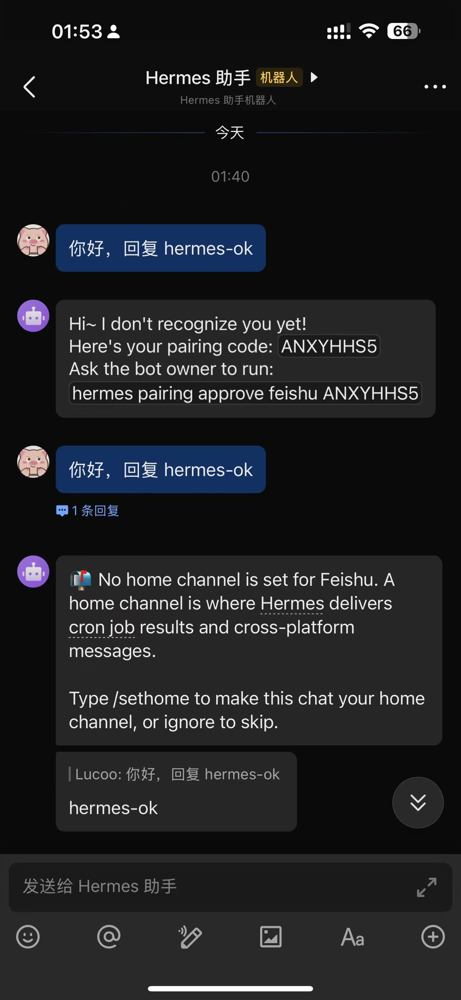

回服务器批准配对后，再发一次消息，Hermes 就能正常回复：

```text
hermes-ok
```

如果你想把这个私聊作为默认通知频道，可以继续发送：

```text
/sethome
```

成功后会看到 Home channel 设置完成：

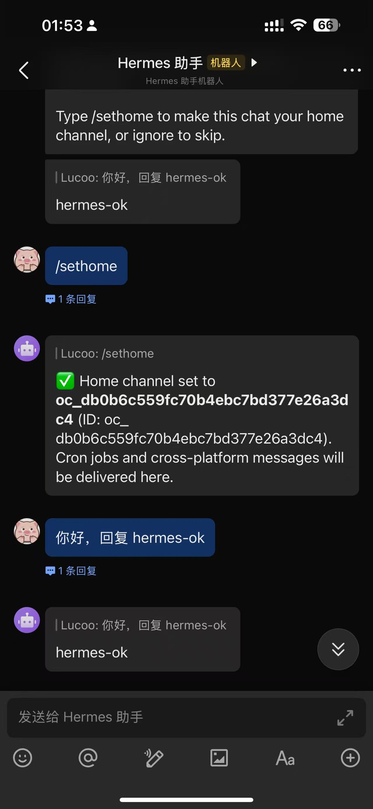

Home channel 的作用是接收 Hermes 的定时任务结果、跨平台通知等消息。普通聊天不设置也能用，但建议顺手设置。

## 三、准备信息

先准备这几项：

| 项目 | 说明 |
| --- | --- |
| 飞书开放平台 | [https://open.feishu.cn](https://open.feishu.cn) |
| 服务器 SSH | 能登录安装 Hermes 的服务器 |
| Hermes 命令 | 服务器里能执行 `hermes doctor` |
| App ID | 飞书应用的 `App ID` |
| App Secret | 飞书应用的 `App Secret`，不要公开 |
| 连接方式 | 选择 `WebSocket / 长连接` |

如果你和我一样是在服务器上操作，可以先登录：

```bash
ssh usa
```

通用写法是：

```bash
ssh root@你的服务器IP
```

检查 Hermes 是否正常：

```bash
hermes doctor
```

如果之前已经把 Hermes 接到了 Lucoo 中转站，模型接口就不用重复配。飞书只是多加一个消息入口，真正回答问题的还是服务器上的 Hermes。

## 四、飞书开放平台创建机器人

打开飞书开放平台：

[https://open.feishu.cn](https://open.feishu.cn)

进入「开发者后台」，创建一个「企业自建应用」。应用名称可以写：

```text
Hermes 助手
```

创建完成后，进入「凭证与基础信息」，复制这两个值：

```text
App ID
App Secret
```

然后到「应用能力」里开启机器人能力。不同飞书后台版本入口可能略有不同，一般叫「机器人」「Bot」或「应用能力」。

## 五、配置权限

进入「权限管理」，可以用批量导入权限。先用最小能聊天版本即可：

```json
{
  "scopes": {
    "tenant": [
      "im:message",
      "im:message.p2p_msg:readonly",
      "im:message.group_at_msg:readonly",
      "im:message:send_as_bot",
      "im:resource",
      "im:chat:read",
      "im:chat.members:read"
    ],
    "user": []
  }
}
```

导入后点「申请开通」。如果页面提示某个权限不存在，先按飞书页面实际提示调整，核心是要有这两类能力：

1. 机器人能接收用户发来的消息。
2. 机器人能以 Bot 身份发送消息。

后面添加 `im.message.receive_v1` 事件时，飞书页面也会自动提示缺哪些权限。看到「待发布」不用慌，最后发布版本后才会正式生效。

## 六、事件配置选择长连接

进入飞书应用的「事件与回调」页面，选择「事件配置」。

订阅方式这里选：

```text
使用 长连接 接收事件
```

不要选「将事件发送至开发者服务器」。开发者服务器模式需要你准备公网 HTTPS 回调地址，配置更麻烦。

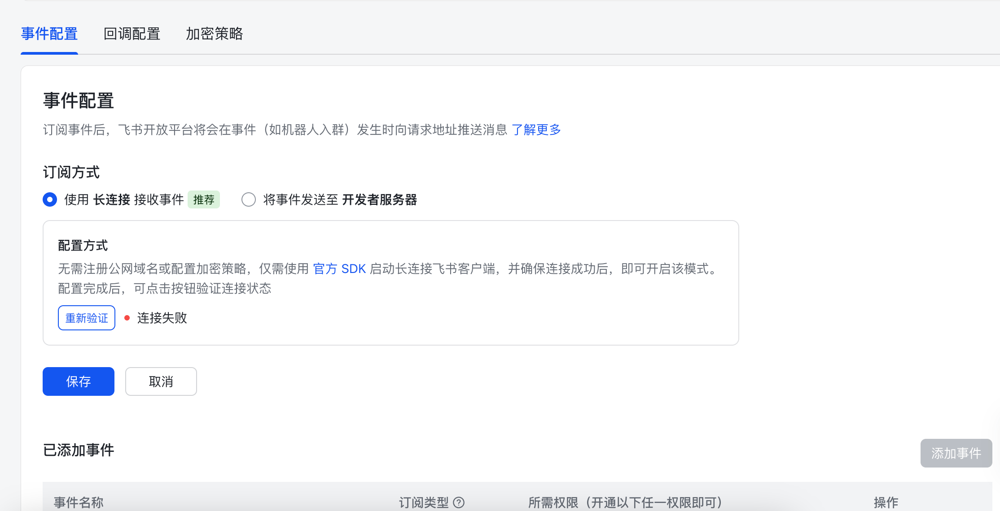

如果页面显示「连接失败」，先不用紧张。此时服务器上的 Hermes Gateway 还没启动长连接，所以飞书验证不到。等后面 Gateway 跑起来后，再回来点「重新验证」。

## 七、服务器安装飞书依赖

回到服务器，先补飞书长连接需要的依赖：

```bash
/usr/local/lib/hermes-agent/venv/bin/pip install lark-oapi websockets aiohttp
```

如果你不是用官方脚本安装，Hermes 虚拟环境路径可能不一样。可以用下面的命令找一下：

```bash
command -v hermes
find /usr/local/lib/hermes-agent -maxdepth 3 -type f -name pip
```

看到 pip 提示有新版本可以先忽略，不影响配置。

## 八、运行 Hermes Gateway 配置向导

在服务器执行：

```bash
hermes gateway setup
```

选择平台时选：

```text
Feishu / Lark
```

按提示填入前面复制的：

```text
App ID
App Secret
```

如果之前已经配置过，它会显示 `Skipped (keeping current)`，表示继续使用当前保存的配置。

## 九、选择 WebSocket 长连接

Connection mode 这里选择第一项：

```text
WebSocket (recommended - no public URL needed)
```

直接按 Enter。

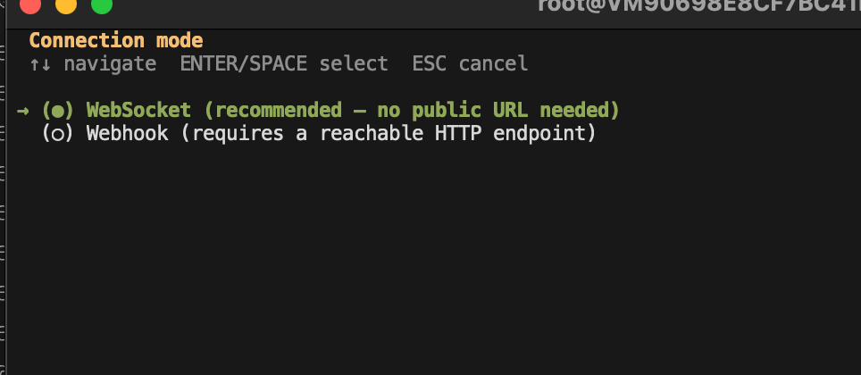

这个选项最适合普通服务器：不需要公网回调，不需要开放端口，也不需要配置 HTTPS 证书。

## 十、私聊授权选择配对审批

接下来它会问：

```text
How should direct messages be authorized?
```

建议选择：

```text
Use DM pairing approval
```

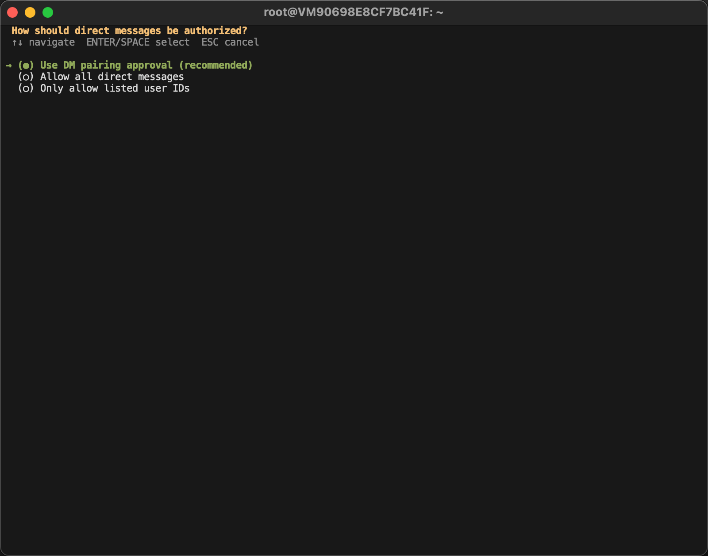

意思是：第一次有人私聊机器人时，Hermes 不会马上允许对方使用，而是生成一个配对码。服务器管理员执行批准命令后，这个用户以后才能用。

不建议选 `Allow all direct messages`。谁都能私聊使用的话，容易消耗你的模型额度，也不安全。

## 十一、群聊只响应 @

群聊处理方式建议选择：

```text
Respond only when @mentioned in groups
```

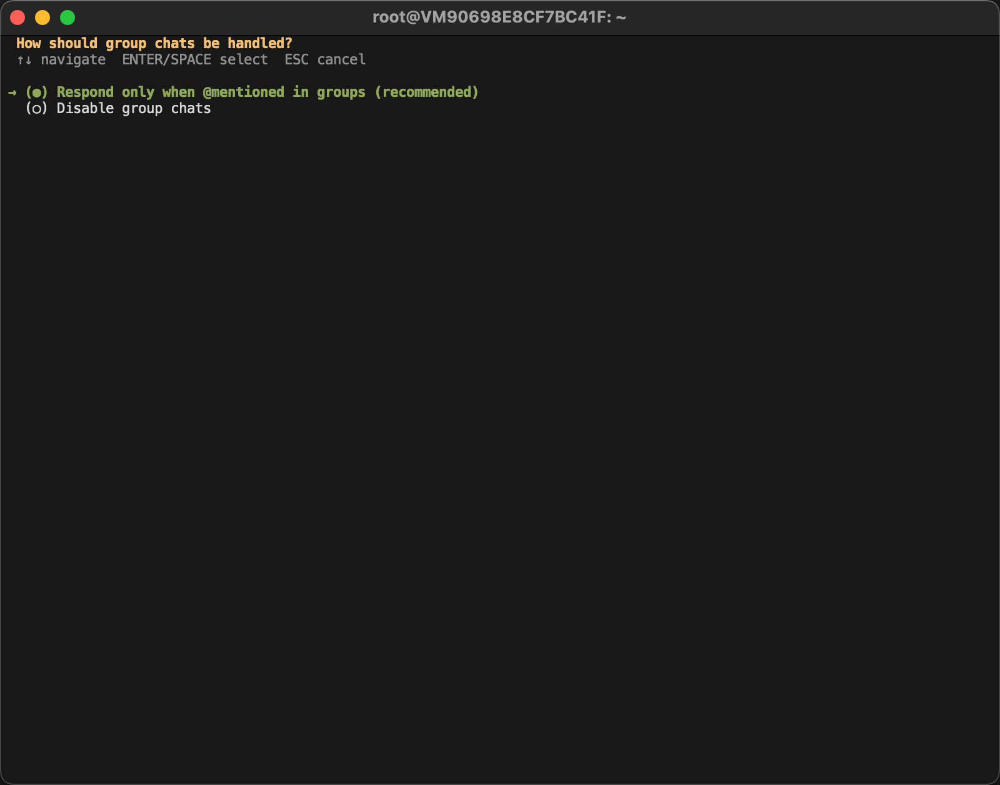

这样机器人被拉进群以后，只有别人 `@Hermes 助手` 时才会回复。否则群里每句话都触发 AI，很容易刷屏，也会浪费额度。

如果你暂时只想私聊使用，也可以选择禁用群聊。后面需要群聊时再重新配置。

## 十二、Home chat ID 先留空

向导会问：

```text
Home chat ID (optional, for cron/notifications):
```

这里先直接按 Enter 留空。

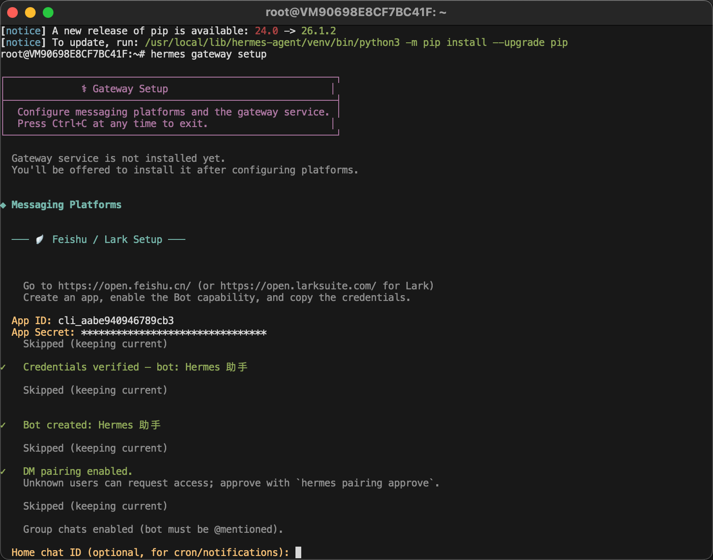

Home chat 是默认通知频道，用来接收 cron 定时任务结果和跨平台通知。刚开始还不知道哪个飞书会话 ID，等私聊机器人跑通后，在飞书里发送 `/sethome` 就能自动设置。

## 十三、安装成 systemd 服务

向导后面会问是否现在启动 Gateway、是否开机自动启动。服务器上建议都选 `Y`。

运行方式选择这里，推荐服务器选择：

```text
System service
```

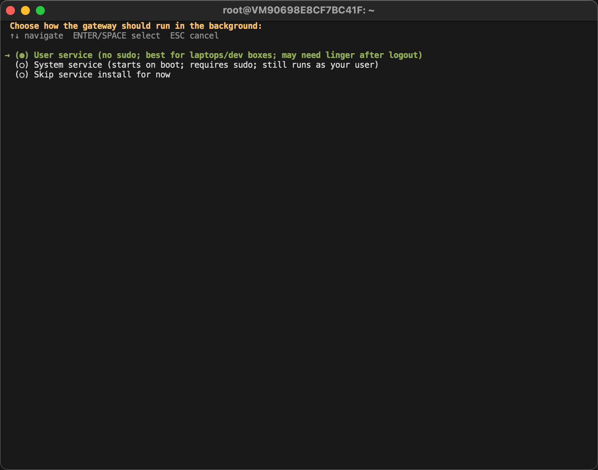

如果它继续问：

```text
Run the system gateway service as which user?
```

如果 Hermes 是 root 安装、配置也在 root 下面，就填：

```text
root
```

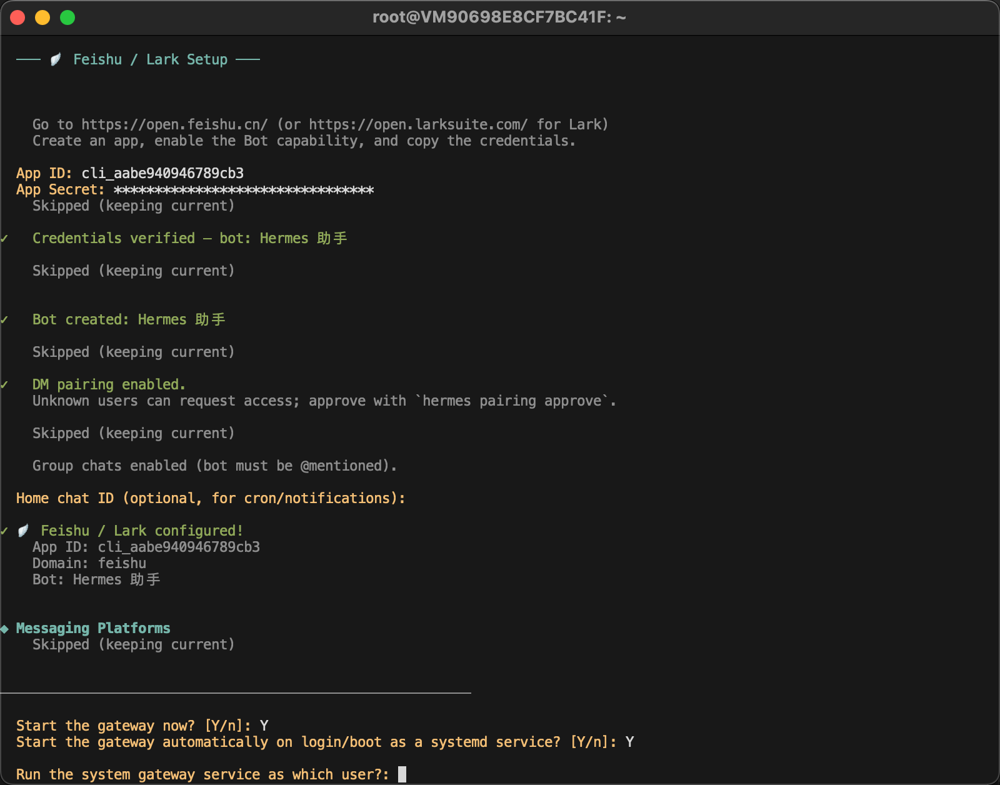

如果你是普通用户安装的 Hermes，就填自己的 Linux 用户名，不要照抄 root。

完成后看到类似下面两行，说明服务已经安装并启动：

```text
System service installed and enabled!
System service started
```

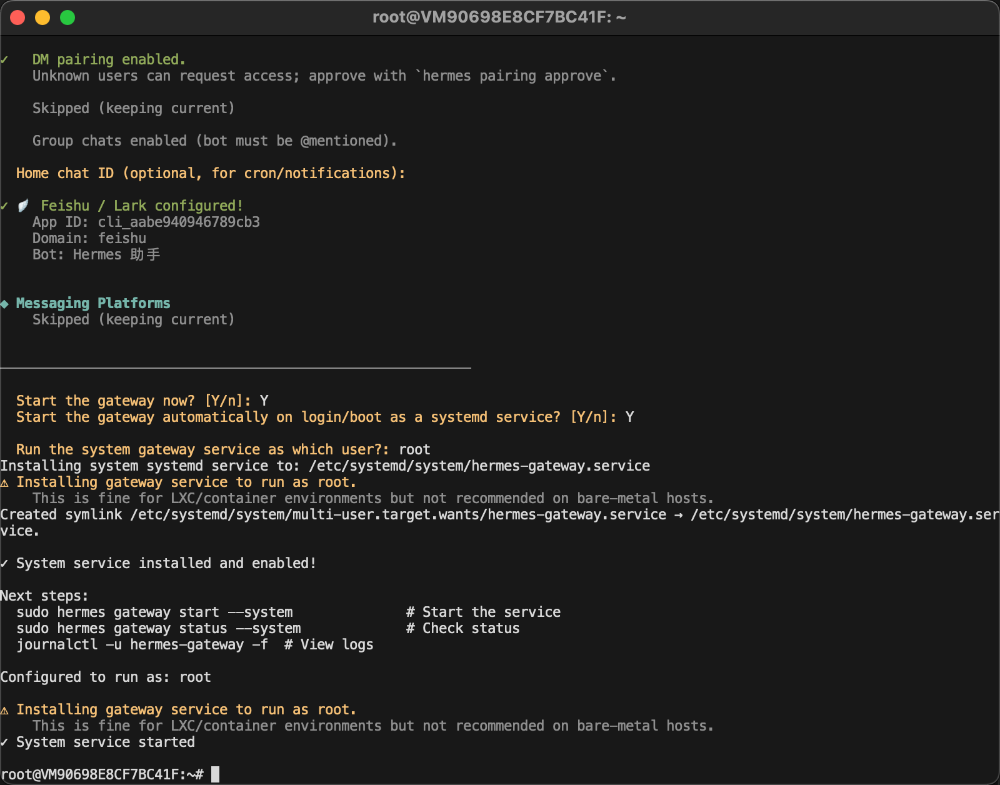

## 十四、检查 Gateway 状态

服务器上执行：

```bash
hermes gateway status
```

如果是 systemd 服务，也可以执行：

```bash
sudo hermes gateway status --system
systemctl status hermes-gateway
```

正常会看到：

```text
active (running)
connected to wss://...
```

查看最近日志：

```bash
journalctl -u hermes-gateway -n 100 --no-pager
```

实时看日志：

```bash
journalctl -u hermes-gateway -f
```

如果飞书后台长连接验证失败，多半是 Gateway 没启动、App ID / App Secret 填错、或者依赖没装好。

## 十五、回飞书后台重新验证

回到飞书开放平台的「事件配置」页面，点：

```text
重新验证
```

如果 Hermes Gateway 已经连上飞书，验证会通过。通过后点击保存。

接着点击「添加事件」，搜索：

```text
im.message.receive_v1
```

勾选「接收消息」事件，然后点右下角「添加」。

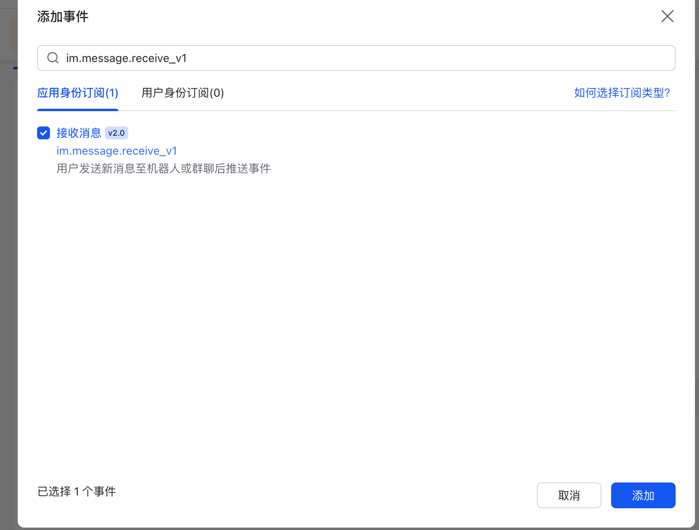

添加后能看到事件已经在列表里：

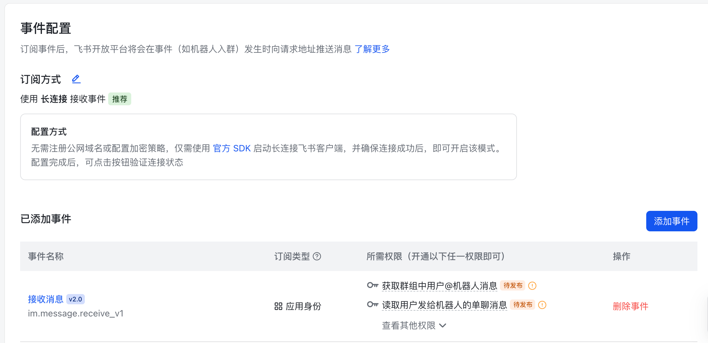

页面里如果显示「待发布」，说明还需要发布应用版本。

## 十六、发布飞书应用版本

飞书应用的权限和事件不是保存后立刻生效，必须发布版本。

进入：

```text
版本管理与发布
```

然后：

1. 点击「创建版本」。
2. 版本说明可以写：`接入 Hermes 飞书机器人`。
3. 提交并发布。
4. 如果页面要求审核，按提示提交审核或确认发布。

发布完成后，再回事件页面看，`待发布` 标记应该会消失。

## 十七、第一次私聊需要配对

打开飞书客户端，搜索你的机器人，例如：

```text
Hermes 助手
```

私聊发送：

```text
你好，回复 hermes-ok
```

如果你前面选择了 DM pairing，第一次会收到类似提示：

```text
Hi~ I don't recognize you yet!
Here's your pairing code: <你的配对码>
Ask the bot owner to run:
hermes pairing approve feishu <你的配对码>
```

这说明流程是通的，只是还没批准当前用户。

回服务器执行它提示的批准命令：

```bash
hermes pairing approve feishu <你的配对码>
```

注意：`<你的配对码>` 要替换成你飞书里实际显示的码。

成功后会看到：

```text
Approved! User ... on feishu can now use the bot
```

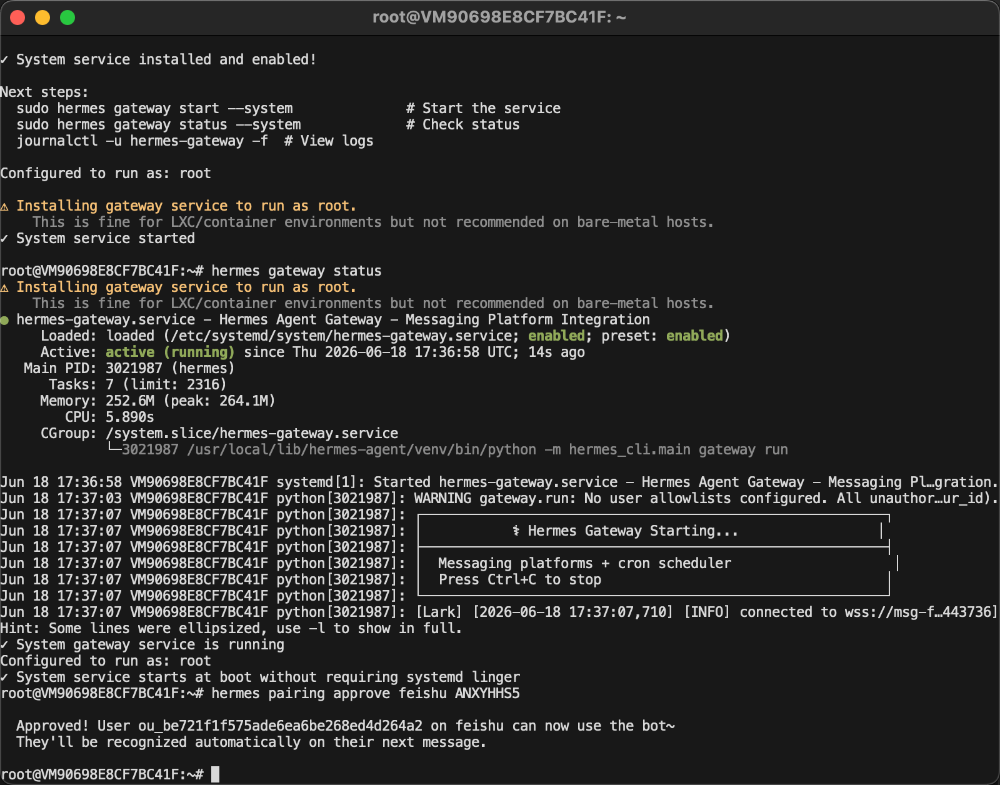

然后回飞书，再发一次：

```text
你好，回复 hermes-ok
```

能看到 `hermes-ok`，就说明 Hermes、飞书、模型接口都打通了。

## 十八、设置 Home channel

第一次成功聊天后，Hermes 可能会提醒：

```text
No home channel is set for Feishu.
Type /sethome to make this chat your home channel, or ignore to skip.
```

这不是报错。意思是 Hermes 还不知道以后把定时任务结果和系统通知发到哪里。

建议在当前私聊里发送：

```text
/sethome
```

成功后会提示：

```text
Home channel set to ...
Cron jobs and cross-platform messages will be delivered here.
```


普通对话不依赖 Home channel，但设置后更完整。

## 十九、常用命令

后面维护时常用这些命令：

| 命令 | 作用 |
| --- | --- |
| `hermes gateway status` | 查看 Gateway 状态 |
| `sudo hermes gateway status --system` | 查看 systemd Gateway 状态 |
| `sudo hermes gateway restart --system` | 重启 systemd Gateway |
| `journalctl -u hermes-gateway -n 100 --no-pager` | 查看最近日志 |
| `journalctl -u hermes-gateway -f` | 实时看日志 |
| `hermes pairing approve feishu <配对码>` | 批准飞书用户 |
| `hermes pairing list` | 查看 pending 和 approved 用户 |
| `hermes gateway setup` | 重新运行配置向导 |

如果修改了飞书 App Secret、事件权限或 Hermes 配置，建议重启：

```bash
sudo hermes gateway restart --system
```

## 二十、常见问题

### 1. 飞书事件配置一直显示连接失败

优先检查：

1. 服务器上的 `hermes-gateway` 是否 active running。
2. 是否选择了 WebSocket / 长连接。
3. App ID 和 App Secret 是否填对。
4. 是否安装了 `lark-oapi`、`websockets`、`aiohttp`。
5. 服务器能否访问飞书长连接地址。

状态检查：

```bash
hermes gateway status
journalctl -u hermes-gateway -n 100 --no-pager
```

### 2. 飞书里发消息没有回复

先看日志有没有收到消息：

```bash
journalctl -u hermes-gateway -f
```

如果日志里出现 `Unauthorized user`，说明还没批准配对。按飞书消息里的命令执行：

```bash
hermes pairing approve feishu <配对码>
```

### 3. 群里机器人不回复

如果你选择的是「只在 @ 时响应」，群里必须 `@Hermes 助手`。

另外确认飞书事件里已经添加：

```text
im.message.receive_v1
```

并且应用已经发布。

### 4. 提示 No home channel is set

这不是错误。在你想作为通知入口的飞书私聊里发送：

```text
/sethome
```

### 5. 模型不回答或回答慢

飞书只是消息入口。真正回答的是 Hermes 后面配置的模型接口。

优先检查：

1. Hermes 的模型配置是否正常。
2. Lucoo 中转站 API Key 是否可用。
3. token 分组是否配置正确。
4. 当前模型是否有权限。
5. 额度是否足够。

服务器上可以先跑：

```bash
hermes -z "Reply with exactly: hermes-ok"
```

如果终端里都不能正常回答，就先排查 Hermes 和模型接口，不要先怪飞书。

## 二十一、安全建议

这类机器人接到服务器后，权限一定要收紧：

1. 私聊建议使用 DM pairing，不要开放给所有人。
2. 群聊建议只在 @ 时响应。
3. 不要在公开文章里展示 App Secret、API Key、服务器密码。
4. 不要让机器人默认执行高危命令。
5. 生产服务器上不要随便开 `--yolo`。
6. 如果 API Key 泄露，立即去 Lucoo 中转站删除旧令牌并重新创建。

如果只是你自己用，最稳的组合是：

```text
WebSocket 长连接
DM pairing approval
群聊仅 @ 响应
systemd 开机自启
Lucoo 中转站统一管理模型额度
```

## 二十二、总结

Hermes 接入飞书以后，使用体验会从「SSH 到服务器里聊天」变成「手机上直接找机器人」。这对服务器运维、定时提醒、临时查日志、远程执行低风险任务都很实用。

这套流程里最容易卡住的地方有三个：

1. 飞书后台必须选择长连接，并添加 `im.message.receive_v1`。
2. Hermes Gateway 必须作为服务跑起来，状态要是 `active (running)`。
3. 第一次私聊必须用 `hermes pairing approve feishu <配对码>` 批准用户。

跑通以后，记得发 `/sethome`。到这一步，你的飞书版 Hermes 助手就基本完成了。
