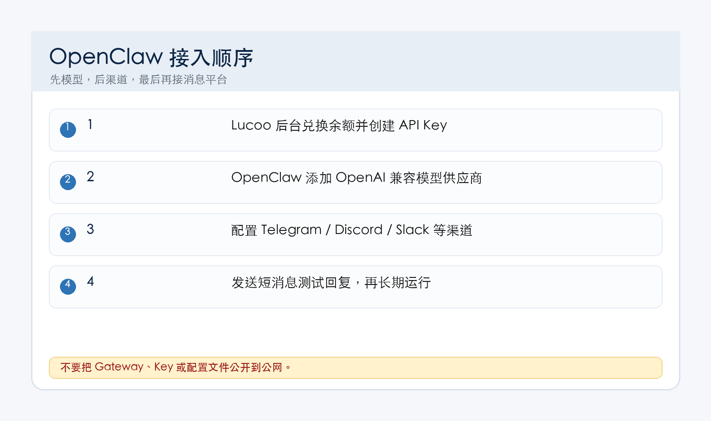
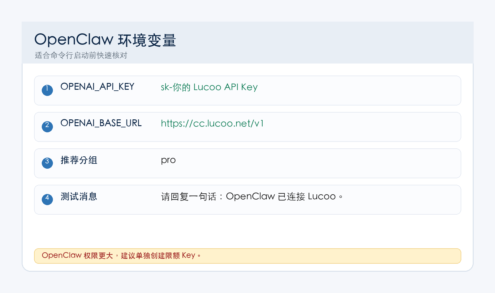

## 一、先准备 Lucoo 信息

OpenClaw 是一个可以把 AI Agent 接到 Telegram、Discord、Slack 等渠道的工具。接入 Lucoo 时，先准备：

| 项目 | 内容 |
| --- | --- |
| 后台 | `https://cc.lucoo.net` |
| OpenAI 兼容 Base URL | `https://cc.lucoo.net/v1` |
| API Key | Lucoo 后台创建的 `sk-` 开头 Key |
| 推荐分组 | `pro` |
| 防丢主页 | `https://lucoo.net` |



<p class="lucoo-token-warning-block">OpenClaw 里填的是 API Key，不是兑换码。兑换码请先在 Lucoo 后台钱包兑换。</p>

## 二、安装 OpenClaw

macOS / Linux 可以按官方方式安装：

```bash
curl -fsSL https://openclaw.bot/install.sh | bash
```

Windows 用户可以使用官方 Windows Hub 或 PowerShell 安装方式，具体看官方文档。

安装完成后检查：

```bash
openclaw --version
```

## 三、启动初始化

首次使用建议走引导流程：

```bash
openclaw onboard
```

如果你想作为后台服务运行，可以按官方提示安装 daemon。新手先跑通前台模式更容易排查。

## 四、选择或添加模型供应商

在 OpenClaw 引导或设置里，选择 OpenAI 兼容 / Custom Provider。

填写：

| 配置项 | 内容 |
| --- | --- |
| Provider 名称 | `Lucoo` |
| Base URL | `https://cc.lucoo.net/v1` |
| API Key | `sk-` 开头的 Lucoo API Key |
| 模型 | 后台当前可用模型，例如 `gpt-5.5` |

如果界面要求环境变量，可以在启动前设置：



```bash
export OPENAI_API_KEY="sk-这里填你自己的 Lucoo API Key"
export OPENAI_BASE_URL="https://cc.lucoo.net/v1"
```

Windows PowerShell：

```powershell
$env:OPENAI_API_KEY="sk-这里填你自己的 Lucoo API Key"
$env:OPENAI_BASE_URL="https://cc.lucoo.net/v1"
```

## 五、选择渠道并测试

OpenClaw 支持很多渠道，新手建议先用最容易排查的渠道测试。常见流程是：

1. 配好模型供应商。
2. 登录或连接消息渠道。
3. 启动 Gateway。
4. 发一条简单消息验证模型回复。

测试消息：

```text
请回复一句话：OpenClaw 已经成功连接 Lucoo 中转站。
```

## 六、备用入口

网络不稳定时，只换 Base URL，不换 Key：

- `https://api.lucoo.net/v1`
- `https://hkcc.lucoo.net/v1`
- `https://sgcc.lucoo.net/v1`
- `https://uscc.lucoo.net/v1`

如果某个地区入口不可用，再换另一个测试。

## 七、安全提醒

OpenClaw 能连接消息平台和本机工具，能力比普通聊天客户端更强。建议：

- 不要用 root 权限长期运行。
- API Key 单独创建，最好设置额度上限。
- 不要把 Gateway 暴露到公网。
- 不确定的第三方技能、插件先别装。
- 出现异常扣费时，立刻删除旧 Key 并重新创建。

## 八、常见问题

### 1. 提示 API Key 错误

检查是否把兑换码填进去了。OpenClaw 只能用 `sk-` 开头 API Key。

### 2. 模型没有响应

检查分组是否支持当前模型。编程和 Agent 场景建议用 `pro` 分组。

### 3. 请求地址错误

OpenAI 兼容接口必须带 `/v1`：`https://cc.lucoo.net/v1`。

### 4. 渠道收不到消息

先确认模型配置能单独测试通过，再排查 Telegram、Discord 等渠道授权。

## 九、参考入口

- OpenClaw 安装文档：[https://docs.openclaw.ai/install](https://docs.openclaw.ai/install)
- OpenClaw 入门文档：[https://docs.openclaw.ai/start/getting-started](https://docs.openclaw.ai/start/getting-started)
- Lucoo 防丢主页：[https://lucoo.net](https://lucoo.net)
