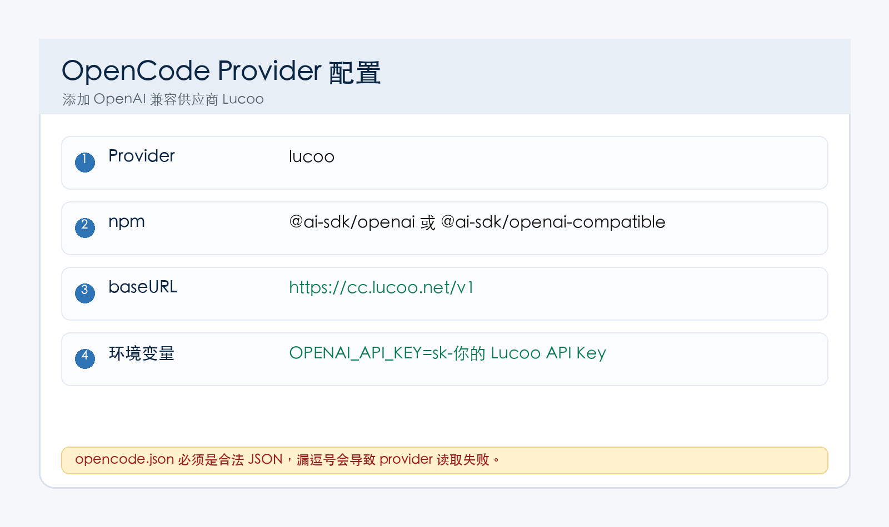

OpenCode 也可以接入 Lucoo。它和 Codex 的区别是：OpenCode 主要读自己的配置文件 `~/.config/opencode/opencode.json`，API Key 可以通过 `opencode auth login` 写入，也可以手动写入认证文件。

<div style="border:2px solid #ef4444;background:#fff1f2;color:#991b1b;padding:14px 16px;border-radius:12px;font-size:18px;font-weight:700;line-height:1.7;margin:18px 0;">
重点：OpenCode 的 Base URL 填 <code>https://cc.lucoo.net/v1</code>。不要把 Lucoo 兑换码填进去，必须填 <code>sk-</code> 开头 API Key。</div>



## 一、准备信息

| 配置项 | 填写内容 |
| --- | --- |
| Provider ID | `lucoo` |
| Provider 名称 | `Lucoo` |
| Base URL | `https://cc.lucoo.net/v1` |
| API Key | Lucoo 后台创建的 `sk-` 开头密钥 |
| 推荐模型 | `gpt-5.5`，如果后台展示不同，以后台为准 |

备用 Base URL：

- `https://api.lucoo.net/v1`
- `https://hkcc.lucoo.net/v1`
- `https://sgcc.lucoo.net/v1`
- `https://uscc.lucoo.net/v1`

## 二、安装 OpenCode

先按 OpenCode 官方方式安装，安装后检查：

```bash
opencode --version
```

如果命令不存在，先处理 OpenCode 本身安装问题，再配置 Lucoo。

## 三、兑换余额并创建 API Key

1. 打开 [https://cc.lucoo.net](https://cc.lucoo.net)。
2. 登录后进入「钱包 / 兑换」，输入兑换码。
3. 进入「API 密钥」，创建 `sk-` 开头 API Key。
4. 分组建议优先选 `pro`；轻量使用可以选 `plus`。
5. 复制 API Key，后面给 OpenCode 使用。

防丢地址：[https://lucoo.net](https://lucoo.net)。

## 四、编辑 OpenCode provider 配置

OpenCode 全局配置文件通常在：

```text
~/.config/opencode/opencode.json
```

如果目录不存在：

```bash
mkdir -p ~/.config/opencode
```

写入或合并下面内容：

```json
{
  "$schema": "https://opencode.ai/config.json",
  "provider": {
    "lucoo": {
      "npm": "@ai-sdk/openai-compatible",
      "name": "Lucoo",
      "options": {
        "baseURL": "https://cc.lucoo.net/v1"
      },
      "models": {
        "gpt-5.5": {
          "name": "gpt-5.5",
          "reasoning": true,
          "modalities": {
            "input": ["text", "image", "pdf"],
            "output": ["text"]
          }
        },
        "gpt-5.4": {
          "name": "gpt-5.4",
          "reasoning": true,
          "modalities": {
            "input": ["text", "image", "pdf"],
            "output": ["text"]
          }
        }
      }
    }
  }
}
```

如果你的 OpenCode 版本使用 `@ai-sdk/openai` 也能正常工作，可以保持；新手建议先用上面的 OpenAI Compatible 写法。

## 五、配置 API Key

### 方式 A：用 OpenCode 登录命令

执行：

```bash
opencode auth login
```

在 provider 里选择或输入 `lucoo`，然后粘贴 Lucoo 后台生成的 `sk-` 开头 API Key。

OpenCode 通常会把认证信息保存到：

```text
~/.local/share/opencode/auth.json
```

### 方式 B：临时环境变量

macOS / Linux / WSL：

```bash
export OPENAI_API_KEY="sk-这里填你自己的 Lucoo API Key"
```

Windows PowerShell：

```powershell
$env:OPENAI_API_KEY="sk-这里填你自己的 Lucoo API Key"
```

### 方式 C：手动认证文件

如果你明确知道 OpenCode 当前版本的认证文件结构，可以手动维护认证文件。新手优先用方式 A，少出错。

## 六、启动并测试

启动：

```bash
opencode
```

选择 `lucoo / gpt-5.5`，然后输入：

```text
请用三句话说明你当前可以做什么，并读取一下当前目录。
```

能正常返回内容，说明 OpenCode 已经接入 Lucoo。

## 七、常见问题

### 1. provider 不存在

检查 `~/.config/opencode/opencode.json` 是否是合法 JSON。最常见错误是：漏逗号、花括号不成对、中文引号混进去。

### 2. API Key 错误或 401

确认你填的是 `sk-` 开头 API Key，不是兑换码。改完后重启 OpenCode。

### 3. 404 或请求地址错误

确认 Base URL 是：

```text
https://cc.lucoo.net/v1
```

不要漏 `/v1`。

### 4. 模型不可用

把 `models` 里的模型名改成 Lucoo 后台当前可用模型名。比如后台显示 `gpt-5.4`，就选择 `gpt-5.4`。

### 5. 想换入口

只改 `baseURL`，例如：

```json
"baseURL": "https://sgcc.lucoo.net/v1"
```

## 八、参考入口

- Lucoo 防丢主页：[https://lucoo.net](https://lucoo.net)
- Lucoo 主站：[https://cc.lucoo.net](https://cc.lucoo.net)
- OpenCode 配置文档：[https://opencode.ai/docs/config/](https://opencode.ai/docs/config/)
- OpenCode providers 文档：[https://opencode.ai/docs/providers/](https://opencode.ai/docs/providers/)
- OpenCode CLI 文档：[https://opencode.ai/docs/cli/](https://opencode.ai/docs/cli/)
