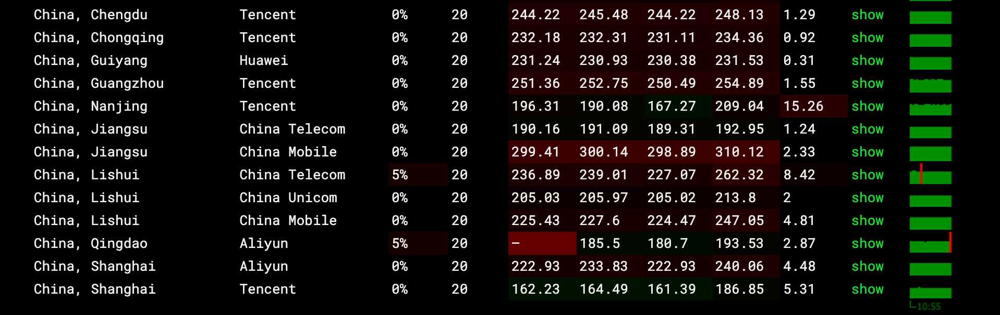

## 结论

- **推荐人群**：联通用户、轻量代理/备用机/低成本长期部署
- **不推荐人群**：对电信/移动回程质量有硬性要求的用户
- **一句话结论**：价格极低、流量不限，回程线路普通但稳定，适合联通用户轻负载用途。

> 延迟截图（示例）：
> 

---

## 产品与方案信息

- **厂商**：TakeHost.biz
- **官网**：https://takehost.biz/
- **套餐名**：IPV6 Or IPV4 VPS Deals - 1GB Yearly Epyc
- **测试时间**：2026-01-30
- **测试机房**：德国 · Frankfurt am Main（Hesse）
- **线路类型**：普通线路（回程 163/169/CMI）
- **支付方式**：PayPal / 信用卡 / 加密 / Apple Pay
  - 官方提示：即将支持 Alipay / WeChat Pay / MobilePay

---

## 配置与资源（实测 + 标称）

| 项目 | 参数 |
| --- | --- |
| CPU | 1 vCPU（AMD EPYC 7763 @ 2.45GHz） |
| 内存 | 1 GB（实测约 922 MB） |
| 硬盘 | 30 GB NVMe |
| 带宽/流量 | 50 Gbps / 无限流量（商家标称） |
| IPv4/IPv6 | IPv4 + IPv6 Online |
| 虚拟化 | KVM |
| 价格 | 5€ / 年 |
| 退款/试用 | 未验证 |

> **定位说明**：低价年付机型，适合轻量部署或备用用途。

---

## 网络与回程

### 回程线路检测（目标 → 回程线路）

| 目标 | 回程线路 |
| --- | --- |
| 北京电信 219.141.136.12 | 电信 163 |
| 北京联通 202.106.50.1 | 联通 169 |
| 北京移动 221.179.155.161 | 移动 CMI |
| 上海电信 202.96.209.133 | 电信 163 |
| 上海联通 210.22.97.1 | 联通 169 |
| 上海移动 211.136.112.200 | 移动 CMI |
| 深圳电信 58.60.188.222 | 电信 163 |
| 深圳联通 210.21.196.6 | 联通 169 |
| 深圳移动 120.196.165.24 | 移动 CMI |

### Ping 延迟（抽样）

| 目标 | 结果 |
| --- | --- |
| 114.114.114.114 | 100% 丢包 |
| 223.5.5.5 | 平均 7.86 ms |
| 1.1.1.1 | 平均 3.76 ms |
| 8.8.8.8 | 平均 7.31 ms |

> 备注：114.114.114.114 的丢包可能与 ICMP 策略有关，不代表实际业务不可用。

---

## 性能测试（基准）

### 1) 磁盘 IO（bench.sh）

| 指标 | 结果 |
| --- | --- |
| I/O Speed(1st) | 384 MB/s |
| I/O Speed(2nd) | 229 MB/s |
| I/O Speed(3rd) | 296 MB/s |
| 平均 | 303 MB/s |

### 2) Speedtest（bench.sh）

| 节点 | 上传 | 下载 | 延迟 |
| --- | --- | --- | --- |
| Speedtest.net | 4482.67 Mbps | 5297.38 Mbps | 9.51 ms |
| Paris, FR | 6948.59 Mbps | 8865.04 Mbps | 12.14 ms |
| Shanghai, CN | 329.22 Mbps | 3099.31 Mbps | 263.08 ms |
| Hong Kong, CN | 429.54 Mbps | 2638.29 Mbps | 192.50 ms |
| Singapore, SG | 69.74 Mbps | 126.73 Mbps | 169.87 ms |
| Tokyo, JP | 407.18 Mbps | 2427.25 Mbps | 219.82 ms |

---

## 流媒体与地区解锁（实测）

```
============[ Multination ]============
 Dazn:                                  Yes (Region: DE)
 Disney+:                               Yes (Region: DE)
 Netflix:                               Yes (Region: DE)
 YouTube Premium:                       Yes (Region: DE)
 Amazon Prime Video:                    Yes (Region: DE)
 TVBAnywhere+:                          Yes
 Spotify Registration:                  No
 OneTrust Region:                       DE [Hesse]
 iQyi Oversea Region:                   DE
 Bing Region:                           DE (Risky)
 Apple Region:                          DE
 YouTube CDN:                           Amsterdam
 Netflix Preferred CDN:                 Frankfurt
 ChatGPT:                               Yes
 Google Gemini:                         No
 Claude:                                Yes
 Wikipedia Editability:                 Yes
 Google Play Store:                     Germany 
 Google Search CAPTCHA Free:            Yes
 Steam Currency:                        EUR
 ---Forum---
 Reddit:                                Yes
 ---Game---
 SD Gundam G Generation Eternal:        Yes
```

---

## 适用场景建议

- 轻量代理 / 低成本长期部署：可用
- 站点镜像 / 备用机：可用
- 游戏加速 / 低延迟业务：不建议（普通线路）

---

## 结论与建议

- **性价比**：高（年付 5€，不限流量）
- **适合人群**：联通用户、低成本长期部署
- **不适合人群**：电信/移动回程质量敏感用户
- **是否推荐购买**：预算极低且可接受普通线路时可考虑

---

## 附：测试命令参考

```bash
# 基础信息
uname -a
cat /etc/os-release
uptime
lscpu
free -h
lsblk
df -hT
ip -br addr
ip route

# CPU/内存
sysbench cpu --cpu-max-prime=20000 run
sysbench memory run

# 磁盘 IO
fio --name=randrw --rw=randrw --bs=4k --size=1G --iodepth=16 --runtime=60 --time_based --group_reporting
dd if=/dev/zero of=./testfile bs=1G count=1 oflag=direct; rm -f ./testfile

# 网络测试
curl -sL yabs.sh | bash
curl -sL bench.sh | bash

# 国内多节点延迟（不依赖安装）
for host in 114.114.114.114 223.5.5.5 1.1.1.1 8.8.8.8; do ping -c 4 $host; done

# 路由追踪（可选）
traceroute -m 20 114.114.114.114
traceroute -m 20 223.5.5.5

# 回程线路检测（可选，需安装）
# bash <(curl -sL https://raw.githubusercontent.com/zhucaidan/mtr_trace/master/mtr_trace.sh)
```
